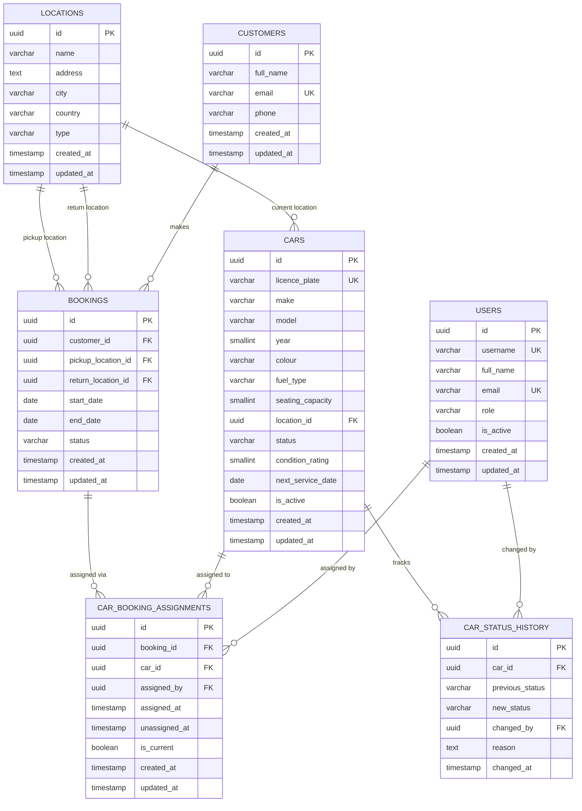

# Database Design – Assign Car to Rental Booking

## Overview

This document describes the database tables required to support the **Assign Car to Rental Booking** feature (US-CM-03). It covers the car inventory, rental bookings, and the assignment relationship between them, together with supporting reference data.

---

## Entity Relationship Diagram

---

## Table Descriptions

### `locations`

Represents physical locations (depots, airports, etc.) used as pickup or return points and as the current location of a car.

| Column     | Type        | Constraints      | Description                                      |
|------------|-------------|------------------|--------------------------------------------------|
| id         | UUID        | PK               | Unique identifier                                |
| name       | VARCHAR     | NOT NULL         | Human-readable name (e.g., "City Centre Depot")  |
| address    | TEXT        | NOT NULL         | Street address                                   |
| city       | VARCHAR     | NOT NULL         | City                                             |
| country    | VARCHAR     | NOT NULL         | Country                                          |
| type       | VARCHAR     | NOT NULL         | Location type (e.g., `depot`, `airport`, `other`)|
| created_at | TIMESTAMP   | NOT NULL         | Record creation timestamp                        |
| updated_at | TIMESTAMP   | NOT NULL         | Record last-update timestamp                     |

---

### `cars`

Represents each vehicle in the rental fleet.

| Column            | Type        | Constraints      | Description                                                                              |
|-------------------|-------------|------------------|------------------------------------------------------------------------------------------|
| id                | UUID        | PK               | Unique identifier                                                                        |
| licence_plate     | VARCHAR     | NOT NULL, UNIQUE | Vehicle registration/licence plate                                                       |
| make              | VARCHAR     | NOT NULL         | Manufacturer (e.g., "Toyota")                                                            |
| model             | VARCHAR     | NOT NULL         | Model name (e.g., "Corolla")                                                             |
| year              | SMALLINT    | NOT NULL         | Manufacturing year                                                                       |
| colour            | VARCHAR     | NOT NULL         | Vehicle colour                                                                           |
| fuel_type         | VARCHAR     | NOT NULL         | Fuel type (e.g., `petrol`, `diesel`, `electric`, `hybrid`)                               |
| seating_capacity  | SMALLINT    | NOT NULL         | Number of passenger seats                                                                |
| location_id       | UUID        | FK → locations   | Current physical location of the car                                                     |
| status            | VARCHAR     | NOT NULL         | Current status: `available`, `reserved`, `rented`, `in_service`, `unavailable`           |
| condition_rating  | SMALLINT    |                  | Condition score (e.g., 1–5)                                                              |
| next_service_date | DATE        |                  | Date of next scheduled service                                                           |
| is_active         | BOOLEAN     | NOT NULL         | Whether the car is in the active rental pool                                             |
| created_at        | TIMESTAMP   | NOT NULL         | Record creation timestamp                                                                |
| updated_at        | TIMESTAMP   | NOT NULL         | Record last-update timestamp                                                             |

---

### `users`

Represents internal system users (fleet managers, operations staff, field agents). Managed by the User Management system.

| Column     | Type      | Constraints      | Description                                                   |
|------------|-----------|------------------|---------------------------------------------------------------|
| id         | UUID      | PK               | Unique identifier                                             |
| username   | VARCHAR   | NOT NULL, UNIQUE | Login username                                                |
| full_name  | VARCHAR   | NOT NULL         | Display name                                                  |
| email      | VARCHAR   | NOT NULL, UNIQUE | Email address                                                 |
| role       | VARCHAR   | NOT NULL         | Role: `fleet_manager`, `operations_staff`, `field_agent`      |
| is_active  | BOOLEAN   | NOT NULL         | Whether the user account is active                            |
| created_at | TIMESTAMP | NOT NULL         | Record creation timestamp                                     |
| updated_at | TIMESTAMP | NOT NULL         | Record last-update timestamp                                  |

---

### `customers`

Represents customers who make rental bookings. Managed by the Booking system.

| Column     | Type      | Constraints      | Description                        |
|------------|-----------|------------------|------------------------------------|
| id         | UUID      | PK               | Unique identifier                  |
| full_name  | VARCHAR   | NOT NULL         | Customer's full name               |
| email      | VARCHAR   | NOT NULL, UNIQUE | Customer's email address           |
| phone      | VARCHAR   |                  | Customer's phone number            |
| created_at | TIMESTAMP | NOT NULL         | Record creation timestamp          |
| updated_at | TIMESTAMP | NOT NULL         | Record last-update timestamp       |

---

### `bookings`

Represents confirmed rental bookings. Managed by the Booking system; referenced here as the anchor for car assignments.

| Column             | Type      | Constraints            | Description                                                                     |
|--------------------|-----------|------------------------|---------------------------------------------------------------------------------|
| id                 | UUID      | PK                     | Unique identifier                                                               |
| customer_id        | UUID      | FK → customers         | The customer who made the booking                                               |
| pickup_location_id | UUID      | FK → locations         | Where the customer will collect the car                                         |
| return_location_id | UUID      | FK → locations         | Where the customer will return the car                                          |
| start_date         | DATE      | NOT NULL               | Start date of the rental period                                                 |
| end_date           | DATE      | NOT NULL               | End date of the rental period                                                   |
| status             | VARCHAR   | NOT NULL               | Booking status: `confirmed`, `active`, `completed`, `cancelled`                 |
| created_at         | TIMESTAMP | NOT NULL               | Record creation timestamp                                                       |
| updated_at         | TIMESTAMP | NOT NULL               | Record last-update timestamp                                                    |

---

### `car_booking_assignments`

Records the assignment of a car to a booking. Only one assignment may be active at a time per booking (enforced by `UNIQUE (booking_id) WHERE is_current = TRUE`).

| Column         | Type      | Constraints               | Description                                                                             |
|----------------|-----------|---------------------------|-----------------------------------------------------------------------------------------|
| id             | UUID      | PK                        | Unique identifier                                                                       |
| booking_id     | UUID      | FK → bookings, NOT NULL   | The booking the car is assigned to                                                      |
| car_id         | UUID      | FK → cars, NOT NULL       | The car assigned to the booking                                                         |
| assigned_by    | UUID      | FK → users, NOT NULL      | The operations staff member who made the assignment                                     |
| assigned_at    | TIMESTAMP | NOT NULL                  | When the assignment was made                                                            |
| unassigned_at  | TIMESTAMP |                           | When the assignment was removed (NULL if still active)                                  |
| is_current     | BOOLEAN   | NOT NULL, default TRUE    | TRUE if this is the active assignment for the booking; FALSE for historical assignments |
| created_at     | TIMESTAMP | NOT NULL                  | Record creation timestamp                                                               |
| updated_at     | TIMESTAMP | NOT NULL                  | Record last-update timestamp                                                            |

**Indexes & Constraints:**
- Partial unique index: `UNIQUE (booking_id) WHERE is_current = TRUE` — prevents more than one active assignment per booking.
- Index on `(car_id, is_current)` — speeds up conflict-detection queries across active car assignments.

---

### `car_status_history`

Audit trail of all car status changes, including those triggered by assignment and unassignment events.

| Column          | Type      | Constraints         | Description                                       |
|-----------------|-----------|---------------------|---------------------------------------------------|
| id              | UUID      | PK                  | Unique identifier                                 |
| car_id          | UUID      | FK → cars, NOT NULL | The car whose status changed                      |
| previous_status | VARCHAR   | NOT NULL            | Status before the change                          |
| new_status      | VARCHAR   | NOT NULL            | Status after the change                           |
| changed_by      | UUID      | FK → users          | User who triggered the change (NULL if automated) |
| reason          | TEXT      |                     | Optional description of why the status changed    |
| changed_at      | TIMESTAMP | NOT NULL            | When the change occurred                          |
