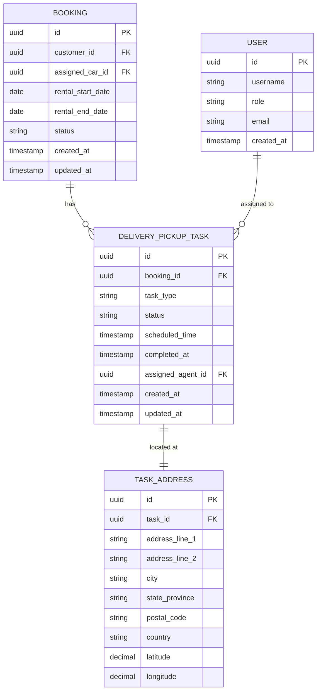

# Database Design – Car Management: Delivery and Pickup at Customer-Chosen Locations

## Entity Relationship Diagram

---

## Table Descriptions

### DELIVERY_PICKUP_TASK

| Column | Type | Constraints | Description |
|---|---|---|---|
| id | UUID | PK, NOT NULL | Unique identifier for the task |
| booking_id | UUID | FK → BOOKING.id, NOT NULL | The booking this task belongs to |
| task_type | VARCHAR(20) | NOT NULL, CHECK IN ('DELIVERY', 'PICKUP') | Whether this is a delivery to or a pickup from a customer-chosen location |
| status | VARCHAR(30) | NOT NULL, DEFAULT 'PENDING', CHECK IN ('PENDING', 'ASSIGNED', 'IN_PROGRESS', 'COMPLETED', 'CANCELLED') | Current status of the task |
| scheduled_time | TIMESTAMP | NOT NULL | When the delivery or pickup is scheduled to occur |
| completed_at | TIMESTAMP | NULLABLE | When the task was actually completed |
| assigned_agent_id | UUID | FK → USER.id, NULLABLE | The field agent assigned to carry out this task |
| created_at | TIMESTAMP | NOT NULL, DEFAULT NOW() | Record creation timestamp |
| updated_at | TIMESTAMP | NOT NULL, DEFAULT NOW() | Record last update timestamp |

### TASK_ADDRESS

| Column | Type | Constraints | Description |
|---|---|---|---|
| id | UUID | PK, NOT NULL | Unique identifier for the address record |
| task_id | UUID | FK → DELIVERY_PICKUP_TASK.id, NOT NULL, UNIQUE | The task this address belongs to (one address per task) |
| address_line_1 | VARCHAR(255) | NOT NULL | Primary street address |
| address_line_2 | VARCHAR(255) | NULLABLE | Secondary address information (apartment, suite, etc.) |
| city | VARCHAR(100) | NOT NULL | City |
| state_province | VARCHAR(100) | NULLABLE | State or province |
| postal_code | VARCHAR(20) | NOT NULL | Postal or ZIP code |
| country | VARCHAR(100) | NOT NULL | Country |
| latitude | DECIMAL(9,6) | NULLABLE | Geographical latitude (optional, for future map integration) |
| longitude | DECIMAL(10,6) | NULLABLE | Geographical longitude (optional, for future map integration) |
