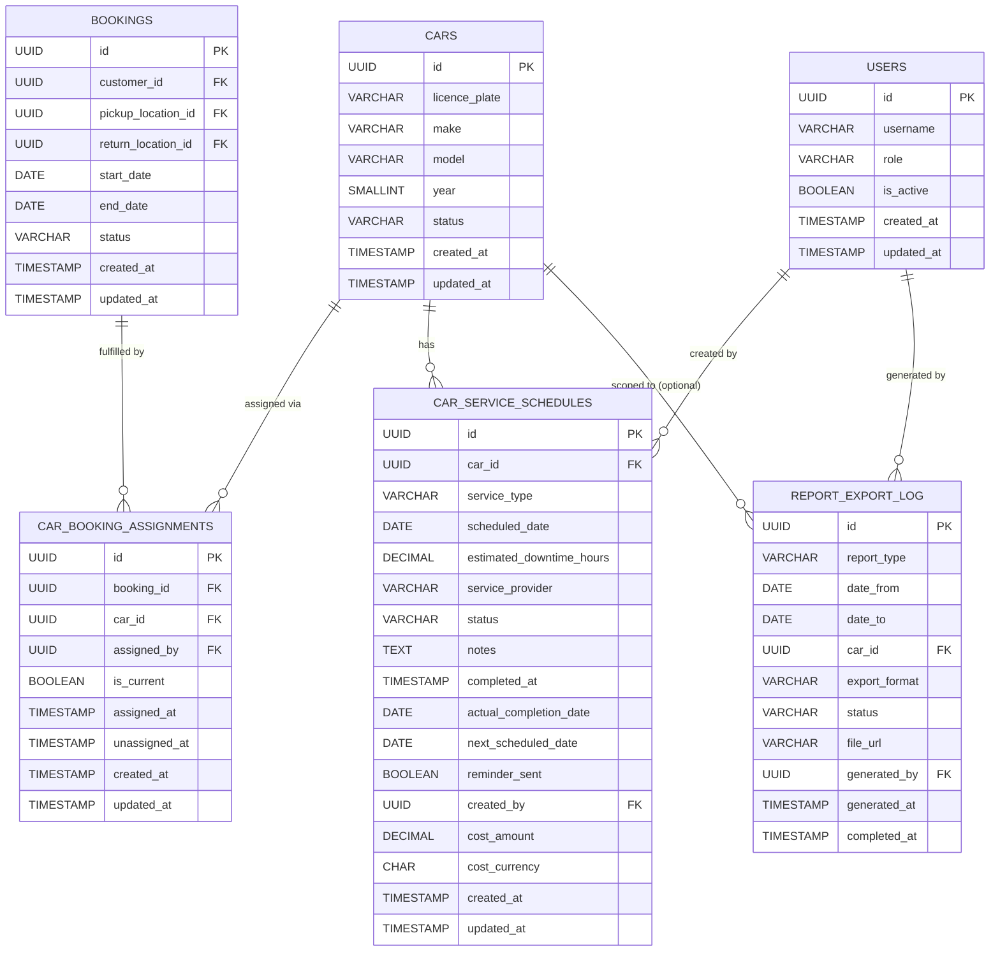

# Database Design — Car Management: Fleet Utilisation and Maintenance Reports

## Overview

This document describes the database design required to support **US-CM-09: View Fleet Utilisation and Maintenance Reports**.

> **Note:** The `cars`, `locations`, `users`, `customers`, `bookings`, `car_booking_assignments`, `car_status_history`, `car_service_reminder_notifications`, `pickup_record`, `pickup_photo`, `pickup_signature`, and `car_service_schedules` tables are part of the consolidated Car Management database design and are defined in:
> - 📄 [database-design-car-management-assign-car-to-booking.md](./database-design-car-management-assign-car-to-booking.md) — defines `locations`, `users`, `customers`, `bookings`, `car_booking_assignments`, `car_status_history`
> - 📄 [database-design-car-pickup-logistics.md](./database-design-car-pickup-logistics.md) — defines `pickup_record`, `pickup_photo`, `pickup_signature`
> - 📄 [database-design-car-management-service-maintenance.md](./database-design-car-management-service-maintenance.md) — defines `car_service_reminder_notifications` and additional columns on `car_service_schedules`
>
> This document references those tables but does not redefine them. It documents **additional columns** required on `car_service_schedules` to support maintenance cost reporting, and introduces the new `report_export_log` table.

---

## Tables

### `car_service_schedules` — Additional Columns

The base table and its US-CM-04 additions are defined in 📄 [database-design-car-management-service-maintenance.md](./database-design-car-management-service-maintenance.md). The following **additional columns** are required to support the Maintenance Activity and Cost Report (US-CM-09):

| Column | Type | Constraints | Description |
|---|---|---|---|
| `cost_amount` | DECIMAL(12, 2) | NULL | Total cost incurred for this service activity; populated when the activity is completed |
| `cost_currency` | CHAR(3) | NULL | ISO 4217 currency code for the cost (e.g., `USD`, `GBP`); required when `cost_amount` is set |

These columns extend the existing full column listing from the service-maintenance TRD:

| Column | Type | Constraints | Description |
|---|---|---|---|
| `id` | UUID | PK, NOT NULL | Unique identifier |
| `car_id` | UUID | FK → `cars.id`, NOT NULL | The car this schedule belongs to |
| `service_type` | VARCHAR(100) | NOT NULL | Type of service (e.g., `routine service`, `tyre change`, `inspection`, `oil change`, `brake service`, `other`) |
| `scheduled_date` | DATE | NOT NULL | Date on which the service is planned to begin |
| `estimated_downtime_hours` | DECIMAL(5,2) | | Estimated hours the car will be unavailable |
| `service_provider` | VARCHAR(255) | | Name of the service provider or workshop |
| `status` | VARCHAR(20) | NOT NULL | One of: `scheduled`, `in_progress`, `completed`, `cancelled` |
| `notes` | TEXT | | Additional notes or instructions |
| `completed_at` | TIMESTAMP | | Timestamp when the service was marked complete |
| `actual_completion_date` | DATE | | *(US-CM-04)* The date the service was actually completed |
| `next_scheduled_date` | DATE | | *(US-CM-04)* Recalculated next service date of the same type |
| `reminder_sent` | BOOLEAN | NOT NULL, DEFAULT FALSE | *(US-CM-04)* Whether the 7-day reminder has been sent |
| `created_by` | UUID | FK → `users.id`, NOT NULL | *(US-CM-04)* Fleet manager who created the entry |
| `cost_amount` | DECIMAL(12, 2) | NULL | *(US-CM-09)* Cost incurred for this activity |
| `cost_currency` | CHAR(3) | NULL | *(US-CM-09)* ISO 4217 currency code for the cost |
| `created_at` | TIMESTAMP | NOT NULL | Record creation timestamp (UTC) |
| `updated_at` | TIMESTAMP | NOT NULL | Last update timestamp (UTC) |

---

### `report_export_log`

New table introduced by US-CM-09. Tracks each export request generated by a fleet manager, enabling audit history and re-download of previously generated files.

| Column | Type | Constraints | Description |
|---|---|---|---|
| `id` | UUID | PK, NOT NULL | Unique identifier for the export request |
| `report_type` | VARCHAR(20) | NOT NULL | Type of report exported: `utilisation`, `downtime`, or `maintenance` |
| `date_from` | DATE | NOT NULL | Start of the date range applied to the report |
| `date_to` | DATE | NOT NULL | End of the date range applied to the report |
| `car_id` | UUID | NULL, FK → `cars.id` | When set, the export was scoped to a single vehicle |
| `export_format` | VARCHAR(5) | NOT NULL | File format of the export: `csv` or `pdf` |
| `status` | VARCHAR(10) | NOT NULL | Processing status: `pending`, `completed`, or `failed` |
| `file_url` | VARCHAR(1024) | NULL | Presigned or relative URL to the generated file; populated on completion |
| `generated_by` | UUID | NOT NULL, FK → `users.id` | Fleet manager who triggered the export |
| `generated_at` | TIMESTAMP | NOT NULL | Timestamp when the export was requested |
| `completed_at` | TIMESTAMP | NULL | Timestamp when the file became available |

**Indexes:**
- `(generated_by)` — for user-specific export history
- `(report_type, date_from, date_to)` — for audit queries

---

## Entity Relationship Diagram

---

## Notes

- The **Utilisation Report** derives its data from the `bookings` table (joined with `car_booking_assignments` to determine which car was rented). Utilisation rate per vehicle is calculated as:
  `utilisation_rate = (total rented days within period) / (total days in period) × 100`
- The **Downtime Report** derives its data from `car_service_schedules` (using `scheduled_date` and `estimated_downtime_hours`/`actual_completion_date` where `status` is `in_progress` or `completed`) and `car_status_history` (periods where `new_status` is `unavailable`).
- The **Maintenance Activity and Cost Report** derives its data from `car_service_schedules`, using the `cost_amount` and `cost_currency` columns introduced by this TRD.
- The `cars`, `bookings`, `users`, and `car_service_schedules` tables are defined in the consolidated Car Management database design documents listed above; they are referenced here but not redefined.
