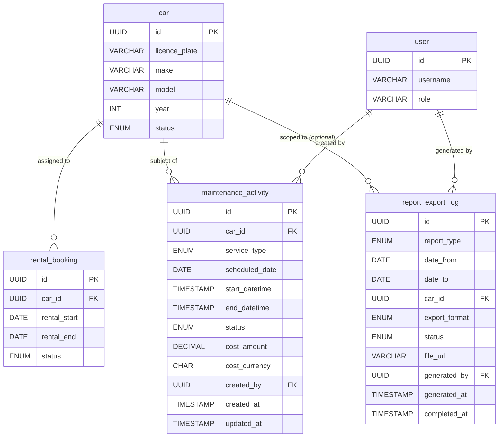

# Database Design — Car Management: Fleet Utilisation and Maintenance Reports

## Tables

### `maintenance_activity`

Stores the record of each maintenance or service activity carried out on a vehicle, including cost information required for the Maintenance Report.

| Column | Type | Constraints | Description |
|---|---|---|---|
| `id` | UUID | PRIMARY KEY | Unique identifier for the maintenance activity record |
| `car_id` | UUID | NOT NULL, FK → `car.id` | The vehicle this activity belongs to |
| `service_type` | ENUM(`routine_service`, `tyre_change`, `inspection`, `repair`, `other`) | NOT NULL | Category of the maintenance activity |
| `scheduled_date` | DATE | NOT NULL | Date the activity was scheduled to occur |
| `start_datetime` | TIMESTAMP | NULL | Actual start date and time of the activity |
| `end_datetime` | TIMESTAMP | NULL | Actual completion date and time of the activity |
| `status` | ENUM(`scheduled`, `in_progress`, `completed`, `cancelled`) | NOT NULL | Current status of the activity |
| `service_provider` | VARCHAR(255) | NULL | Name or identifier of the service provider |
| `cost_amount` | DECIMAL(12, 2) | NULL | Cost incurred for this activity |
| `cost_currency` | CHAR(3) | NULL | ISO 4217 currency code (e.g., `USD`, `GBP`) |
| `notes` | TEXT | NULL | Free-text notes or description of work performed |
| `created_by` | UUID | NOT NULL, FK → `user.id` | User who created the record |
| `created_at` | TIMESTAMP | NOT NULL | Record creation timestamp |
| `updated_at` | TIMESTAMP | NOT NULL | Record last updated timestamp |

**Indexes:**
- `(car_id)` — for per-vehicle lookups
- `(status)` — for filtering active/completed activities
- `(scheduled_date)`, `(start_datetime)`, `(end_datetime)` — for date-range queries used in downtime and maintenance reports

---

### `report_export_log`

Tracks each export request generated by a fleet manager, enabling audit history and re-download of previously generated files.

| Column | Type | Constraints | Description |
|---|---|---|---|
| `id` | UUID | PRIMARY KEY | Unique identifier for the export request |
| `report_type` | ENUM(`utilisation`, `downtime`, `maintenance`) | NOT NULL | The type of report that was exported |
| `date_from` | DATE | NOT NULL | Start of the date range applied to the report |
| `date_to` | DATE | NOT NULL | End of the date range applied to the report |
| `car_id` | UUID | NULL, FK → `car.id` | When set, the export was scoped to a single vehicle |
| `export_format` | ENUM(`csv`, `pdf`) | NOT NULL | File format of the export |
| `status` | ENUM(`pending`, `completed`, `failed`) | NOT NULL | Processing status of the export job |
| `file_url` | VARCHAR(1024) | NULL | Presigned or relative URL to the generated file |
| `generated_by` | UUID | NOT NULL, FK → `user.id` | Fleet manager who triggered the export |
| `generated_at` | TIMESTAMP | NOT NULL | Timestamp when the export was requested |
| `completed_at` | TIMESTAMP | NULL | Timestamp when the file became available |

**Indexes:**
- `(generated_by)` — for user-specific export history
- `(report_type, date_from, date_to)` — for audit queries

---

## Entity Relationship Diagram

---

## Notes

- The **Utilisation Report** derives its data from the `rental_booking` table. Utilisation rate per vehicle is calculated as:
  `utilisation_rate = (total rented days within period) / (total days in period) × 100`
- The **Downtime Report** derives its data from the `maintenance_activity` table (using `start_datetime` and `end_datetime` where `status` is `in_progress` or `completed`) and any `rental_booking` record with status `unavailable`.
- The **Maintenance Report** derives its data entirely from `maintenance_activity`.
- The `car` and `rental_booking` tables are defined in the car management and booking modules respectively; they are referenced here but not re-defined.
