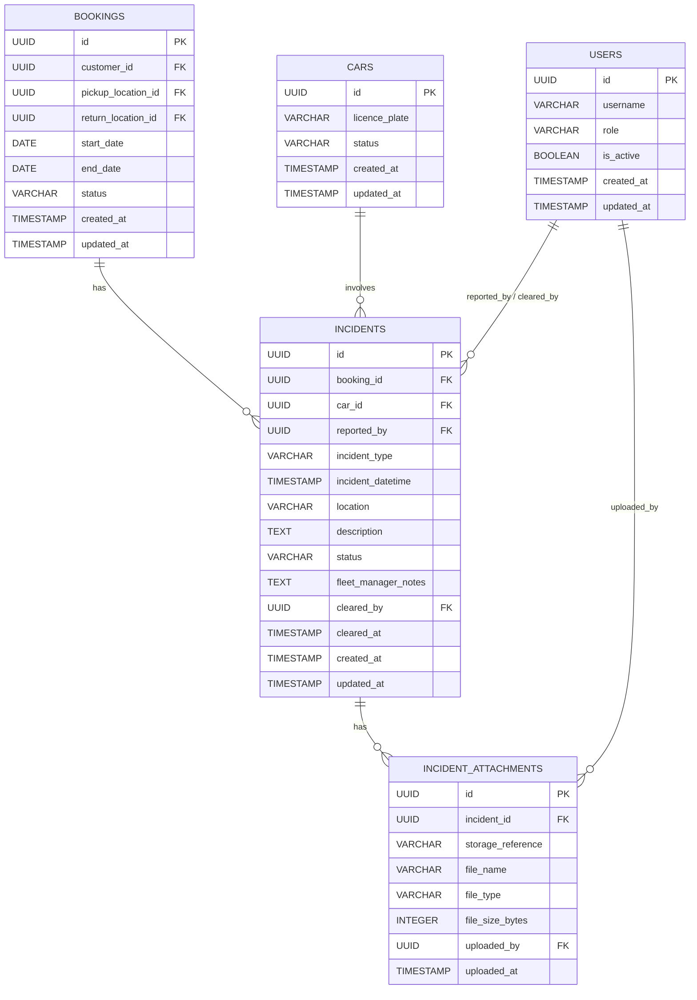

# Database Design – Record Incidents During a Rental

## Overview

This document describes the database tables required to support **US-CM-07: Record Incidents During a Rental**.

> **Note:** The `cars`, `locations`, `users`, `customers`, `bookings`, `car_booking_assignments`, `car_status_history`, `car_service_reminder_notifications`, `pickup_record`, `pickup_photo`, `pickup_signature`, and `car_service_schedules` tables are part of the consolidated Car Management database design and are defined in:
> - 📄 [database-design-car-management-assign-car-to-booking.md](./database-design-car-management-assign-car-to-booking.md) — defines `locations`, `users`, `customers`, `bookings`, `car_booking_assignments`, `car_status_history`
> - 📄 [database-design-car-pickup-logistics.md](./database-design-car-pickup-logistics.md) — defines `pickup_record`, `pickup_photo`, `pickup_signature`
> - 📄 [database-design-car-management-service-maintenance.md](./database-design-car-management-service-maintenance.md) — defines `car_service_reminder_notifications` and additional columns on `car_service_schedules`
>
> This document references those tables but does not redefine them. It introduces only the two new tables specific to the incident recording workflow: `incidents` and `incident_attachments`.

---

## Entity Relationship Diagram

---

## Table Descriptions

### `cars`, `bookings`, `users`, `locations`, `customers`, `car_booking_assignments`, and `car_status_history`

These tables are defined in the consolidated Car Management database design:
- 📄 [database-design-car-management.md](./database-design-car-management.md) — defines `cars` and `car_service_schedules`
- 📄 [database-design-car-management-assign-car-to-booking.md](./database-design-car-management-assign-car-to-booking.md) — defines `locations`, `users`, `customers`, `bookings`, `car_booking_assignments`, `car_status_history`

Key points relevant to this feature:
- `cars.status` is set to `unavailable_incident_review` when an incident is logged, and restored to `available` when a fleet manager clears the incident.
- `bookings.status` must be `active` for an incident to be logged against the booking.
- `users.role` must be `operations_staff` or `fleet_manager` to log an incident; only `fleet_manager` may clear one.

---

## New Tables

### `incidents`

Stores each incident record linked to an active booking and the car involved.

| Column | Type | Constraints | Description |
|---|---|---|---|
| `id` | UUID | PK, NOT NULL | Unique identifier |
| `booking_id` | UUID | FK → `bookings.id`, NOT NULL | The active booking during which the incident occurred |
| `car_id` | UUID | FK → `cars.id`, NOT NULL | The car involved in the incident |
| `reported_by` | UUID | FK → `users.id`, NOT NULL | The operations staff member who logged the incident |
| `incident_type` | VARCHAR(20) | NOT NULL | Incident category: `accident`, `breakdown`, or `other` |
| `incident_datetime` | TIMESTAMP WITH TIME ZONE | NOT NULL | Date and time when the incident occurred |
| `location` | VARCHAR(500) | NOT NULL | Free-text description of the incident location |
| `description` | TEXT | NOT NULL | Detailed narrative of what occurred |
| `status` | VARCHAR(30) | NOT NULL, DEFAULT `open` | Lifecycle state: `open`, `under_review`, or `cleared` |
| `fleet_manager_notes` | TEXT | NULLABLE | Notes added by the fleet manager when reviewing or clearing the incident |
| `cleared_by` | UUID | FK → `users.id`, NULLABLE | Fleet manager who cleared the incident |
| `cleared_at` | TIMESTAMP WITH TIME ZONE | NULLABLE | Timestamp when the incident was cleared |
| `created_at` | TIMESTAMP WITH TIME ZONE | NOT NULL, DEFAULT NOW() | Record creation timestamp |
| `updated_at` | TIMESTAMP WITH TIME ZONE | NOT NULL, DEFAULT NOW() | Last update timestamp |

**Indexes:**
- `idx_incidents_booking_id` on `booking_id` — supports fetching all incidents for a booking
- `idx_incidents_car_id` on `car_id` — supports fetching car incident history
- `idx_incidents_status` on `status` — supports filtering open/under_review incidents for fleet manager queues

**Constraints:**
- `incident_type` must be one of: `accident`, `breakdown`, `other`.
- `status` must be one of: `open`, `under_review`, `cleared`.
- Records must not be deleted; only status transitions are permitted (immutable history).

---

### `incident_attachments`

Stores references to photos or documents uploaded against an incident.

| Column | Type | Constraints | Description |
|---|---|---|---|
| `id` | UUID | PK, NOT NULL | Unique identifier |
| `incident_id` | UUID | FK → `incidents.id`, NOT NULL | The incident this file belongs to |
| `storage_reference` | VARCHAR(1000) | NOT NULL | File storage path or URL for the uploaded file |
| `file_name` | VARCHAR(255) | NOT NULL | Original file name as uploaded |
| `file_type` | VARCHAR(10) | NOT NULL | File type extension: `jpg`, `png`, or `pdf` |
| `file_size_bytes` | INTEGER | NOT NULL, CHECK > 0 | Size of the file in bytes |
| `uploaded_by` | UUID | FK → `users.id`, NOT NULL | User who uploaded the file |
| `uploaded_at` | TIMESTAMP WITH TIME ZONE | NOT NULL, DEFAULT NOW() | Upload timestamp |

**Indexes:**
- `idx_incident_attachments_incident_id` on `incident_id` — supports fetching all attachments for a given incident

---

## Relationships

| Relationship | Cardinality | Description |
|---|---|---|
| `bookings` → `incidents` | 1 : 0..N | A booking may have zero or more incidents |
| `cars` → `incidents` | 1 : 0..N | A car may appear in multiple incidents across its lifetime |
| `incidents` → `incident_attachments` | 1 : 0..N | An incident may have zero or more attachments |
| `users` → `incidents` (reported_by) | 1 : 0..N | A user may report many incidents |
| `users` → `incidents` (cleared_by) | 1 : 0..N | A fleet manager may clear many incidents |
| `users` → `incident_attachments` | 1 : 0..N | A user may upload many attachments |
