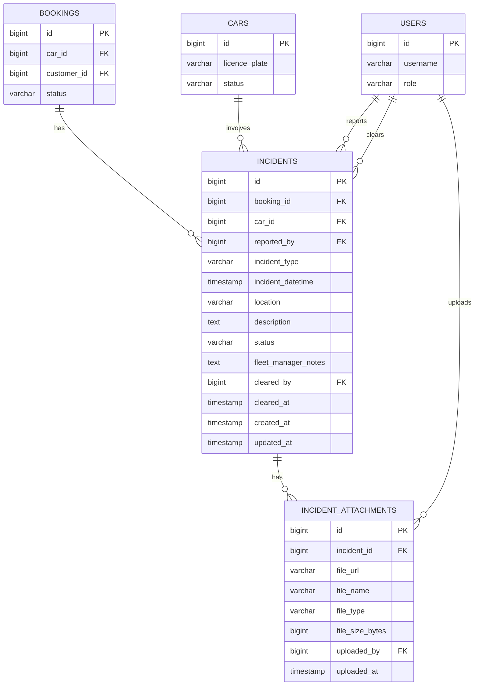

# Database Design – Record Incidents During a Rental

## Entity Relationship Diagram

---

## Table Definitions

### `incidents`

Stores each incident record linked to an active booking and a car.

| Column | Type | Constraints | Description |
|---|---|---|---|
| `id` | BIGINT | PK, NOT NULL, auto-increment | Unique identifier |
| `booking_id` | BIGINT | FK → bookings.id, NOT NULL | The active booking during which the incident occurred |
| `car_id` | BIGINT | FK → cars.id, NOT NULL | The car involved in the incident |
| `reported_by` | BIGINT | FK → users.id, NOT NULL | The operations staff member who logged the incident |
| `incident_type` | VARCHAR(20) | NOT NULL | Incident category: `ACCIDENT`, `BREAKDOWN`, or `OTHER` |
| `incident_datetime` | TIMESTAMP | NOT NULL | Date and time when the incident occurred |
| `location` | VARCHAR(500) | NOT NULL | Free-text description of the incident location |
| `description` | TEXT | NOT NULL | Detailed narrative of what occurred |
| `status` | VARCHAR(30) | NOT NULL, default `OPEN` | Lifecycle state: `OPEN`, `UNDER_REVIEW`, or `CLEARED` |
| `fleet_manager_notes` | TEXT | NULL | Notes added by the fleet manager when reviewing or clearing the incident |
| `cleared_by` | BIGINT | FK → users.id, NULL | Fleet manager who cleared the incident |
| `cleared_at` | TIMESTAMP | NULL | Timestamp when the incident was cleared |
| `created_at` | TIMESTAMP | NOT NULL, default now() | Record creation timestamp |
| `updated_at` | TIMESTAMP | NOT NULL, default now() | Last update timestamp |

**Indexes:**
- `idx_incidents_booking_id` on `booking_id`
- `idx_incidents_car_id` on `car_id`
- `idx_incidents_status` on `status`

---

### `incident_attachments`

Stores references to photos or documents uploaded against an incident.

| Column | Type | Constraints | Description |
|---|---|---|---|
| `id` | BIGINT | PK, NOT NULL, auto-increment | Unique identifier |
| `incident_id` | BIGINT | FK → incidents.id, NOT NULL | The incident this file belongs to |
| `file_url` | VARCHAR(1000) | NOT NULL | URL or storage path of the uploaded file |
| `file_name` | VARCHAR(255) | NOT NULL | Original file name as uploaded |
| `file_type` | VARCHAR(10) | NOT NULL | MIME type extension: `jpg`, `png`, `pdf` |
| `file_size_bytes` | BIGINT | NOT NULL | Size of the file in bytes |
| `uploaded_by` | BIGINT | FK → users.id, NOT NULL | User who uploaded the file |
| `uploaded_at` | TIMESTAMP | NOT NULL, default now() | Upload timestamp |

**Indexes:**
- `idx_incident_attachments_incident_id` on `incident_id`

---

## Referenced Tables (pre-existing)

The `incidents` and `incident_attachments` tables reference the following pre-existing tables. No changes to these tables are required by this feature.

| Table | Referenced Column | Purpose |
|---|---|---|
| `bookings` | `id` | Links the incident to the active rental booking |
| `cars` | `id` | Links the incident to the specific vehicle |
| `users` | `id` | Identifies the reporter, attachment uploader, and clearing fleet manager |
