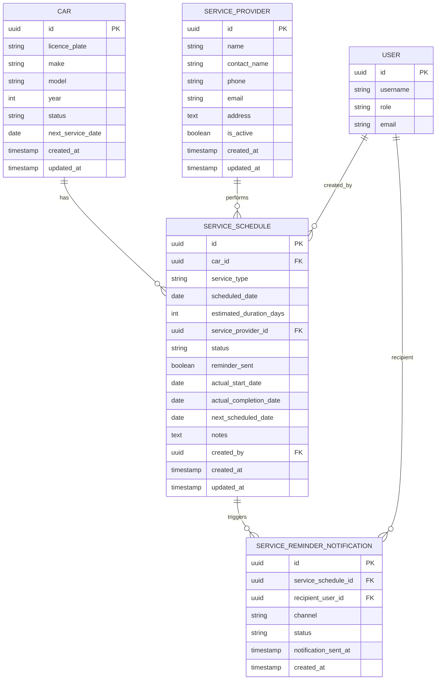

# Database Design – Car Management: Service and Maintenance Schedules

## Entity Relationship Diagram

---

## Table Descriptions

### `service_schedule`

Stores all service and maintenance records for each car.

| Column | Type | Nullable | Description |
|---|---|---|---|
| `id` | UUID | No | Primary key |
| `car_id` | UUID | No | Foreign key to `car.id` |
| `service_type` | ENUM | No | One of: `routine_service`, `tyre_change`, `inspection`, `oil_change`, `brake_service`, `other` |
| `scheduled_date` | DATE | No | The date the service is planned to begin |
| `estimated_duration_days` | INT | No | Number of days the car will be unavailable; must be ≥ 1 |
| `service_provider_id` | UUID | Yes | Foreign key to `service_provider.id`; nullable if provider not yet assigned |
| `status` | ENUM | No | One of: `scheduled`, `in_progress`, `completed`, `cancelled` |
| `actual_start_date` | DATE | Yes | Populated when service starts |
| `actual_completion_date` | DATE | Yes | Populated when fleet manager marks service as done |
| `next_scheduled_date` | DATE | Yes | The recalculated date for the next service of the same type |
| `notes` | TEXT | Yes | Free-text notes about the service |
| `reminder_sent` | BOOLEAN | No | Set to `true` once a 7-day reminder notification has been dispatched; defaults to `false`. Indexed to optimise the daily reminder job query. |
| `created_by` | UUID | No | Foreign key to `user.id`; the fleet manager who created the record |
| `created_at` | TIMESTAMP | No | Record creation timestamp |
| `updated_at` | TIMESTAMP | No | Record last-updated timestamp |

---

### `service_provider`

Stores information about external service and maintenance providers.

| Column | Type | Nullable | Description |
|---|---|---|---|
| `id` | UUID | No | Primary key |
| `name` | VARCHAR(255) | No | Name of the service provider |
| `contact_name` | VARCHAR(255) | Yes | Name of the primary contact person |
| `phone` | VARCHAR(30) | Yes | Contact phone number |
| `email` | VARCHAR(255) | Yes | Contact email address |
| `address` | TEXT | Yes | Physical address of the provider |
| `is_active` | BOOLEAN | No | Whether the provider is available for selection; defaults to `true` |
| `created_at` | TIMESTAMP | No | Record creation timestamp |
| `updated_at` | TIMESTAMP | No | Record last-updated timestamp |

---

### `service_reminder_notification`

Audit log of all reminder notifications sent for upcoming service schedules.

| Column | Type | Nullable | Description |
|---|---|---|---|
| `id` | UUID | No | Primary key |
| `service_schedule_id` | UUID | No | Foreign key to `service_schedule.id` |
| `recipient_user_id` | UUID | No | Foreign key to `user.id`; the fleet manager who received the notification |
| `channel` | ENUM | No | One of: `email`, `in_app` |
| `status` | ENUM | No | One of: `sent`, `failed` |
| `notification_sent_at` | TIMESTAMP | No | Timestamp when the notification was dispatched |
| `created_at` | TIMESTAMP | No | Record creation timestamp |

---

## Notes on Related Tables

- The **`car`** table (defined in the Car Management – General TRD) contains a `next_service_date` column and a `status` column (e.g., `available`, `in_service`). These fields are updated as a side-effect of service schedule operations.
- The **`user`** table is managed by the User Management module. This design references it via foreign keys only.
