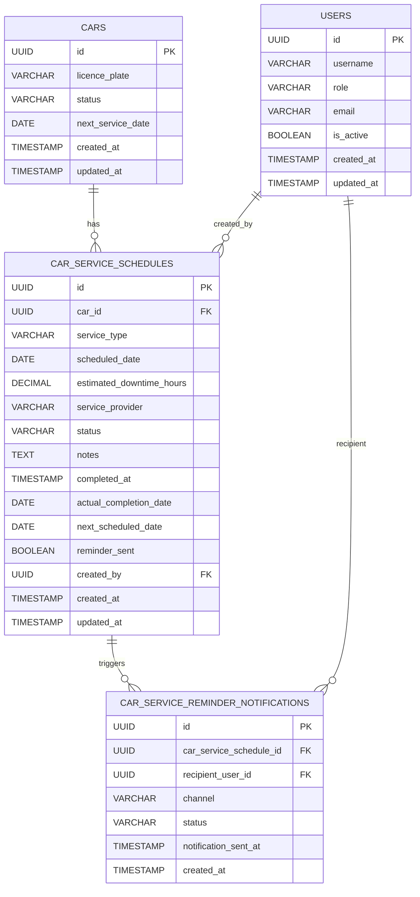

# Database Design – Car Management: Service and Maintenance Schedules

## Overview

This document describes the database design required to support **US-CM-04: Manage Service and Maintenance Schedules**.

> **Note:** The `cars`, `car_service_schedules`, `locations`, `users`, `customers`, `bookings`, `car_booking_assignments`, and `car_status_history` tables are part of the consolidated Car Management database design and are defined in:
> - 📄 [database-design-car-management.md](./database-design-car-management.md) — defines `cars` and `car_service_schedules`
> - 📄 [database-design-car-management-assign-car-to-booking.md](./database-design-car-management-assign-car-to-booking.md) — defines `locations`, `users`, `customers`, `bookings`, `car_booking_assignments`, `car_status_history`
>
> This document references those tables and documents the **additional columns** required on `car_service_schedules` for this feature, as well as the new `car_service_reminder_notifications` table.

---

## Entity Relationship Diagram

---

## Table Descriptions

### `cars` and `users`

These tables are defined in the consolidated Car Management database design:
📄 [database-design-car-management.md](./database-design-car-management.md)

Key points relevant to this feature:
- `cars.status` values used here: `available`, `in_service`, `unavailable`, `inactive`.
- `cars.next_service_date` is updated whenever a service schedule is created, completed, or cancelled.
- `cars.is_active` must be `TRUE` for a service schedule to be created against the car.
- `users.role` must be `fleet_manager` for a user to create or manage service schedules.

---

### `car_service_schedules`

The base table is defined in 📄 [database-design-car-management.md](./database-design-car-management.md). The following **additional columns** are required to support US-CM-04:

| Column | Type | Constraints | Description |
|---|---|---|---|
| `actual_completion_date` | DATE | | The date the service was actually completed; populated when fleet manager marks the record as done. |
| `next_scheduled_date` | DATE | | The recalculated date for the next service of the same type; optionally set when completing a schedule. |
| `reminder_sent` | BOOLEAN | NOT NULL, DEFAULT FALSE | Set to `TRUE` once the 7-day advance reminder notification has been dispatched. Indexed to optimise the daily reminder job query. |
| `created_by` | UUID | FK → `users.id`, NOT NULL | The fleet manager who created the schedule entry. |

Full column listing including columns from the consolidated design:

| Column | Type | Constraints | Description |
|---|---|---|---|
| `id` | UUID | PK, NOT NULL | Unique identifier |
| `car_id` | UUID | FK → `cars.id`, NOT NULL | The car this schedule belongs to |
| `service_type` | VARCHAR(100) | NOT NULL | Type of service (e.g., `routine service`, `tyre change`, `inspection`, `oil change`, `brake service`, `other`) |
| `scheduled_date` | DATE | NOT NULL | Date on which the service is planned to begin |
| `estimated_downtime_hours` | DECIMAL(5,2) | | Estimated hours the car will be unavailable |
| `service_provider` | VARCHAR(255) | | Name of the service provider or workshop (free text) |
| `status` | VARCHAR(20) | NOT NULL | One of: `scheduled`, `in_progress`, `completed`, `cancelled` |
| `notes` | TEXT | | Additional notes or instructions |
| `completed_at` | TIMESTAMP | | Timestamp when the service was marked complete (from consolidated design) |
| `actual_completion_date` | DATE | | *(US-CM-04 addition)* The date the service was actually completed |
| `next_scheduled_date` | DATE | | *(US-CM-04 addition)* Recalculated next service date of the same type |
| `reminder_sent` | BOOLEAN | NOT NULL, DEFAULT FALSE | *(US-CM-04 addition)* Whether the 7-day reminder has been sent; indexed |
| `created_by` | UUID | FK → `users.id`, NOT NULL | *(US-CM-04 addition)* Fleet manager who created the entry |
| `created_at` | TIMESTAMP | NOT NULL | Record creation timestamp (UTC) |
| `updated_at` | TIMESTAMP | NOT NULL | Last update timestamp (UTC) |

---

### `car_service_reminder_notifications`

New table introduced by US-CM-04. Audit log of all reminder notifications dispatched for upcoming service schedules.

| Column | Type | Constraints | Description |
|---|---|---|---|
| `id` | UUID | PK, NOT NULL | Unique identifier |
| `car_service_schedule_id` | UUID | FK → `car_service_schedules.id`, NOT NULL | The service schedule that triggered this notification |
| `recipient_user_id` | UUID | FK → `users.id`, NOT NULL | The fleet manager who received the notification |
| `channel` | VARCHAR(20) | NOT NULL | Delivery channel: `email` or `in_app` |
| `status` | VARCHAR(20) | NOT NULL | Delivery outcome: `sent` or `failed` |
| `notification_sent_at` | TIMESTAMP | NOT NULL | When the notification was dispatched |
| `created_at` | TIMESTAMP | NOT NULL | Record creation timestamp (UTC) |
