# Database Design – Car Management (Consolidated)

This document is the single consolidated database design reference for the entire Car Management module. It merges table definitions introduced across all Car Management user stories (US-CM-01 through US-CM-08).

---

## Entity Relationship Diagram

```mermaid
erDiagram
    locations {
        uuid id PK
        varchar name
        text address
        varchar city
        varchar country
        varchar type
        timestamp created_at
        timestamp updated_at
    }

    cars {
        uuid id PK
        varchar licence_plate
        varchar make
        varchar model
        smallint year
        varchar colour
        varchar fuel_type
        smallint seating_capacity
        uuid location_id FK
        smallint condition_rating
        varchar status
        date next_service_date
        boolean is_active
        timestamp created_at
        timestamp updated_at
    }

    users {
        uuid id PK
        varchar username
        varchar full_name
        varchar email
        varchar role
        boolean is_active
        timestamp created_at
        timestamp updated_at
    }

    customers {
        uuid id PK
        varchar full_name
        varchar email
        varchar phone
        timestamp created_at
        timestamp updated_at
    }

    bookings {
        uuid id PK
        uuid customer_id FK
        uuid pickup_location_id FK
        uuid return_location_id FK
        date start_date
        date end_date
        varchar status
        timestamp created_at
        timestamp updated_at
    }

    car_booking_assignments {
        uuid id PK
        uuid booking_id FK
        uuid car_id FK
        uuid assigned_by FK
        timestamp assigned_at
        timestamp unassigned_at
        boolean is_current
        timestamp created_at
        timestamp updated_at
    }

    car_status_history {
        uuid id PK
        uuid car_id FK
        varchar previous_status
        varchar new_status
        uuid changed_by FK
        text reason
        timestamp changed_at
    }

    service_schedule {
        uuid id PK
        uuid car_id FK
        varchar service_type
        date scheduled_date
        int estimated_duration_days
        uuid service_provider_id FK
        varchar status
        boolean reminder_sent
        date actual_start_date
        date actual_completion_date
        date next_scheduled_date
        text notes
        uuid created_by FK
        timestamp created_at
        timestamp updated_at
    }

    service_provider {
        uuid id PK
        varchar name
        varchar contact_name
        varchar phone
        varchar email
        text address
        boolean is_active
        timestamp created_at
        timestamp updated_at
    }

    service_reminder_notification {
        uuid id PK
        uuid service_schedule_id FK
        uuid recipient_user_id FK
        varchar channel
        varchar status
        timestamp notification_sent_at
        timestamp created_at
    }

    pickup_record {
        uuid id PK
        uuid booking_id FK
        uuid car_id FK
        timestamp pickup_datetime
        varchar pickup_location
        varchar fuel_level
        int odometer_reading
        text condition_notes
        boolean damage_found
        uuid signature_id FK
        varchar status
        uuid created_by FK
        timestamp created_at
        timestamp confirmed_at
        uuid confirmed_by FK
    }

    pickup_photo {
        uuid id PK
        uuid pickup_record_id FK
        varchar storage_reference
        varchar file_name
        int file_size_bytes
        varchar mime_type
        timestamp uploaded_at
        uuid uploaded_by FK
    }

    pickup_signature {
        uuid id PK
        varchar storage_reference
        timestamp captured_at
        uuid captured_by FK
    }

    return_record {
        uuid id PK
        uuid booking_id FK
        uuid car_id FK
        timestamp return_datetime
        varchar return_location
        varchar fuel_level
        int odometer_reading
        text condition_notes
        boolean damage_found
        uuid damage_report_id FK
        uuid signature_id FK
        int preparation_period_minutes
        varchar status
        uuid created_by FK
        timestamp created_at
        timestamp confirmed_at
        uuid confirmed_by FK
    }

    return_photo {
        uuid id PK
        uuid return_record_id FK
        varchar storage_reference
        varchar file_name
        int file_size_bytes
        varchar mime_type
        timestamp uploaded_at
        uuid uploaded_by FK
    }

    return_signature {
        uuid id PK
        varchar storage_reference
        timestamp captured_at
        uuid captured_by FK
    }

    damage_report {
        uuid id PK
        uuid return_record_id FK
        uuid booking_id FK
        uuid car_id FK
        text description
        varchar review_status
        uuid reviewed_by FK
        timestamp reviewed_at
        text resolution_notes
        timestamp created_at
    }

    incidents {
        uuid id PK
        uuid booking_id FK
        uuid car_id FK
        uuid reported_by FK
        varchar incident_type
        timestamp incident_datetime
        varchar location
        text description
        varchar status
        text fleet_manager_notes
        uuid cleared_by FK
        timestamp cleared_at
        timestamp created_at
        timestamp updated_at
    }

    incident_attachments {
        uuid id PK
        uuid incident_id FK
        varchar file_url
        varchar file_name
        varchar file_type
        bigint file_size_bytes
        uuid uploaded_by FK
        timestamp uploaded_at
    }

    delivery_pickup_task {
        uuid id PK
        uuid booking_id FK
        varchar task_type
        varchar status
        timestamp scheduled_time
        timestamp completed_at
        uuid assigned_agent_id FK
        timestamp created_at
        timestamp updated_at
    }

    task_address {
        uuid id PK
        uuid task_id FK
        varchar address_line_1
        varchar address_line_2
        varchar city
        varchar state_province
        varchar postal_code
        varchar country
        decimal latitude
        decimal longitude
    }

    locations          ||--o{ cars                      : "current location"
    locations          ||--o{ bookings                  : "pickup location"
    locations          ||--o{ bookings                  : "return location"
    customers          ||--o{ bookings                  : "makes"
    bookings           ||--o{ car_booking_assignments   : "assigned via"
    cars               ||--o{ car_booking_assignments   : "assigned to"
    users              ||--o{ car_booking_assignments   : "assigned by"
    cars               ||--o{ car_status_history        : "tracks"
    users              ||--o{ car_status_history        : "changed by"
    cars               ||--o{ service_schedule          : "has"
    service_provider   ||--o{ service_schedule          : "performs"
    users              ||--o{ service_schedule          : "created by"
    service_schedule   ||--o{ service_reminder_notification : "triggers"
    users              ||--o{ service_reminder_notification : "recipient"
    bookings           ||--o| pickup_record             : "has"
    cars               ||--o{ pickup_record             : "picked up as"
    pickup_record      ||--o{ pickup_photo              : "has"
    pickup_record      ||--o| pickup_signature          : "has"
    users              ||--o{ pickup_record             : "created by"
    users              ||--o{ pickup_photo              : "uploaded by"
    users              ||--o{ pickup_signature          : "captured by"
    bookings           ||--o| return_record             : "has"
    cars               ||--o{ return_record             : "returned as"
    return_record      ||--o{ return_photo              : "has"
    return_record      ||--o| return_signature          : "has"
    return_record      ||--o| damage_report             : "triggers"
    users              ||--o{ return_record             : "created by"
    users              ||--o{ return_photo              : "uploaded by"
    users              ||--o{ return_signature          : "captured by"
    users              ||--o{ damage_report             : "reviewed by"
    bookings           ||--o{ incidents                 : "has"
    cars               ||--o{ incidents                 : "involves"
    users              ||--o{ incidents                 : "reported by"
    users              ||--o{ incidents                 : "cleared by"
    incidents          ||--o{ incident_attachments      : "has"
    users              ||--o{ incident_attachments      : "uploaded by"
    bookings           ||--o{ delivery_pickup_task      : "has"
    users              ||--o{ delivery_pickup_task      : "assigned to"
    delivery_pickup_task ||--|| task_address            : "located at"
```

---

## Table Definitions

### `locations`

Represents physical locations (depots, airports, etc.) used as car locations, booking pickup points, and booking return points.

| Column | Type | Constraints | Description |
|---|---|---|---|
| `id` | UUID | PK, NOT NULL | Unique identifier |
| `name` | VARCHAR(255) | NOT NULL | Human-readable name (e.g., "City Centre Depot") |
| `address` | TEXT | NOT NULL | Street address |
| `city` | VARCHAR(100) | NOT NULL | City |
| `country` | VARCHAR(100) | NOT NULL | Country |
| `type` | VARCHAR(30) | NOT NULL | Location type: `depot`, `airport`, `other` |
| `created_at` | TIMESTAMP WITH TIME ZONE | NOT NULL, DEFAULT NOW() | Record creation timestamp |
| `updated_at` | TIMESTAMP WITH TIME ZONE | NOT NULL, DEFAULT NOW() | Record last-update timestamp |

---

### `cars`

Stores the master record for each rental vehicle.

| Column | Type | Constraints | Description |
|---|---|---|---|
| `id` | UUID | PK, NOT NULL | Unique identifier |
| `licence_plate` | VARCHAR(20) | NOT NULL, UNIQUE | Vehicle registration / licence plate number |
| `make` | VARCHAR(100) | NOT NULL | Manufacturer (e.g., Toyota, Ford) |
| `model` | VARCHAR(100) | NOT NULL | Model name (e.g., Corolla, Focus) |
| `year` | SMALLINT | NOT NULL | Manufacturing year |
| `colour` | VARCHAR(50) | NOT NULL | Exterior colour |
| `fuel_type` | VARCHAR(20) | NOT NULL | Fuel type: `petrol`, `diesel`, `electric`, `hybrid` |
| `seating_capacity` | SMALLINT | NOT NULL | Number of passenger seats |
| `location_id` | UUID | FK → `locations.id`, NOT NULL | Current physical location of the car |
| `condition_rating` | SMALLINT | NOT NULL, CHECK BETWEEN 1 AND 5 | Condition score: 1 (poor) to 5 (excellent) |
| `status` | VARCHAR(30) | NOT NULL | See allowed values below |
| `next_service_date` | DATE | NULLABLE | Date of next scheduled service |
| `is_active` | BOOLEAN | NOT NULL, DEFAULT TRUE | Whether the car is in the active rental pool |
| `created_at` | TIMESTAMP WITH TIME ZONE | NOT NULL, DEFAULT NOW() | Record creation timestamp |
| `updated_at` | TIMESTAMP WITH TIME ZONE | NOT NULL, DEFAULT NOW() | Record last-update timestamp |

**Allowed values for `cars.status`:**

| Value | Meaning |
|---|---|
| `available` | Car is ready to be assigned to a booking |
| `reserved` | Car is assigned to a confirmed upcoming booking |
| `rented` | Car is currently with a customer on an active rental |
| `in_service` | Car is undergoing scheduled service or maintenance |
| `unavailable` | Car is unavailable (e.g., pending inspection, damage review, incident review) |

**Indexes:**
- `idx_cars_status` on `status`
- `idx_cars_licence_plate` on `licence_plate`
- `idx_cars_next_service_date` on `next_service_date`
- `idx_cars_is_active_status` on `(is_active, status)`
- `idx_cars_location_id` on `location_id`

---

### `users`

Represents internal system users (fleet managers, operations staff, field agents). Managed by the User Management module.

| Column | Type | Constraints | Description |
|---|---|---|---|
| `id` | UUID | PK, NOT NULL | Unique identifier |
| `username` | VARCHAR(100) | NOT NULL, UNIQUE | Login username |
| `full_name` | VARCHAR(255) | NOT NULL | Display name |
| `email` | VARCHAR(255) | NOT NULL, UNIQUE | Email address |
| `role` | VARCHAR(30) | NOT NULL | Role: `fleet_manager`, `operations_staff`, `field_agent` |
| `is_active` | BOOLEAN | NOT NULL, DEFAULT TRUE | Whether the user account is active |
| `created_at` | TIMESTAMP WITH TIME ZONE | NOT NULL, DEFAULT NOW() | Record creation timestamp |
| `updated_at` | TIMESTAMP WITH TIME ZONE | NOT NULL, DEFAULT NOW() | Record last-update timestamp |

---

### `customers`

Represents customers who make rental bookings. Managed by the Booking system.

| Column | Type | Constraints | Description |
|---|---|---|---|
| `id` | UUID | PK, NOT NULL | Unique identifier |
| `full_name` | VARCHAR(255) | NOT NULL | Customer's full name |
| `email` | VARCHAR(255) | NOT NULL, UNIQUE | Customer's email address |
| `phone` | VARCHAR(30) | NULLABLE | Customer's phone number |
| `created_at` | TIMESTAMP WITH TIME ZONE | NOT NULL, DEFAULT NOW() | Record creation timestamp |
| `updated_at` | TIMESTAMP WITH TIME ZONE | NOT NULL, DEFAULT NOW() | Record last-update timestamp |

---

### `bookings`

Represents confirmed rental bookings. Managed by the Booking system; referenced by all car management workflows.

| Column | Type | Constraints | Description |
|---|---|---|---|
| `id` | UUID | PK, NOT NULL | Unique identifier |
| `customer_id` | UUID | FK → `customers.id`, NOT NULL | The customer who made the booking |
| `pickup_location_id` | UUID | FK → `locations.id`, NULLABLE | Depot or location where the customer collects the car (null if delivery chosen) |
| `return_location_id` | UUID | FK → `locations.id`, NULLABLE | Depot or location where the customer returns the car (null if pickup at customer location chosen) |
| `start_date` | DATE | NOT NULL | Start date of the rental period |
| `end_date` | DATE | NOT NULL | End date of the rental period |
| `status` | VARCHAR(20) | NOT NULL | See allowed values below |
| `created_at` | TIMESTAMP WITH TIME ZONE | NOT NULL, DEFAULT NOW() | Record creation timestamp |
| `updated_at` | TIMESTAMP WITH TIME ZONE | NOT NULL, DEFAULT NOW() | Record last-update timestamp |

**Allowed values for `bookings.status`:**

| Value | Meaning |
|---|---|
| `confirmed` | Booking is confirmed; car not yet assigned |
| `reserved` | Car has been assigned to the booking |
| `active` | Rental is underway (car has been picked up) |
| `completed` | Rental has ended and car returned |
| `cancelled` | Booking was cancelled |

---

### `car_booking_assignments`

Records the assignment of a car to a booking. Only one assignment may be active per booking at any time.

| Column | Type | Constraints | Description |
|---|---|---|---|
| `id` | UUID | PK, NOT NULL | Unique identifier |
| `booking_id` | UUID | FK → `bookings.id`, NOT NULL | The booking the car is assigned to |
| `car_id` | UUID | FK → `cars.id`, NOT NULL | The car assigned |
| `assigned_by` | UUID | FK → `users.id`, NOT NULL | Operations staff member who made the assignment |
| `assigned_at` | TIMESTAMP WITH TIME ZONE | NOT NULL | When the assignment was created |
| `unassigned_at` | TIMESTAMP WITH TIME ZONE | NULLABLE | When the assignment was removed (NULL if still active) |
| `is_current` | BOOLEAN | NOT NULL, DEFAULT TRUE | TRUE if this is the active assignment; FALSE for historical records |
| `created_at` | TIMESTAMP WITH TIME ZONE | NOT NULL, DEFAULT NOW() | Record creation timestamp |
| `updated_at` | TIMESTAMP WITH TIME ZONE | NOT NULL, DEFAULT NOW() | Record last-update timestamp |

**Indexes & Constraints:**
- Partial unique index: `UNIQUE (booking_id) WHERE is_current = TRUE` — prevents more than one active assignment per booking
- Index on `(car_id, is_current)` — speeds up conflict-detection queries

---

### `car_status_history`

Audit trail of all car status changes.

| Column | Type | Constraints | Description |
|---|---|---|---|
| `id` | UUID | PK, NOT NULL | Unique identifier |
| `car_id` | UUID | FK → `cars.id`, NOT NULL | The car whose status changed |
| `previous_status` | VARCHAR(30) | NOT NULL | Status before the change |
| `new_status` | VARCHAR(30) | NOT NULL | Status after the change |
| `changed_by` | UUID | FK → `users.id`, NULLABLE | User who triggered the change (NULL if automated) |
| `reason` | TEXT | NULLABLE | Description of why the status changed |
| `changed_at` | TIMESTAMP WITH TIME ZONE | NOT NULL | When the change occurred |

**Indexes:**
- `idx_car_status_history_car_id` on `car_id`
- `idx_car_status_history_changed_at` on `changed_at`

---

### `service_schedule`

Stores all planned and completed service/maintenance records for each car. Consolidates the `car_service_schedules` and `service_schedule` definitions from earlier user stories.

| Column | Type | Constraints | Description |
|---|---|---|---|
| `id` | UUID | PK, NOT NULL | Unique identifier |
| `car_id` | UUID | FK → `cars.id`, NOT NULL | The car this schedule belongs to |
| `service_type` | VARCHAR(50) | NOT NULL | One of: `routine_service`, `tyre_change`, `inspection`, `oil_change`, `brake_service`, `other` |
| `scheduled_date` | DATE | NOT NULL | The date the service is planned to begin |
| `estimated_duration_days` | INT | NOT NULL, CHECK ≥ 1 | Number of days the car will be unavailable |
| `service_provider_id` | UUID | FK → `service_provider.id`, NULLABLE | The assigned service provider (nullable until assigned) |
| `status` | VARCHAR(20) | NOT NULL, DEFAULT `scheduled` | One of: `scheduled`, `in_progress`, `completed`, `cancelled` |
| `reminder_sent` | BOOLEAN | NOT NULL, DEFAULT FALSE | TRUE once a 7-day advance reminder has been dispatched |
| `actual_start_date` | DATE | NULLABLE | Populated when the service begins |
| `actual_completion_date` | DATE | NULLABLE | Populated when the service is marked complete |
| `next_scheduled_date` | DATE | NULLABLE | Recalculated date for the next service of the same type |
| `notes` | TEXT | NULLABLE | Free-text notes about the service |
| `created_by` | UUID | FK → `users.id`, NOT NULL | The fleet manager who created the record |
| `created_at` | TIMESTAMP WITH TIME ZONE | NOT NULL, DEFAULT NOW() | Record creation timestamp |
| `updated_at` | TIMESTAMP WITH TIME ZONE | NOT NULL, DEFAULT NOW() | Record last-update timestamp |

**Indexes:**
- `idx_service_schedule_car_id` on `car_id`
- `idx_service_schedule_scheduled_date` on `scheduled_date`
- `idx_service_schedule_status` on `status`
- `idx_service_schedule_reminder_sent` on `reminder_sent` — optimises the daily reminder job query

---

### `service_provider`

Stores information about external service and maintenance providers.

| Column | Type | Constraints | Description |
|---|---|---|---|
| `id` | UUID | PK, NOT NULL | Unique identifier |
| `name` | VARCHAR(255) | NOT NULL | Name of the service provider |
| `contact_name` | VARCHAR(255) | NULLABLE | Primary contact person |
| `phone` | VARCHAR(30) | NULLABLE | Contact phone number |
| `email` | VARCHAR(255) | NULLABLE | Contact email address |
| `address` | TEXT | NULLABLE | Physical address |
| `is_active` | BOOLEAN | NOT NULL, DEFAULT TRUE | Whether the provider is available for selection |
| `created_at` | TIMESTAMP WITH TIME ZONE | NOT NULL, DEFAULT NOW() | Record creation timestamp |
| `updated_at` | TIMESTAMP WITH TIME ZONE | NOT NULL, DEFAULT NOW() | Record last-update timestamp |

---

### `service_reminder_notification`

Audit log of all reminder notifications dispatched for upcoming service schedules.

| Column | Type | Constraints | Description |
|---|---|---|---|
| `id` | UUID | PK, NOT NULL | Unique identifier |
| `service_schedule_id` | UUID | FK → `service_schedule.id`, NOT NULL | The service schedule that triggered this reminder |
| `recipient_user_id` | UUID | FK → `users.id`, NOT NULL | The fleet manager who received the notification |
| `channel` | VARCHAR(20) | NOT NULL | Delivery channel: `email`, `in_app` |
| `status` | VARCHAR(10) | NOT NULL | Dispatch result: `sent`, `failed` |
| `notification_sent_at` | TIMESTAMP WITH TIME ZONE | NOT NULL | When the notification was dispatched |
| `created_at` | TIMESTAMP WITH TIME ZONE | NOT NULL, DEFAULT NOW() | Record creation timestamp |

**Indexes:**
- `idx_service_reminder_notification_schedule_id` on `service_schedule_id`

---

### `pickup_record`

Stores the structured data collected during a car pickup handover at the start of a rental.

| Column | Type | Constraints | Description |
|---|---|---|---|
| `id` | UUID | PK, NOT NULL | Unique identifier |
| `booking_id` | UUID | FK → `bookings.id`, NOT NULL, UNIQUE | The rental booking this pickup belongs to |
| `car_id` | UUID | FK → `cars.id`, NOT NULL | The car being handed over |
| `pickup_datetime` | TIMESTAMP WITH TIME ZONE | NOT NULL | Recorded date and time of pickup |
| `pickup_location` | VARCHAR(500) | NOT NULL | Address or location description of the pickup |
| `fuel_level` | VARCHAR(15) | NOT NULL | Fuel level at pickup: `empty`, `quarter`, `half`, `three_quarter`, `full` |
| `odometer_reading` | INTEGER | NOT NULL, CHECK ≥ 0 | Odometer reading (km) at time of pickup |
| `condition_notes` | TEXT | NULLABLE | Free-text notes on the car's condition |
| `damage_found` | BOOLEAN | NOT NULL, DEFAULT FALSE | Whether damage was recorded at pickup |
| `signature_id` | UUID | FK → `pickup_signature.id`, NULLABLE | Reference to the captured customer signature |
| `status` | VARCHAR(10) | NOT NULL, DEFAULT `draft` | Lifecycle status: `draft`, `confirmed` |
| `created_by` | UUID | FK → `users.id`, NOT NULL | User who initiated the pickup |
| `created_at` | TIMESTAMP WITH TIME ZONE | NOT NULL, DEFAULT NOW() | Record creation timestamp |
| `confirmed_at` | TIMESTAMP WITH TIME ZONE | NULLABLE | When the pickup was confirmed |
| `confirmed_by` | UUID | FK → `users.id`, NULLABLE | User who confirmed the pickup |

**Indexes:**
- `booking_id` (UNIQUE) — ensures at most one pickup record per booking
- `idx_pickup_record_car_id` on `car_id`
- `idx_pickup_record_status` on `status`

---

### `pickup_photo`

Stores references to photos uploaded during the pickup condition check.

| Column | Type | Constraints | Description |
|---|---|---|---|
| `id` | UUID | PK, NOT NULL | Unique identifier |
| `pickup_record_id` | UUID | FK → `pickup_record.id`, NOT NULL | The pickup record this photo belongs to |
| `storage_reference` | VARCHAR(1000) | NOT NULL | File storage path or URL |
| `file_name` | VARCHAR(255) | NOT NULL | Original filename at upload |
| `file_size_bytes` | INTEGER | NOT NULL, CHECK > 0 | File size in bytes |
| `mime_type` | VARCHAR(50) | NOT NULL | MIME type (e.g., `image/jpeg`, `image/png`) |
| `uploaded_at` | TIMESTAMP WITH TIME ZONE | NOT NULL, DEFAULT NOW() | Timestamp of upload |
| `uploaded_by` | UUID | FK → `users.id`, NOT NULL | User who uploaded the photo |

**Indexes:**
- `idx_pickup_photo_pickup_record_id` on `pickup_record_id`

---

### `pickup_signature`

Stores the customer's signature captured at the time of pickup handover.

| Column | Type | Constraints | Description |
|---|---|---|---|
| `id` | UUID | PK, NOT NULL | Unique identifier |
| `storage_reference` | VARCHAR(1000) | NOT NULL | File storage path or URL for the signature image |
| `captured_at` | TIMESTAMP WITH TIME ZONE | NOT NULL | When the signature was captured |
| `captured_by` | UUID | FK → `users.id`, NOT NULL | User who recorded the signature |

---

### `return_record`

Stores the structured data collected during a car return handover at the end of a rental.

| Column | Type | Constraints | Description |
|---|---|---|---|
| `id` | UUID | PK, NOT NULL | Unique identifier |
| `booking_id` | UUID | FK → `bookings.id`, NOT NULL, UNIQUE | The rental booking this return belongs to |
| `car_id` | UUID | FK → `cars.id`, NOT NULL | The car being returned |
| `return_datetime` | TIMESTAMP WITH TIME ZONE | NOT NULL | Recorded date and time of return |
| `return_location` | VARCHAR(500) | NOT NULL | Address or location description of the return |
| `fuel_level` | VARCHAR(15) | NOT NULL | Fuel level at return: `empty`, `quarter`, `half`, `three_quarter`, `full` |
| `odometer_reading` | INTEGER | NOT NULL, CHECK ≥ 0 | Odometer reading (km) at time of return |
| `condition_notes` | TEXT | NULLABLE | Free-text notes on the car's condition at return |
| `damage_found` | BOOLEAN | NOT NULL, DEFAULT FALSE | Whether damage was recorded during the return check |
| `damage_report_id` | UUID | FK → `damage_report.id`, NULLABLE | Reference to the damage report (if damage found) |
| `signature_id` | UUID | FK → `return_signature.id`, NULLABLE | Reference to the captured customer signature |
| `preparation_period_minutes` | INTEGER | NULLABLE, CHECK ≥ 0 | Optional cleaning/preparation hold before the car returns to `available` |
| `status` | VARCHAR(10) | NOT NULL, DEFAULT `draft` | Lifecycle status: `draft`, `confirmed` |
| `created_by` | UUID | FK → `users.id`, NOT NULL | User who initiated the return |
| `created_at` | TIMESTAMP WITH TIME ZONE | NOT NULL, DEFAULT NOW() | Record creation timestamp |
| `confirmed_at` | TIMESTAMP WITH TIME ZONE | NULLABLE | When the return was confirmed |
| `confirmed_by` | UUID | FK → `users.id`, NULLABLE | User who confirmed the return |

**Indexes:**
- `booking_id` (UNIQUE) — ensures at most one return record per booking
- `idx_return_record_car_id` on `car_id`
- `idx_return_record_status` on `status`
- `idx_return_record_damage_found` on `damage_found`

---

### `return_photo`

Stores references to photos uploaded during the return condition check.

| Column | Type | Constraints | Description |
|---|---|---|---|
| `id` | UUID | PK, NOT NULL | Unique identifier |
| `return_record_id` | UUID | FK → `return_record.id`, NOT NULL | The return record this photo belongs to |
| `storage_reference` | VARCHAR(1000) | NOT NULL | File storage path or URL |
| `file_name` | VARCHAR(255) | NOT NULL | Original filename at upload |
| `file_size_bytes` | INTEGER | NOT NULL, CHECK > 0 | File size in bytes |
| `mime_type` | VARCHAR(50) | NOT NULL | MIME type (e.g., `image/jpeg`, `image/png`) |
| `uploaded_at` | TIMESTAMP WITH TIME ZONE | NOT NULL, DEFAULT NOW() | Timestamp of upload |
| `uploaded_by` | UUID | FK → `users.id`, NOT NULL | User who uploaded the photo |

**Indexes:**
- `idx_return_photo_return_record_id` on `return_record_id`

---

### `return_signature`

Stores the customer's signature captured at the time of return handover.

| Column | Type | Constraints | Description |
|---|---|---|---|
| `id` | UUID | PK, NOT NULL | Unique identifier |
| `storage_reference` | VARCHAR(1000) | NOT NULL | File storage path or URL for the signature image |
| `captured_at` | TIMESTAMP WITH TIME ZONE | NOT NULL | When the signature was captured |
| `captured_by` | UUID | FK → `users.id`, NOT NULL | User who recorded the signature |

---

### `damage_report`

Records details of damage identified during a return check. Generated when `damage_found = TRUE` on a `return_record`.

| Column | Type | Constraints | Description |
|---|---|---|---|
| `id` | UUID | PK, NOT NULL | Unique identifier |
| `return_record_id` | UUID | FK → `return_record.id`, NOT NULL, UNIQUE | The return record that triggered this report |
| `booking_id` | UUID | FK → `bookings.id`, NOT NULL | The associated booking |
| `car_id` | UUID | FK → `cars.id`, NOT NULL | The car on which damage was found |
| `description` | TEXT | NOT NULL | Damage description provided by the field agent |
| `review_status` | VARCHAR(20) | NOT NULL, DEFAULT `pending` | Current review status: `pending`, `under_review`, `resolved` |
| `reviewed_by` | UUID | FK → `users.id`, NULLABLE | Fleet manager or staff member who reviewed the report |
| `reviewed_at` | TIMESTAMP WITH TIME ZONE | NULLABLE | When the review was completed |
| `resolution_notes` | TEXT | NULLABLE | Notes recorded when the damage report is resolved |
| `created_at` | TIMESTAMP WITH TIME ZONE | NOT NULL, DEFAULT NOW() | Record creation timestamp |

**Indexes:**
- `return_record_id` (UNIQUE) — ensures at most one damage report per return record
- `idx_damage_report_car_id` on `car_id`
- `idx_damage_report_booking_id` on `booking_id`
- `idx_damage_report_review_status` on `review_status`

---

### `incidents`

Stores each incident (accident, breakdown, or other event) that occurs during an active rental.

| Column | Type | Constraints | Description |
|---|---|---|---|
| `id` | UUID | PK, NOT NULL | Unique identifier |
| `booking_id` | UUID | FK → `bookings.id`, NOT NULL | The active booking during which the incident occurred |
| `car_id` | UUID | FK → `cars.id`, NOT NULL | The car involved in the incident |
| `reported_by` | UUID | FK → `users.id`, NOT NULL | The user who logged the incident |
| `incident_type` | VARCHAR(20) | NOT NULL | Incident category: `ACCIDENT`, `BREAKDOWN`, `OTHER` |
| `incident_datetime` | TIMESTAMP WITH TIME ZONE | NOT NULL | Date and time when the incident occurred |
| `location` | VARCHAR(500) | NOT NULL | Free-text description of the incident location |
| `description` | TEXT | NOT NULL | Detailed narrative of what occurred |
| `status` | VARCHAR(20) | NOT NULL, DEFAULT `OPEN` | Lifecycle state: `OPEN`, `UNDER_REVIEW`, `CLEARED` |
| `fleet_manager_notes` | TEXT | NULLABLE | Notes added by the fleet manager when reviewing or clearing |
| `cleared_by` | UUID | FK → `users.id`, NULLABLE | Fleet manager who cleared the incident |
| `cleared_at` | TIMESTAMP WITH TIME ZONE | NULLABLE | When the incident was cleared |
| `created_at` | TIMESTAMP WITH TIME ZONE | NOT NULL, DEFAULT NOW() | Record creation timestamp |
| `updated_at` | TIMESTAMP WITH TIME ZONE | NOT NULL, DEFAULT NOW() | Record last-update timestamp |

**Indexes:**
- `idx_incidents_booking_id` on `booking_id`
- `idx_incidents_car_id` on `car_id`
- `idx_incidents_status` on `status`

---

### `incident_attachments`

Stores references to photos or documents uploaded against an incident.

| Column | Type | Constraints | Description |
|---|---|---|---|
| `id` | UUID | PK, NOT NULL | Unique identifier |
| `incident_id` | UUID | FK → `incidents.id`, NOT NULL | The incident this file belongs to |
| `file_url` | VARCHAR(1000) | NOT NULL | URL or storage path of the uploaded file |
| `file_name` | VARCHAR(255) | NOT NULL | Original file name as uploaded |
| `file_type` | VARCHAR(10) | NOT NULL | File extension / MIME subtype: `jpg`, `png`, `pdf` |
| `file_size_bytes` | BIGINT | NOT NULL | Size of the file in bytes |
| `uploaded_by` | UUID | FK → `users.id`, NOT NULL | User who uploaded the file |
| `uploaded_at` | TIMESTAMP WITH TIME ZONE | NOT NULL, DEFAULT NOW() | Upload timestamp |

**Indexes:**
- `idx_incident_attachments_incident_id` on `incident_id`

---

### `delivery_pickup_task`

Represents a single delivery-to-customer or pickup-from-customer task linked to a booking.

| Column | Type | Constraints | Description |
|---|---|---|---|
| `id` | UUID | PK, NOT NULL | Unique identifier |
| `booking_id` | UUID | FK → `bookings.id`, NOT NULL | The booking this task belongs to |
| `task_type` | VARCHAR(10) | NOT NULL, CHECK IN (`DELIVERY`, `PICKUP`) | Whether this is a delivery to or a pickup from a customer-chosen location |
| `status` | VARCHAR(15) | NOT NULL, DEFAULT `PENDING` | See allowed values below |
| `scheduled_time` | TIMESTAMP WITH TIME ZONE | NOT NULL | When the delivery or pickup is scheduled to occur |
| `completed_at` | TIMESTAMP WITH TIME ZONE | NULLABLE | When the task was actually completed |
| `assigned_agent_id` | UUID | FK → `users.id`, NULLABLE | The field agent assigned to carry out this task |
| `created_at` | TIMESTAMP WITH TIME ZONE | NOT NULL, DEFAULT NOW() | Record creation timestamp |
| `updated_at` | TIMESTAMP WITH TIME ZONE | NOT NULL, DEFAULT NOW() | Record last-update timestamp |

**Allowed values for `delivery_pickup_task.status`:**

| Value | Meaning |
|---|---|
| `PENDING` | Task created but no agent assigned yet |
| `ASSIGNED` | A field agent has been assigned |
| `IN_PROGRESS` | Agent is actively executing the task |
| `COMPLETED` | Task has been completed |
| `CANCELLED` | Task was cancelled |

**Indexes:**
- `idx_delivery_pickup_task_booking_id` on `booking_id`
- `idx_delivery_pickup_task_status` on `status`
- `idx_delivery_pickup_task_assigned_agent_id` on `assigned_agent_id`
- Partial unique index: `UNIQUE (booking_id, task_type)` — ensures at most one DELIVERY and one PICKUP task per booking

---

### `task_address`

Holds the customer-specified address for a delivery or pickup task. Each task has exactly one address.

| Column | Type | Constraints | Description |
|---|---|---|---|
| `id` | UUID | PK, NOT NULL | Unique identifier |
| `task_id` | UUID | FK → `delivery_pickup_task.id`, NOT NULL, UNIQUE | The task this address belongs to (one address per task) |
| `address_line_1` | VARCHAR(255) | NOT NULL | Primary street address |
| `address_line_2` | VARCHAR(255) | NULLABLE | Secondary address information (apartment, suite, etc.) |
| `city` | VARCHAR(100) | NOT NULL | City |
| `state_province` | VARCHAR(100) | NULLABLE | State or province |
| `postal_code` | VARCHAR(20) | NOT NULL | Postal or ZIP code |
| `country` | VARCHAR(100) | NOT NULL | Country |
| `latitude` | DECIMAL(9,6) | NULLABLE | Geographical latitude (reserved for future map integration) |
| `longitude` | DECIMAL(10,6) | NULLABLE | Geographical longitude (reserved for future map integration) |
