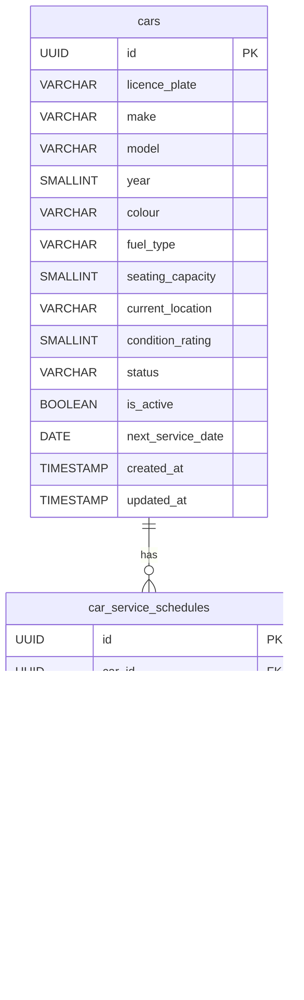

# Database Design – Car Management

## Tables

### `cars`

Stores the master record for each rental vehicle.

| Column | Type | Constraints | Description |
|---|---|---|---|
| `id` | UUID | PK, NOT NULL | Unique identifier for the car |
| `licence_plate` | VARCHAR(20) | NOT NULL, UNIQUE | Vehicle licence plate number |
| `make` | VARCHAR(100) | NOT NULL | Manufacturer (e.g., Toyota, Ford) |
| `model` | VARCHAR(100) | NOT NULL | Model name (e.g., Corolla, Focus) |
| `year` | SMALLINT | NOT NULL | Year of manufacture |
| `colour` | VARCHAR(50) | NOT NULL | Exterior colour of the vehicle |
| `fuel_type` | VARCHAR(20) | NOT NULL | Fuel type: `petrol`, `diesel`, `electric`, `hybrid` |
| `seating_capacity` | SMALLINT | NOT NULL | Number of seats including driver |
| `current_location` | VARCHAR(255) | NOT NULL | Descriptive location or depot reference |
| `condition_rating` | SMALLINT | NOT NULL | Condition score from 1 (poor) to 10 (excellent) |
| `status` | VARCHAR(30) | NOT NULL | One of: `available`, `reserved`, `rented`, `in_service`, `unavailable`, `inactive` |
| `is_active` | BOOLEAN | NOT NULL, DEFAULT TRUE | Whether the car is in the active rental pool |
| `next_service_date` | DATE | | Date of the next scheduled service; derived from `car_service_schedules` or set manually |
| `created_at` | TIMESTAMP | NOT NULL | Record creation timestamp (UTC) |
| `updated_at` | TIMESTAMP | NOT NULL | Last update timestamp (UTC) |

---

### `car_service_schedules`

Stores planned and historical service/maintenance entries per vehicle.

| Column | Type | Constraints | Description |
|---|---|---|---|
| `id` | UUID | PK, NOT NULL | Unique identifier for the schedule entry |
| `car_id` | UUID | FK → `cars.id`, NOT NULL | The car this schedule belongs to |
| `service_type` | VARCHAR(100) | NOT NULL | Type of service (e.g., routine service, tyre change, inspection) |
| `scheduled_date` | DATE | NOT NULL | Date on which the service is planned |
| `estimated_downtime_hours` | DECIMAL(5,2) | | Estimated hours the car will be unavailable |
| `service_provider` | VARCHAR(255) | | Name of the service provider or workshop |
| `status` | VARCHAR(20) | NOT NULL | `scheduled`, `in_progress`, `completed`, `cancelled` |
| `notes` | TEXT | | Additional notes or instructions |
| `completed_at` | TIMESTAMP | | Timestamp when the service was marked complete |
| `created_at` | TIMESTAMP | NOT NULL | Record creation timestamp (UTC) |
| `updated_at` | TIMESTAMP | NOT NULL | Last update timestamp (UTC) |

---

## Entity Relationship Diagram

