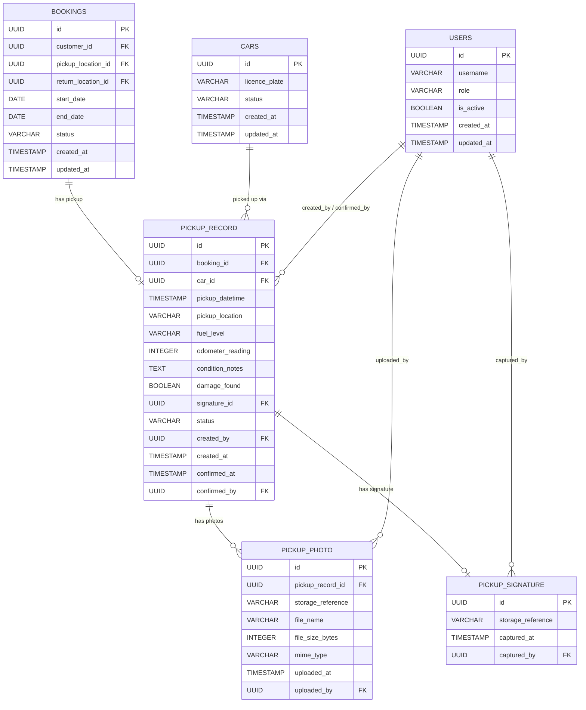

# Database Design – Car Pickup Logistics

## Overview

This document describes the database tables required to support **US-CM-05: Manage Car Pickup Logistics**.

> **Note:** The `cars`, `locations`, `users`, `customers`, `bookings`, `car_booking_assignments`, `car_status_history`, `car_service_reminder_notifications`, and `car_service_schedules` tables are part of the consolidated Car Management database design and are defined in:
> - 📄 [database-design-car-management.md](./database-design-car-management.md) — defines `cars` and `car_service_schedules`
> - 📄 [database-design-car-management-assign-car-to-booking.md](./database-design-car-management-assign-car-to-booking.md) — defines `locations`, `users`, `customers`, `bookings`, `car_booking_assignments`, `car_status_history`
> - 📄 [database-design-car-management-service-maintenance.md](./database-design-car-management-service-maintenance.md) — defines `car_service_reminder_notifications` and additional columns on `car_service_schedules`
>
> This document references those tables but does not redefine them. It introduces only the three new tables specific to the pickup workflow: `pickup_record`, `pickup_photo`, and `pickup_signature`.

---

## Entity Relationship Diagram

---

## Table Descriptions

### `cars`, `bookings`, and `users`

These tables are defined in the consolidated Car Management database design:
- 📄 [database-design-car-management.md](./database-design-car-management.md) — `cars`
- 📄 [database-design-car-management-assign-car-to-booking.md](./database-design-car-management-assign-car-to-booking.md) — `bookings`, `users`

Key points relevant to this feature:
- `cars.status` is updated to `rented` when a pickup is confirmed.
- `bookings.status` is updated to `active` when a pickup is confirmed. The booking must have status `assigned` (i.e., a car has been assigned via `car_booking_assignments`) before a pickup can be initiated.
- `users.role` must be `operations_staff` or `field_agent` to initiate or confirm a pickup record.

---

## New Tables

### `pickup_record`

Stores the structured data collected during a car pickup handover for a rental booking.

| Column | Type | Constraints | Description |
|---|---|---|---|
| `id` | UUID | PK, NOT NULL | Unique identifier for the pickup record |
| `booking_id` | UUID | FK → `bookings.id`, NOT NULL, UNIQUE | The rental booking this pickup is for |
| `car_id` | UUID | FK → `cars.id`, NOT NULL | The car being handed over |
| `pickup_datetime` | TIMESTAMP WITH TIME ZONE | NOT NULL | Recorded date and time of pickup |
| `pickup_location` | VARCHAR(500) | NOT NULL | Address or location description of the pickup |
| `fuel_level` | ENUM(`empty`, `quarter`, `half`, `three_quarter`, `full`) | NOT NULL | Fuel level at time of pickup |
| `odometer_reading` | INTEGER | NOT NULL, CHECK ≥ 0 | Odometer reading (km) at time of pickup |
| `condition_notes` | TEXT | NULLABLE | Free-text notes on the car's condition |
| `damage_found` | BOOLEAN | NOT NULL, DEFAULT FALSE | Whether damage was recorded at pickup |
| `signature_id` | UUID | FK → `pickup_signature.id`, NULLABLE | Reference to the captured customer signature |
| `status` | ENUM(`draft`, `confirmed`) | NOT NULL, DEFAULT `draft` | Lifecycle status of the pickup record |
| `created_by` | UUID | FK → `users.id`, NOT NULL | User who initiated the pickup |
| `created_at` | TIMESTAMP WITH TIME ZONE | NOT NULL, DEFAULT NOW() | Record creation timestamp |
| `confirmed_at` | TIMESTAMP WITH TIME ZONE | NULLABLE | Timestamp when the pickup was confirmed |
| `confirmed_by` | UUID | FK → `users.id`, NULLABLE | User who confirmed the pickup |

**Indexes:**
- `booking_id` (UNIQUE) — ensures at most one pickup record per booking
- `car_id` — supports queries for a car's pickup history
- `status` — supports filtering by draft/confirmed records

---

### `pickup_photo`

Stores references to photos uploaded as part of the pickup condition check. One pickup record may have many photos.

| Column | Type | Constraints | Description |
|---|---|---|---|
| `id` | UUID | PK, NOT NULL | Unique identifier for the photo |
| `pickup_record_id` | UUID | FK → `pickup_record.id`, NOT NULL | The pickup record this photo belongs to |
| `storage_reference` | VARCHAR(1000) | NOT NULL | File storage path or URL for the photo |
| `file_name` | VARCHAR(255) | NOT NULL | Original filename at time of upload |
| `file_size_bytes` | INTEGER | NOT NULL, CHECK > 0 | File size in bytes |
| `mime_type` | VARCHAR(50) | NOT NULL | MIME type (e.g., `image/jpeg`, `image/png`) |
| `uploaded_at` | TIMESTAMP WITH TIME ZONE | NOT NULL, DEFAULT NOW() | Timestamp of upload |
| `uploaded_by` | UUID | FK → `users.id`, NOT NULL | User who uploaded the photo |

**Indexes:**
- `pickup_record_id` — supports fetching all photos for a given pickup record

---

### `pickup_signature`

Stores a reference to the customer's digital or scanned signature captured at the time of handover.

| Column | Type | Constraints | Description |
|---|---|---|---|
| `id` | UUID | PK, NOT NULL | Unique identifier for the signature |
| `storage_reference` | VARCHAR(1000) | NOT NULL | File storage path or URL for the signature image |
| `captured_at` | TIMESTAMP WITH TIME ZONE | NOT NULL | Timestamp when the signature was captured |
| `captured_by` | UUID | FK → `users.id`, NOT NULL | User who recorded the signature |

**Indexes:**
- None beyond the primary key; referenced by `pickup_record.signature_id`

---

## Relationships

| Relationship | Cardinality | Description |
|---|---|---|
| `bookings` → `pickup_record` | 1 : 0..1 | A booking may have at most one pickup record |
| `cars` → `pickup_record` | 1 : 0..N | A car may appear in multiple pickup records over time |
| `pickup_record` → `pickup_photo` | 1 : 0..N | A pickup record may have zero or more photos while in draft; at least one photo is required before it can be confirmed |
| `pickup_record` → `pickup_signature` | 1 : 0..1 | A pickup record has no signature while in draft; exactly one signature is required before it can be confirmed |
| `users` → `pickup_record` | 1 : 0..N | A user may create or confirm many pickup records |
| `users` → `pickup_photo` | 1 : 0..N | A user may upload many photos |
| `users` → `pickup_signature` | 1 : 0..N | A user may capture many signatures |
