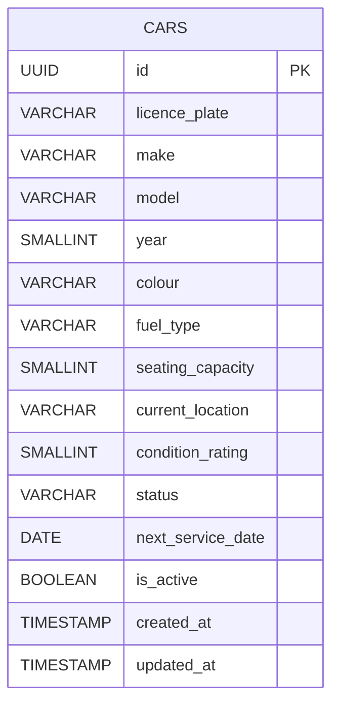

# Database Design - View Car Inventory

## Entity: `cars`

This table stores all rental vehicles managed by the fleet.

| Column | Type | Constraints | Description |
|---|---|---|---|
| `id` | UUID | PRIMARY KEY, NOT NULL | Unique identifier for the car record |
| `licence_plate` | VARCHAR(20) | UNIQUE, NOT NULL | The car's registration / licence plate number |
| `make` | VARCHAR(100) | NOT NULL | Manufacturer of the car (e.g., Toyota, Ford) |
| `model` | VARCHAR(100) | NOT NULL | Model name of the car (e.g., Corolla, Focus) |
| `year` | SMALLINT | NOT NULL | Manufacturing year of the car |
| `colour` | VARCHAR(50) | NOT NULL | Exterior colour of the car |
| `fuel_type` | VARCHAR(30) | NOT NULL | Fuel type (e.g., Petrol, Diesel, Electric, Hybrid) |
| `seating_capacity` | SMALLINT | NOT NULL | Number of passenger seats |
| `current_location` | VARCHAR(255) | NOT NULL | Human-readable description or name of the car's current location |
| `condition_rating` | SMALLINT | NOT NULL | Condition score from 1 (poor) to 5 (excellent) |
| `status` | VARCHAR(30) | NOT NULL | Current availability status — see allowed values below |
| `next_service_date` | DATE | NULLABLE | Date of the next scheduled service or maintenance |
| `is_active` | BOOLEAN | NOT NULL, DEFAULT TRUE | Whether the car is active in the rental pool |
| `created_at` | TIMESTAMP | NOT NULL, DEFAULT NOW() | Record creation timestamp |
| `updated_at` | TIMESTAMP | NOT NULL, DEFAULT NOW() | Record last-updated timestamp |

### Allowed Values for `status`

| Value | Meaning |
|---|---|
| `available` | Car is available and ready to be assigned to a booking |
| `reserved` | Car is assigned to a confirmed upcoming booking |
| `rented` | Car is currently with a customer on an active rental |
| `in_service` | Car is undergoing scheduled service or maintenance |
| `unavailable` | Car is unavailable for other reasons (e.g., inspection pending, damage review) |

### Indexes

| Index Name | Columns | Purpose |
|---|---|---|
| `idx_cars_status` | `status` | Support fast filtering of inventory by availability status |
| `idx_cars_licence_plate` | `licence_plate` | Support fast lookup by licence plate |
| `idx_cars_next_service_date` | `next_service_date` | Support upcoming-service queries and reminders |
| `idx_cars_is_active_status` | `is_active`, `status` | Support combined active + status filter used by the inventory list API |

---

## Entity Relationship Diagram

> **Note:** This diagram covers only the `cars` entity as required by US-CM-01 (View Car Inventory). Related entities such as `bookings`, `service_schedules`, and `incidents` will be defined in the TRDs for their respective user stories (US-CM-02 through US-CM-09).
