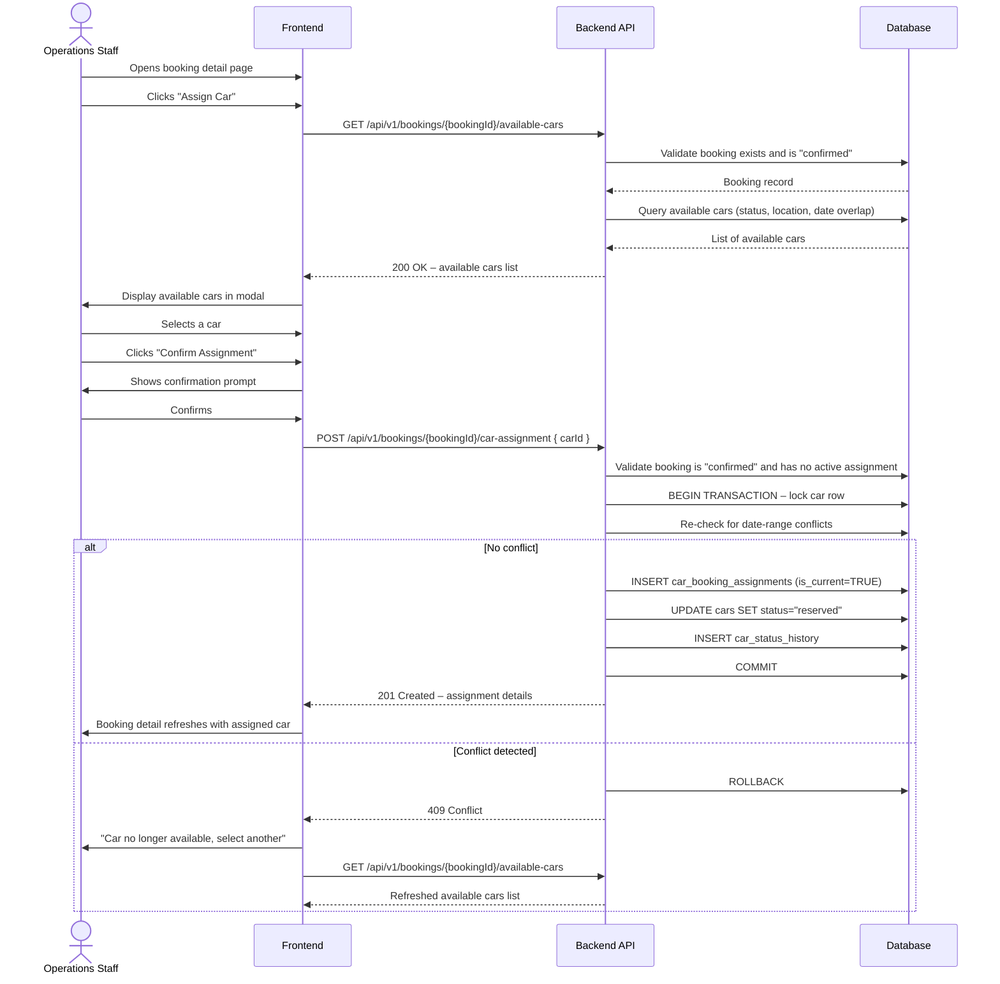
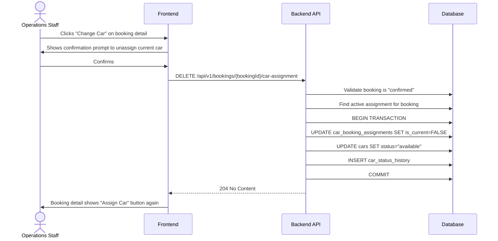

# TRD - Assign Car to Rental Booking

## Document Information

| Field            | Details                                      |
|------------------|----------------------------------------------|
| **Feature Name** | Assign Car to Rental Booking (US-CM-03)      |
| **Author**       | Copilot                                      |
| **Date**         |                                              |
| **Version**      |                                              |

---

## Table of Contents

1. [Background](#background)
2. [In Scope](#in-scope)
3. [Constraints](#constraints)
4. [Technical Requirements](#technical-requirements)
   - [Database Design](#database-design)
   - [Frontend](#frontend)
   - [Backend](#backend)
5. [Security Requirements](#security-requirements)
6. [Non-Functional Requirements](#non-functional-requirements)

---

## Background

This TRD implements the functional requirement **US-CM-03: Assign Car to Rental Booking** defined in the [Car Management PRD](../prd/prd-car-management.md#us-cm-03-assign-car-to-rental-booking).

The requirement allows operations staff to assign an available car to a confirmed rental booking. The system must filter cars to only those that are available for the full rental period at the required pickup location. Once assigned, the car's status must change to `reserved` and must no longer appear as available for any overlapping date range.

---

## In Scope

- Retrieving the list of cars that are eligible for assignment to a specific booking (filtered by availability status, rental period, and pickup location).
- Creating a car-to-booking assignment record.
- Updating the assigned car's status to `reserved`.
- Preventing duplicate or conflicting assignments by detecting date-range overlaps at the point of assignment.
- Returning an error response when an assignment conflict is detected.
- Removing (unassigning) a car from a booking to allow reassignment.
- Recording a status-change audit entry whenever a car's status is changed as a result of an assignment or unassignment action.
- Role-based access control: only users with the `operations_staff` role may create or remove assignments.

---

## Constraints

- The booking record is owned and managed by the Booking system. This TRD does not cover creating or modifying bookings themselves.
- User authentication and role management are out of scope; they are handled by the User Management system.
- Service and maintenance schedules that block a car's availability are managed by US-CM-04 and are not defined in this TRD. However, the availability query defined here must respect any blocking intervals produced by that feature.
- Real-time GPS location tracking is out of scope (v1 constraint from the PRD). Car location is a manually maintained field.
- Mobile-optimised or native mobile interfaces are out of scope for v1.
- Notification or alerting of the assignment outcome (e.g., email to the customer) is out of scope for this TRD.
- Bulk assignment of cars to multiple bookings in a single operation is out of scope.

---

## Technical Requirements

### Database Design

The tables required for this feature are defined and documented in:

📄 [database-design-car-management-assign-car-to-booking.md](./database-design-car-management-assign-car-to-booking.md)

Key tables involved:

| Table                      | Role in this feature                                                                  |
|----------------------------|---------------------------------------------------------------------------------------|
| `cars`                     | Source of available vehicles; status is updated on assignment/unassignment            |
| `bookings`                 | The booking a car is assigned to; provides rental period and pickup location          |
| `car_booking_assignments`  | Records the assignment relationship between a car and a booking                       |
| `car_status_history`       | Audit trail of car status changes triggered by assignment and unassignment actions    |
| `locations`                | Used to match car current location with booking pickup location                       |
| `users`                    | Records which operations staff member performed the assignment                        |
| `customers`                | Links bookings to customer information; owned by the Booking system                  |

---

### Frontend

- The Assign Car functionality must be embedded within the booking detail view and must not require navigation to a separate page.
- An **"Assign Car"** button must be shown on the booking detail page only when the booking status is `confirmed` and no car is currently assigned.
- Clicking **"Assign Car"** opens a modal or inline panel that lists available cars fetched from the backend. Each list item must display: licence plate, make/model/year, colour, fuel type, seating capacity, and condition rating.
- While the available-car list is loading, a loading indicator must be displayed.
- If no cars are available, the modal must display a clear message (e.g., "No cars are available for this booking period and location.") instead of an empty list.
- The staff member must select exactly one car from the list before the **"Confirm Assignment"** button becomes active.
- Before the assignment is submitted, a confirmation prompt must be displayed showing the selected car's details and the booking period.
- On successful assignment, the booking detail view must refresh to display the assigned car's details (licence plate, make/model/year) and the **"Assign Car"** button must be replaced by a **"Change Car"** button.
- If the backend returns a conflict error (HTTP 409), an inline error message must be displayed: "This car is no longer available. Please select another car." The car list must be refreshed automatically.
- If a generic error occurs, a dismissible error banner must be shown at the top of the modal.
- An **"Unassign Car"** action must be available when a car is already assigned to the booking and the booking status is still `confirmed`. The action must require a confirmation prompt before proceeding.
- All form validation must be performed on the client side before the API call is made. Field-level error messages must be displayed inline.
- The UI must follow the application's standard responsive layout. No mobile-specific breakpoints are required for v1.

---

### Backend

#### REST API Specification

All endpoints are prefixed with `/api/v1`. All requests and responses use `application/json`. All endpoints require a valid JWT in the `Authorization: Bearer <token>` header.

---

##### 1. List Available Cars for a Booking

Retrieve the cars that can be assigned to the specified booking. Only cars that are `available`, are located at the booking's pickup location, are active (`is_active = true`), and have no conflicting assignment or service block for the booking's `start_date`–`end_date` range are returned.

| Attribute       | Value                                        |
|-----------------|----------------------------------------------|
| **Method**      | GET                                          |
| **URL**         | `/api/v1/bookings/{bookingId}/available-cars` |
| **Auth**        | Required – `operations_staff` role           |

**Path Parameters**

| Parameter   | Type   | Required | Description                        |
|-------------|--------|----------|------------------------------------|
| `bookingId` | UUID   | Yes      | Unique identifier of the booking   |

**Response Body – 200 OK**

```json
{
  "bookingId": "uuid",
  "availableCars": [
    {
      "id": "uuid",
      "licencePlate": "string",
      "make": "string",
      "model": "string",
      "year": 0,
      "colour": "string",
      "fuelType": "string",
      "seatingCapacity": 0,
      "conditionRating": 0,
      "locationId": "uuid",
      "locationName": "string"
    }
  ]
}
```

**Error Responses**

| HTTP Status | Condition                                           |
|-------------|-----------------------------------------------------|
| 401         | Missing or invalid JWT                              |
| 403         | Authenticated user does not have `operations_staff` role |
| 404         | Booking not found                                   |
| 422         | Booking is not in `confirmed` status                |

---

##### 2. Assign a Car to a Booking

Assign the specified car to the booking. The backend must re-validate availability atomically to prevent race conditions.

| Attribute       | Value                                              |
|-----------------|----------------------------------------------------|
| **Method**      | POST                                               |
| **URL**         | `/api/v1/bookings/{bookingId}/car-assignment`       |
| **Auth**        | Required – `operations_staff` role                 |

**Path Parameters**

| Parameter   | Type   | Required | Description                        |
|-------------|--------|----------|------------------------------------|
| `bookingId` | UUID   | Yes      | Unique identifier of the booking   |

**Request Body**

```json
{
  "carId": "uuid"
}
```

| Field   | Type | Required | Validation                          |
|---------|------|----------|-------------------------------------|
| `carId` | UUID | Yes      | Must be a valid UUID; must not be blank |

**Response Body – 201 Created**

```json
{
  "assignmentId": "uuid",
  "bookingId": "uuid",
  "car": {
    "id": "uuid",
    "licencePlate": "string",
    "make": "string",
    "model": "string",
    "year": 0
  },
  "assignedBy": "uuid",
  "assignedAt": "ISO-8601 timestamp"
}
```

**Error Responses**

| HTTP Status | Condition                                                                      |
|-------------|--------------------------------------------------------------------------------|
| 400         | `carId` is missing or not a valid UUID                                         |
| 401         | Missing or invalid JWT                                                         |
| 403         | Authenticated user does not have `operations_staff` role                       |
| 404         | Booking or car not found                                                       |
| 409         | The car is no longer available for the booking period (conflict detected)      |
| 422         | Booking is not in `confirmed` status, or an active assignment already exists   |

---

##### 3. Get Current Car Assignment for a Booking

Retrieve the active car assignment for a booking.

| Attribute       | Value                                              |
|-----------------|----------------------------------------------------|
| **Method**      | GET                                                |
| **URL**         | `/api/v1/bookings/{bookingId}/car-assignment`       |
| **Auth**        | Required – `operations_staff` role                 |

**Path Parameters**

| Parameter   | Type   | Required | Description                        |
|-------------|--------|----------|------------------------------------|
| `bookingId` | UUID   | Yes      | Unique identifier of the booking   |

**Response Body – 200 OK**

```json
{
  "assignmentId": "uuid",
  "bookingId": "uuid",
  "car": {
    "id": "uuid",
    "licencePlate": "string",
    "make": "string",
    "model": "string",
    "year": 0
  },
  "assignedBy": "uuid",
  "assignedAt": "ISO-8601 timestamp"
}
```

**Error Responses**

| HTTP Status | Condition                                               |
|-------------|---------------------------------------------------------|
| 401         | Missing or invalid JWT                                  |
| 403         | Authenticated user does not have `operations_staff` role |
| 404         | Booking not found, or no active assignment exists       |

---

##### 4. Remove (Unassign) a Car from a Booking

Remove the active car assignment from a booking. The car's status reverts to `available`.

| Attribute       | Value                                              |
|-----------------|----------------------------------------------------|
| **Method**      | DELETE                                             |
| **URL**         | `/api/v1/bookings/{bookingId}/car-assignment`       |
| **Auth**        | Required – `operations_staff` role                 |

**Path Parameters**

| Parameter   | Type   | Required | Description                        |
|-------------|--------|----------|------------------------------------|
| `bookingId` | UUID   | Yes      | Unique identifier of the booking   |

**Response – 204 No Content**

No response body.

**Error Responses**

| HTTP Status | Condition                                                                     |
|-------------|-------------------------------------------------------------------------------|
| 401         | Missing or invalid JWT                                                        |
| 403         | Authenticated user does not have `operations_staff` role                      |
| 404         | Booking not found, or no active assignment exists to remove                   |
| 422         | Booking is not in `confirmed` status (car cannot be unassigned after activation) |

---

#### Validation Rules

| Field      | Rule                                                                        |
|------------|-----------------------------------------------------------------------------|
| `bookingId`| Must be a valid UUID v4; must reference an existing booking                 |
| `carId`    | Must be a valid UUID v4; must reference an existing, active car             |

---

#### API Logic – Pseudocode and Sequence Diagrams

##### List Available Cars Algorithm

```
FUNCTION getAvailableCarsForBooking(bookingId, requestingUserId):

  booking = findBookingById(bookingId)
  IF booking IS NULL THEN RETURN 404

  IF booking.status != "confirmed" THEN RETURN 422

  user = findUserById(requestingUserId)
  IF user.role != "operations_staff" THEN RETURN 403

  availableCars = queryDatabase(
    SELECT cars
    WHERE cars.is_active = TRUE
      AND cars.status = "available"
      AND cars.location_id = booking.pickup_location_id
      AND NOT EXISTS (
        SELECT 1 FROM car_booking_assignments cba
        JOIN bookings b ON b.id = cba.booking_id
        WHERE cba.car_id = cars.id
          AND cba.is_current = TRUE
          AND b.start_date < booking.end_date
          AND b.end_date > booking.start_date
      )
      AND NOT EXISTS (
        /* Exclude cars blocked by service schedules during the booking period.
           The service_schedules table is defined by US-CM-04 (Manage Service and
           Maintenance Schedules) and is referenced here for completeness. */
        SELECT 1 FROM service_schedules ss
        WHERE ss.car_id = cars.id
          AND ss.scheduled_start < booking.end_date
          AND ss.scheduled_end > booking.start_date
      )
  )

  RETURN 200, { bookingId, availableCars }
```

---

##### Assign Car Algorithm

```
FUNCTION assignCarToBooking(bookingId, carId, requestingUserId):

  booking = findBookingById(bookingId)
  IF booking IS NULL THEN RETURN 404

  IF booking.status != "confirmed" THEN RETURN 422

  existingAssignment = findActiveAssignment(bookingId)
  IF existingAssignment IS NOT NULL THEN RETURN 422

  car = findCarById(carId)
  IF car IS NULL OR car.is_active = FALSE THEN RETURN 404

  /* Atomic conflict check to prevent race conditions */
  BEGIN TRANSACTION with SELECT FOR UPDATE on car row

    conflictExists = queryDatabase(
      SELECT 1 FROM car_booking_assignments cba
      JOIN bookings b ON b.id = cba.booking_id
      WHERE cba.car_id = carId
        AND cba.is_current = TRUE
        AND b.start_date < booking.end_date
        AND b.end_date > booking.start_date
    )

    IF conflictExists THEN
      ROLLBACK
      RETURN 409

    assignment = INSERT INTO car_booking_assignments (
      booking_id   = bookingId,
      car_id       = carId,
      assigned_by  = requestingUserId,
      assigned_at  = NOW(),
      is_current   = TRUE
    )

    previousStatus = car.status

    UPDATE cars SET status = "reserved", updated_at = NOW()
    WHERE id = carId

    INSERT INTO car_status_history (
      car_id          = carId,
      previous_status = previousStatus,
      new_status      = "reserved",
      changed_by      = requestingUserId,
      reason          = "Assigned to booking " + bookingId,
      changed_at      = NOW()
    )

  COMMIT TRANSACTION

  RETURN 201, assignment
```

---

##### Remove Car Assignment Algorithm

```
FUNCTION removeCarAssignment(bookingId, requestingUserId):

  booking = findBookingById(bookingId)
  IF booking IS NULL THEN RETURN 404

  IF booking.status != "confirmed" THEN RETURN 422

  assignment = findActiveAssignment(bookingId)
  IF assignment IS NULL THEN RETURN 404

  BEGIN TRANSACTION

    UPDATE car_booking_assignments
    SET is_current = FALSE, unassigned_at = NOW()
    WHERE id = assignment.id

    previousStatus = "reserved"

    UPDATE cars SET status = "available", updated_at = NOW()
    WHERE id = assignment.car_id

    INSERT INTO car_status_history (
      car_id          = assignment.car_id,
      previous_status = previousStatus,
      new_status      = "available",
      changed_by      = requestingUserId,
      reason          = "Unassigned from booking " + bookingId,
      changed_at      = NOW()
    )

  COMMIT TRANSACTION

  RETURN 204
```

---

##### Sequence Diagram – Assigning a Car to a Booking



---

##### Sequence Diagram – Removing a Car Assignment



---

## Security Requirements

- All four endpoints must require a valid JWT in the `Authorization: Bearer <token>` header. Requests without a token, or with an expired or tampered token, must receive a `401 Unauthorized` response.
- JWT tokens must be signed using the **HS256** algorithm. The token payload must include at minimum:
  - `sub` – the user's UUID
  - `role` – the user's role (e.g., `operations_staff`, `fleet_manager`)
  - `exp` – the token expiry timestamp
- Only users with the `operations_staff` role in the JWT payload are authorised to call any of the four endpoints. Any other role must receive a `403 Forbidden` response.
- The `bookingId` path parameter must be validated as a valid UUID v4 on every request to prevent injection attacks via malformed input.
- The `carId` field in the POST request body must be validated as a valid UUID v4 before any database query is executed.
- The conflict-detection check in the assignment flow must be performed inside a database transaction with a row-level lock on the car record (`SELECT FOR UPDATE`) to prevent time-of-check/time-of-use (TOCTOU) race conditions.
- All database queries must use parameterised statements or an equivalent mechanism to prevent SQL injection.
- API responses must not expose internal database identifiers, stack traces, or other implementation details in error messages.

---

## Non-Functional Requirements

*(To be defined)*
