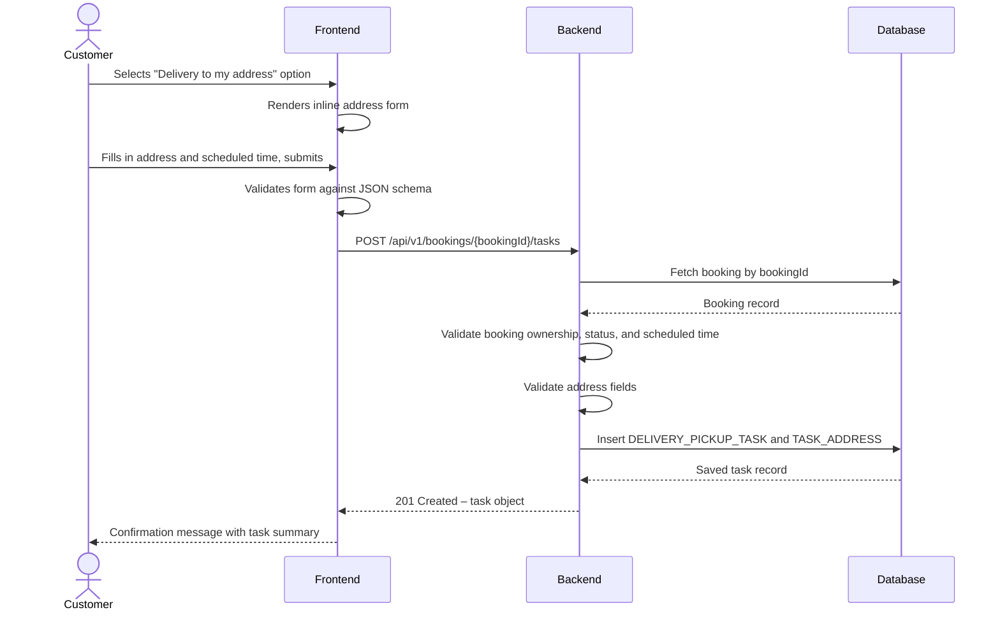
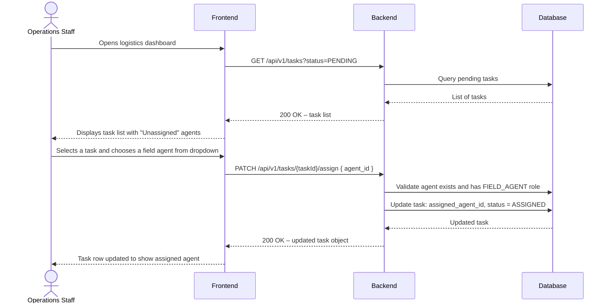
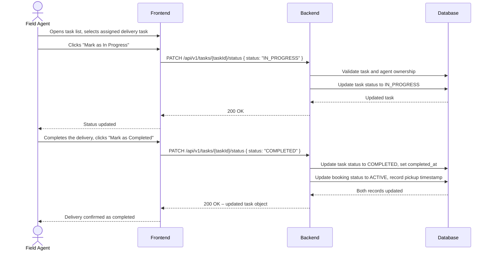

# TRD – Support Delivery and Pickup at Customer-Chosen Locations

## Document Information

| Field | Details |
|---|---|
| **Feature Name** | Support Delivery and Pickup at Customer-Chosen Locations (US-CM-08) |
| **Author** | Copilot |
| **Date** | |
| **Version** | |

---

## Table of Contents

1. [Background](#background)
2. [In Scope](#in-scope)
3. [Constraints](#constraints)
4. [Technical Requirements](#technical-requirements)
   - [Database Design](#database-design)
   - [Frontend](#frontend)
   - [Backend](#backend)
5. [Security Requirements](#security-requirements)
6. [Non-Functional Requirements](#non-functional-requirements)

---

## Background

This TRD implements the functional requirement **US-CM-08: Support Delivery and Pickup at Customer-Chosen Locations** as defined in the [Car Management PRD](../prd/prd-car-management.md#us-cm-08-support-delivery-and-pickup-at-customer-chosen-locations).

The requirement allows customers (or operations staff acting on their behalf) to request car delivery to a location of their choice and/or request that their car be picked up from a chosen location at the end of the rental, removing the need to travel to a company depot.

---

## In Scope

- Allowing customers or operations staff to specify a delivery address and/or a return pickup address when creating or updating a booking.
- Storing delivery and pickup tasks linked to a booking, each with an address, scheduled time, status, and assigned field agent.
- Providing an operations staff logistics dashboard view listing all pending and active delivery/pickup tasks with their details.
- Providing a mechanism for operations staff to assign a field agent to a task.
- Providing a mechanism for field agents to update the status of their assigned tasks.
- REST API endpoints supporting all the above interactions.
- Input validation for address fields.

---

## Constraints

- Real-time GPS tracking of field agents is **not** in scope; location information is entered manually.
- Route optimisation or distance/travel-time calculation between depot and customer address is **not** in scope.
- Automated scheduling or intelligent assignment of field agents to tasks is **not** in scope; assignment is manual by operations staff.
- Notifications or alerts to field agents or customers about task status changes are **not** in scope for this TRD; notification infrastructure is a separate concern.
- Mobile-optimised or native mobile interfaces for field agents are **not** in scope for the initial release; the desktop web interface is the only target.
- Payment or fee calculation for delivery/pickup services is **not** in scope.
- Address geocoding (converting an address into coordinates) is **not** in scope for the initial release; latitude and longitude fields are available in the data model for future use.

---

## Technical Requirements

### Database Design

The tables required for this feature are defined in [database-design-car-management-delivery-pickup.md](database-design-car-management-delivery-pickup.md).

Key entities:
- **DELIVERY_PICKUP_TASK** – represents a single delivery or pickup task linked to a booking.
- **TASK_ADDRESS** – holds the customer-specified address for the task.

### Frontend

- **Booking form – address entry:**
  - When a customer (or operations staff) selects the delivery option during booking, an address form must be displayed inline, without a full page reload.
  - The address form must show fields for: address line 1, address line 2 (optional), city, state/province, postal code, and country.
  - The address form must be rendered for `DELIVERY` tasks, `PICKUP` tasks, or both, independently.
  - Inline validation errors must be displayed adjacent to the field that failed validation.
  - All required address fields must be validated client-side before submission, using a pre-defined JSON schema.

- **Logistics dashboard (operations staff):**
  - The dashboard must display a paginated list of delivery and pickup tasks.
  - Each row must show: task type, booking reference, customer name, address, scheduled time, assigned car, and assigned field agent (or "Unassigned").
  - The list must be filterable by task type (`DELIVERY` / `PICKUP`), status, and scheduled date range.
  - Operations staff must be able to open a task detail view and assign or reassign a field agent from a dropdown of available agents.
  - Status changes must be reflected in the list without a full page reload.

- **Field agent task view:**
  - A field agent must see a list of tasks assigned to them, filterable by status and date.
  - Each task must show: task type, address, scheduled time, and current status.
  - A field agent must be able to update a task status (e.g., mark as `IN_PROGRESS` or `COMPLETED`) via a button action.
  - The design must be responsive and usable on common desktop browser widths.

### Backend

#### REST API Specification

All endpoints require authentication. Role-based authorisation is specified per endpoint.

---

##### 1. Add a Delivery or Pickup Task to a Booking

**POST** `/api/v1/bookings/{bookingId}/tasks`

- **Path parameter:** `bookingId` (UUID) – the booking to attach the task to.
- **Authorisation:** Customer (own booking only) or Operations Staff.
- **Request body:**
  ```
  {
    "task_type": "DELIVERY" | "PICKUP",
    "scheduled_time": ISO-8601 datetime string,
    "address": {
      "address_line_1": string (required, max 255 chars),
      "address_line_2": string (optional, max 255 chars),
      "city": string (required, max 100 chars),
      "state_province": string (optional, max 100 chars),
      "postal_code": string (required, max 20 chars, alphanumeric and hyphen only),
      "country": string (required, max 100 chars)
    }
  }
  ```
- **Response (201 Created):**
  ```
  {
    "id": UUID,
    "booking_id": UUID,
    "task_type": string,
    "status": "PENDING",
    "scheduled_time": ISO-8601 datetime string,
    "assigned_agent_id": null,
    "address": { ... },
    "created_at": ISO-8601 datetime string
  }
  ```
- **Error responses:** 400 (validation failure), 404 (booking not found), 409 (a task of the same type already exists for this booking), 403 (forbidden).

---

##### 2. Update a Delivery or Pickup Task

**PUT** `/api/v1/tasks/{taskId}`

- **Path parameter:** `taskId` (UUID).
- **Authorisation:** Operations Staff only.
- **Request body:** Same structure as the POST request body above (all fields replaceable).
- **Response (200 OK):** Updated task object (same shape as the 201 response above).
- **Error responses:** 400, 404, 403.

---

##### 3. List Tasks (Logistics Dashboard)

**GET** `/api/v1/tasks`

- **Authorisation:** Operations Staff only.
- **Query parameters:**
  - `task_type` (optional): `DELIVERY` or `PICKUP`
  - `status` (optional): `PENDING`, `ASSIGNED`, `IN_PROGRESS`, `COMPLETED`, `CANCELLED`
  - `scheduled_from` (optional): ISO-8601 date string
  - `scheduled_to` (optional): ISO-8601 date string
  - `page` (optional, default 1): integer ≥ 1
  - `page_size` (optional, default 20, max 100): integer
- **Response (200 OK):**
  ```
  {
    "data": [
      {
        "id": UUID,
        "booking_id": UUID,
        "task_type": string,
        "status": string,
        "scheduled_time": ISO-8601 datetime string,
        "assigned_agent_id": UUID | null,
        "assigned_agent_name": string | null,
        "address": { ... }
      },
      ...
    ],
    "pagination": {
      "page": integer,
      "page_size": integer,
      "total_count": integer
    }
  }
  ```

---

##### 4. Get Tasks for a Booking

**GET** `/api/v1/bookings/{bookingId}/tasks`

- **Path parameter:** `bookingId` (UUID).
- **Authorisation:** Customer (own booking only), Operations Staff, or Field Agent.
- **Response (200 OK):**
  ```
  {
    "data": [ /* array of task objects as above */ ]
  }
  ```
- **Error responses:** 404, 403.

---

##### 5. Assign a Field Agent to a Task

**PATCH** `/api/v1/tasks/{taskId}/assign`

- **Path parameter:** `taskId` (UUID).
- **Authorisation:** Operations Staff only.
- **Request body:**
  ```
  {
    "agent_id": UUID
  }
  ```
- **Response (200 OK):** Updated task object with `status` changed to `ASSIGNED` and `assigned_agent_id` set.
- **Error responses:** 400 (agent not found or not a field agent), 404 (task not found), 403.

---

##### 6. Update Task Status

**PATCH** `/api/v1/tasks/{taskId}/status`

- **Path parameter:** `taskId` (UUID).
- **Authorisation:** Field Agent (own assigned tasks only) or Operations Staff.
- **Request body:**
  ```
  {
    "status": "IN_PROGRESS" | "COMPLETED" | "CANCELLED"
  }
  ```
- **Response (200 OK):** Updated task object.
- **Business rule:** Setting `status` to `COMPLETED` records the current timestamp as `completed_at`. Transitioning to `COMPLETED` on a `DELIVERY` task also triggers the booking pickup to be recorded (updates booking status to `ACTIVE`).
- **Error responses:** 400 (invalid status transition), 403, 404.

---

#### Input Validation Rules

| Field | Rule |
|---|---|
| `task_type` | Must be one of `DELIVERY` or `PICKUP` |
| `scheduled_time` | Must be a valid ISO-8601 datetime; when submitted by a `CUSTOMER`, must be in the future at time of creation; must fall within the booking rental period |
| `address.address_line_1` | Required; 1–255 characters |
| `address.city` | Required; 1–100 characters; letters, spaces, hyphens, and apostrophes only |
| `address.postal_code` | Required; 1–20 characters; alphanumeric characters and hyphens only |
| `address.country` | Required; 1–100 characters |
| `agent_id` | Must be a valid UUID corresponding to a user with the `FIELD_AGENT` role |
| `status` (PATCH) | Must be a valid status value; must represent a valid forward transition from the current status |

#### Status Transition Rules

Valid status transitions for a `DELIVERY_PICKUP_TASK`:

```
PENDING → ASSIGNED → IN_PROGRESS → COMPLETED
PENDING → CANCELLED
ASSIGNED → CANCELLED
IN_PROGRESS → CANCELLED
```

No backward transitions are permitted.

#### Algorithm – Create Delivery/Pickup Task

```
FUNCTION createTask(bookingId, taskType, scheduledTime, address):
  booking = fetchBooking(bookingId)
  IF booking is NOT FOUND:
    RETURN 404 Not Found

  IF caller is CUSTOMER AND booking.customer_id != caller.id:
    RETURN 403 Forbidden

  IF booking.status NOT IN ('CONFIRMED', 'RESERVED'):
    RETURN 400 Bad Request ("Task can only be added to a confirmed booking")

  IF fetchTaskByBookingAndType(bookingId, taskType) EXISTS:
    RETURN 409 Conflict ("A task of this type already exists for this booking")

  VALIDATE scheduledTime is within [booking.rental_start_date, booking.rental_end_date]
  IF validation fails:
    RETURN 400 Bad Request

  VALIDATE address fields according to validation rules
  IF validation fails:
    RETURN 400 Bad Request with field-level error details

  task = CREATE DELIVERY_PICKUP_TASK(
    booking_id = bookingId,
    task_type = taskType,
    scheduled_time = scheduledTime,
    status = 'PENDING'
  )
  CREATE TASK_ADDRESS(task_id = task.id, ...address fields)

  RETURN 201 Created with task object
```

#### Algorithm – Complete a Task (Mark as COMPLETED)

```
FUNCTION completeTask(taskId, callerId, callerRole):
  task = fetchTask(taskId)
  IF task is NOT FOUND:
    RETURN 404 Not Found

  IF callerRole == 'FIELD_AGENT' AND task.assigned_agent_id != callerId:
    RETURN 403 Forbidden

  IF task.status != 'IN_PROGRESS':
    RETURN 400 Bad Request ("Task must be IN_PROGRESS before it can be completed")

  UPDATE task SET status = 'COMPLETED', completed_at = NOW()

  IF task.task_type == 'DELIVERY':
    RECORD booking pickup (update booking.status to 'ACTIVE', set pickup timestamp)

  RETURN 200 OK with updated task object
```

#### Sequence Diagrams

##### Customer Adding a Delivery Task During Booking



##### Operations Staff Assigning a Field Agent to a Task



##### Field Agent Completing a Delivery Task



---

## Security Requirements

All API endpoints in this feature must be secured as follows:

- **Authentication:** Every request must include a valid JSON Web Token (JWT) in the `Authorization` header using the `Bearer` scheme.
  - JWT algorithm: **HS256** (HMAC with SHA-256).
  - JWT payload must include at minimum:
    - `sub` (string): the authenticated user's unique ID (UUID).
    - `role` (string): the user's role, one of `CUSTOMER`, `OPERATIONS_STAFF`, or `FIELD_AGENT`.
    - `exp` (integer): expiration timestamp (Unix epoch). Tokens must not be accepted after expiry.
    - `iat` (integer): issued-at timestamp (Unix epoch).

- **Authorisation (Role-Based Access Control):**

  | Endpoint | Allowed Roles |
  |---|---|
  | POST `/bookings/{bookingId}/tasks` | `CUSTOMER` (own booking only), `OPERATIONS_STAFF` |
  | PUT `/tasks/{taskId}` | `OPERATIONS_STAFF` |
  | GET `/tasks` | `OPERATIONS_STAFF` |
  | GET `/bookings/{bookingId}/tasks` | `CUSTOMER` (own booking), `OPERATIONS_STAFF`, `FIELD_AGENT` (own tasks) |
  | PATCH `/tasks/{taskId}/assign` | `OPERATIONS_STAFF` |
  | PATCH `/tasks/{taskId}/status` | `FIELD_AGENT` (own assigned task), `OPERATIONS_STAFF` |

- **Ownership enforcement:** A `CUSTOMER` must only be able to access or modify tasks linked to their own bookings. A `FIELD_AGENT` must only be able to update the status of tasks assigned to them. The backend must enforce this by comparing the `sub` claim from the JWT against the relevant record's owner ID.

- **Input sanitisation:** All string inputs must be sanitised to prevent injection attacks before being persisted or used in queries. Parameterised queries must be used for all database interactions.

- **HTTPS:** All API communication must occur over HTTPS. Plain HTTP must not be accepted.

---

## Non-Functional Requirements

*(To be defined)*
