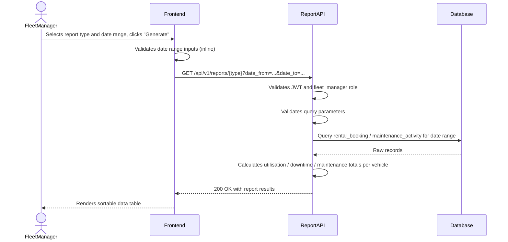
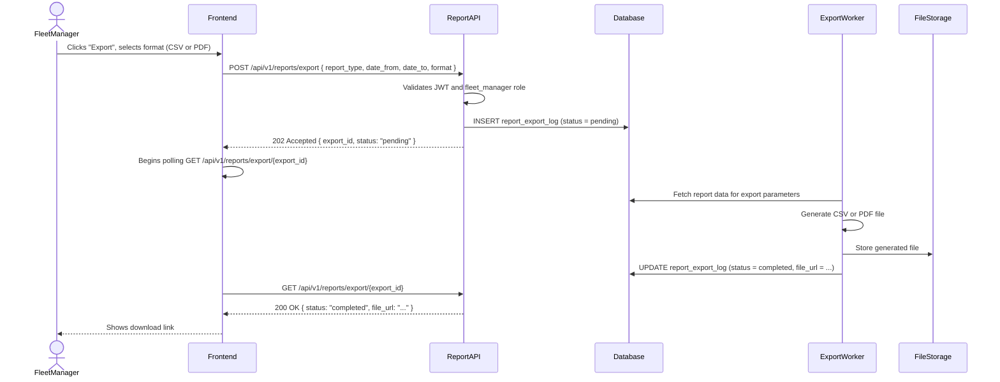

# TRD — View Fleet Utilisation and Maintenance Reports

## Document Information

| Field | Details |
|---|---|
| **Feature Name** | View Fleet Utilisation and Maintenance Reports |
| **Author** | RavishankarDuMCA10 |
| **Date** | |
| **Version** | |

---

## Table of Contents

1. [Background](#background)
2. [In Scope](#in-scope)
3. [Constraints](#constraints)
4. [Technical Requirements](#technical-requirements)
   - [Database Design](#database-design)
   - [Frontend](#frontend)
   - [Backend](#backend)
5. [Security Requirements](#security-requirements)
6. [Non-Functional Requirements](#non-functional-requirements)

---

## Background

This TRD covers the technical implementation of **US-CM-09: View Fleet Utilisation and Maintenance Reports**, as defined in the [Car Management PRD](../prd/prd-car-management.md#us-cm-09-view-fleet-utilisation-and-maintenance-reports).

Fleet managers need data-driven insight into how the rental fleet is performing. The system must provide three reports:

1. **Vehicle Utilisation** — the percentage of time each car is actively rented versus available within a selected date range.
2. **Vehicle Downtime** — the total time each car spent in service or marked unavailable within a selected date range.
3. **Maintenance Activity and Cost** — a per-vehicle history of all maintenance activities and associated costs within a selected date range.

All reports must be filterable by date range and exportable as CSV or PDF.

---

## In Scope

- REST API endpoints that return report data (utilisation, downtime, maintenance) for a given date range, with an optional per-vehicle filter.
- Server-side calculation of utilisation rate and downtime duration, derived from existing rental booking and maintenance activity records.
- REST API endpoint to trigger generation of a CSV or PDF export file for any supported report type.
- Asynchronous export processing with status polling; the export log is persisted in the `report_export_log` table.
- Frontend report dashboard within the fleet manager interface, containing a report-type selector, a date range picker, a data table, and an Export button.
- Inline validation of date-range inputs on the frontend.
- Role-based access control — only users with the `fleet_manager` role may access any reporting endpoint or UI.

---

## Constraints

- This TRD does not cover real-time or live dashboards with automatic refresh; data reflects a point-in-time query result.
- Charting or graphical visualisation of report data (e.g., bar/line charts) is not in scope for the initial release; tabular display only.
- Scheduling or automatic delivery of reports (e.g., email on a recurring schedule) is not in scope.
- The `car` and `rental_booking` tables are defined in other modules. This TRD only defines tables that are new and required exclusively for the reporting feature (`maintenance_activity` and `report_export_log`).
- Mobile-optimised UI for the reporting section is not in scope (desktop web only, consistent with the broader car management module).
- No integration with third-party business intelligence (BI) tools is in scope.
- Currency conversion for maintenance costs across different currencies is not in scope; costs are displayed in the currency in which they were recorded.

---

## Technical Requirements

### Database Design

The following tables are required to support this feature. For full schema details and the entity relationship diagram, see:

👉 [database-design-car-management-fleet-utilisation-maintenance-reports.md](./database-design-car-management-fleet-utilisation-maintenance-reports.md)

| Table | Purpose |
|---|---|
| `maintenance_activity` | Records each service or maintenance event per vehicle, including cost, dates, and status |
| `report_export_log` | Persists each export request, its parameters, processing status, and resulting file URL |

The **Utilisation** and **Downtime** reports also read from the `rental_booking` table (defined in the booking module) and the `car` table (defined in the car management module).

---

### Frontend

- The reporting section must be reachable from the main fleet manager navigation menu.
- A **report-type selector** (e.g., segmented control or tab group) must allow the fleet manager to switch between: `Vehicle Utilisation`, `Vehicle Downtime`, and `Maintenance Activity & Cost`.
- A **date range picker** with a `From` and `To` date must be displayed for every report type. Both dates are required.
  - `From` must not be later than `To`.
  - `To` must not be a future date.
  - Date range validation errors must be displayed inline, adjacent to the relevant input field.
- An optional **vehicle filter** (single-select dropdown populated from the car inventory) must allow the fleet manager to scope a report to one specific vehicle.
- The report data must be rendered in a **sortable data table** with columns specific to the selected report type (see Backend section for field definitions).
- An **Export button** must appear above or below the data table. On click, it must:
  1. Display a format selector (`CSV` or `PDF`).
  2. Submit an export request to the backend.
  3. Show a loading/pending indicator while the export is processing.
  4. Provide a download link when the export is ready.
  5. Display an error message inline if the export fails.
- If the query returns no data for the selected filters, the table must display an empty-state message (e.g., "No data found for the selected period.").
- The UI must follow any pre-defined JSON schema for form validation where applicable.

---

### Backend

#### REST API Specification

All endpoints are prefixed with `/api/v1`. All requests must include a valid JWT Bearer token in the `Authorization` header. All response bodies are `application/json` unless stated otherwise.

---

##### 1. Get Utilisation Report

| Property | Value |
|---|---|
| **Method** | `GET` |
| **URL** | `/api/v1/reports/utilisation` |
| **Auth** | Required — `fleet_manager` role |

**Query Parameters:**

| Parameter | Type | Required | Description |
|---|---|---|---|
| `date_from` | `string` (ISO 8601 date: `YYYY-MM-DD`) | Yes | Start of the reporting period (inclusive) |
| `date_to` | `string` (ISO 8601 date: `YYYY-MM-DD`) | Yes | End of the reporting period (inclusive) |
| `car_id` | `string` (UUID) | No | When provided, limits results to the specified vehicle |

**Response Body (200 OK):**

```json
{
  "date_from": "2025-01-01",
  "date_to": "2025-03-31",
  "period_days": 90,
  "results": [
    {
      "car_id": "uuid",
      "licence_plate": "AB12 CDE",
      "make": "Toyota",
      "model": "Corolla",
      "year": 2023,
      "rented_days": 67,
      "utilisation_rate_percent": 74.4
    }
  ]
}
```

**Error Responses:**

| HTTP Status | Condition |
|---|---|
| `400 Bad Request` | Missing or invalid `date_from` / `date_to`; `date_from` is after `date_to` |
| `401 Unauthorized` | Missing or invalid JWT |
| `403 Forbidden` | Authenticated user does not have `fleet_manager` role |

---

##### 2. Get Downtime Report

| Property | Value |
|---|---|
| **Method** | `GET` |
| **URL** | `/api/v1/reports/downtime` |
| **Auth** | Required — `fleet_manager` role |

**Query Parameters:** Same as the Utilisation Report (`date_from`, `date_to`, `car_id`).

**Response Body (200 OK):**

```json
{
  "date_from": "2025-01-01",
  "date_to": "2025-03-31",
  "period_days": 90,
  "results": [
    {
      "car_id": "uuid",
      "licence_plate": "AB12 CDE",
      "make": "Toyota",
      "model": "Corolla",
      "year": 2023,
      "downtime_days": 12,
      "downtime_breakdown": {
        "in_service_days": 8,
        "unavailable_days": 4
      }
    }
  ]
}
```

**Error Responses:** Same as the Utilisation Report.

---

##### 3. Get Maintenance Report

| Property | Value |
|---|---|
| **Method** | `GET` |
| **URL** | `/api/v1/reports/maintenance` |
| **Auth** | Required — `fleet_manager` role |

**Query Parameters:** Same as the Utilisation Report (`date_from`, `date_to`, `car_id`).

**Response Body (200 OK):**

```json
{
  "date_from": "2025-01-01",
  "date_to": "2025-03-31",
  "results": [
    {
      "car_id": "uuid",
      "licence_plate": "AB12 CDE",
      "make": "Toyota",
      "model": "Corolla",
      "year": 2023,
      "total_activities": 3,
      "total_cost_amount": 850.00,
      "cost_currency": "USD",
      "activities": [
        {
          "activity_id": "uuid",
          "service_type": "routine_service",
          "scheduled_date": "2025-01-15",
          "completed_date": "2025-01-15",
          "status": "completed",
          "service_provider": "AutoCare Ltd",
          "cost_amount": 250.00,
          "notes": "Oil change and filter replacement"
        }
      ]
    }
  ]
}
```

**Error Responses:** Same as the Utilisation Report.

---

##### 4. Request Report Export

| Property | Value |
|---|---|
| **Method** | `POST` |
| **URL** | `/api/v1/reports/export` |
| **Auth** | Required — `fleet_manager` role |

**Request Body:**

```json
{
  "report_type": "utilisation",
  "date_from": "2025-01-01",
  "date_to": "2025-03-31",
  "car_id": null,
  "format": "csv"
}
```

| Field | Type | Required | Valid Values |
|---|---|---|---|
| `report_type` | `string` | Yes | `utilisation`, `downtime`, `maintenance` |
| `date_from` | `string` (ISO 8601 date) | Yes | Any valid date not after `date_to` |
| `date_to` | `string` (ISO 8601 date) | Yes | Any valid date not after today |
| `car_id` | `string` (UUID) or `null` | No | UUID of an existing car, or `null` |
| `format` | `string` | Yes | `csv`, `pdf` |

**Response Body (202 Accepted):**

```json
{
  "export_id": "uuid",
  "status": "pending"
}
```

**Error Responses:**

| HTTP Status | Condition |
|---|---|
| `400 Bad Request` | Missing required fields; invalid `report_type` or `format`; invalid date range |
| `401 Unauthorized` | Missing or invalid JWT |
| `403 Forbidden` | Authenticated user does not have `fleet_manager` role |

---

##### 5. Get Export Status

| Property | Value |
|---|---|
| **Method** | `GET` |
| **URL** | `/api/v1/reports/export/{export_id}` |
| **Auth** | Required — `fleet_manager` role |

**Path Parameter:**

| Parameter | Type | Required | Description |
|---|---|---|---|
| `export_id` | `string` (UUID) | Yes | The export job ID returned by the export request |

**Response Body (200 OK):**

```json
{
  "export_id": "uuid",
  "status": "completed",
  "file_url": "/files/exports/uuid-utilisation-2025Q1.csv",
  "generated_at": "2026-01-10T09:00:00Z",
  "completed_at": "2026-01-10T09:00:05Z"
}
```

| Field | Possible Values |
|---|---|
| `status` | `pending`, `completed`, `failed` |
| `file_url` | Present only when `status` is `completed` |

**Error Responses:**

| HTTP Status | Condition |
|---|---|
| `401 Unauthorized` | Missing or invalid JWT |
| `403 Forbidden` | Authenticated user does not have `fleet_manager` role |
| `404 Not Found` | No export job found for the given `export_id` |

---

#### Input Validation

| Parameter | Rule |
|---|---|
| `date_from`, `date_to` | Must conform to ISO 8601 date format (`YYYY-MM-DD`); `date_from` must be ≤ `date_to`; `date_to` must be ≤ today's date |
| `car_id` | When provided, must be a valid UUID corresponding to an existing car in the system |
| `report_type` | Must be one of the enumerated values: `utilisation`, `downtime`, `maintenance` |
| `format` | Must be one of: `csv`, `pdf` |

---

#### Calculation Logic and Sequence

**Utilisation Rate Calculation:**

```
period_days = date_to - date_from + 1 (inclusive)

FOR each car:
  rented_days = SUM of days where rental_booking.status = 'active' OR 'completed'
                AND the booking period overlaps with [date_from, date_to]
  utilisation_rate_percent = (rented_days / period_days) * 100
```

**Downtime Calculation:**

```
FOR each car:
  in_service_days = SUM of days where maintenance_activity.status IN ('in_progress', 'completed')
                    AND the activity period overlaps with [date_from, date_to]
  unavailable_days = SUM of days where car was in status 'unavailable' or 'unavailable_inspection'
                     AND the period overlaps with [date_from, date_to]
  downtime_days = in_service_days + unavailable_days
```

**Sequence Diagram — Fetch Report:**



**Sequence Diagram — Export Report:**



---

## Security Requirements

- All reporting endpoints must require a valid JWT Bearer token in the `Authorization` header.
- JWT tokens must be signed using the **HS256** algorithm (HMAC-SHA256). The signing secret must be stored in server-side configuration and must not be exposed to the client.
- The JWT payload must include:
  - `sub` — the authenticated user's UUID
  - `role` — the user's role (must be `fleet_manager` to access reporting endpoints)
  - `exp` — token expiry timestamp (Unix epoch)
  - `iat` — token issued-at timestamp (Unix epoch)
- The server must reject tokens where `exp` is in the past or `role` is not `fleet_manager`, returning `401 Unauthorized` or `403 Forbidden` respectively.
- Export file URLs (`file_url`) must be time-limited presigned URLs or require an authenticated request to download; they must not be publicly accessible without authentication.
- Date-range and filter inputs must be validated and sanitised server-side before being used in database queries to prevent injection attacks.

---

## Non-Functional Requirements

*(To be defined)*
