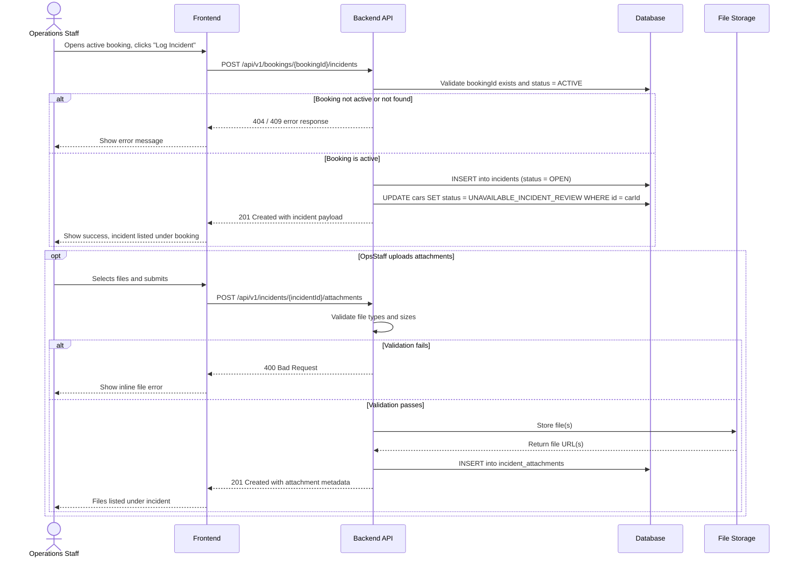

# TRD - Record Incidents During a Rental

## Document Information

| Field | Details |
|---|---|
| **Feature Name** | Record Incidents During a Rental (US-CM-07) |
| **Author** | RavishankarDuMCA10 |
| **Date** | |
| **Version** | |

---

## Table of Contents

1. [Background](#background)
2. [In Scope](#in-scope)
3. [Constraints](#constraints)
4. [Technical Requirements](#technical-requirements)
   - [Database Design](#database-design)
   - [Frontend](#frontend)
   - [Backend](#backend)
5. [Security Requirements](#security-requirements)
6. [Non-Functional Requirements](#non-functional-requirements)

---

## Background

This TRD implements the functional requirement **US-CM-07: Record Incidents During a Rental** defined in the [Car Management PRD](../prd/prd-car-management.md#us-cm-07-record-incidents-during-a-rental).

The requirement states that operations staff must be able to log incidents (accidents, breakdowns, or other events) against an active rental booking and the associated car. Each incident must be formally recorded and the car must be flagged for inspection. A fleet manager must review and explicitly clear the incident before the car becomes available for new assignments.

---

## In Scope

- REST API for creating an incident record linked to an active booking and car.
- REST API for retrieving incident records by booking and by car.
- REST API for uploading attachments (photos and documents) against an incident.
- REST API for fleet managers to clear a reviewed incident and restore car availability.
- Automatic update of the car's status to `UNAVAILABLE_INCIDENT_REVIEW` upon incident creation.
- Automatic update of the car's status to `AVAILABLE` when a fleet manager clears the incident.
- Input validation for all incident fields (type, datetime, location, description).
- File type and size validation for attachments.
- Role-based access control: operations staff create incidents; fleet managers clear them.
- Database schema for the `incidents` and `incident_attachments` tables.
- Frontend form for logging a new incident from the active booking detail page.
- Frontend view for listing incidents per booking and per car.
- Frontend action for fleet managers to review and clear an incident.

---

## Constraints

- No real-time push notifications (e.g., SMS, email, or push) are triggered when an incident is logged; alerting is out of scope for this feature.
- No integration with external insurance or claims management systems.
- No automated insurance claim workflow is created from an incident record.
- No real-time GPS capture for incident location; location is entered as free text.
- Mobile-optimised or native mobile interface is out of scope (desktop web only, aligned with the v1 constraint in the PRD).
- File storage infrastructure (object storage) is pre-existing and is not provisioned as part of this feature.
- The `bookings`, `cars`, and `users` tables are pre-existing; this feature adds no columns to them beyond the car `status` field update at runtime.
- Incident records cannot be deleted; only status transitions are permitted (immutable history).

---

## Technical Requirements

### Database Design

The database design for this feature is documented in [database-design-car-management-record-incidents.md](./database-design-car-management-record-incidents.md).

New tables introduced:
- `incidents` — stores incident records, each linked to a booking and a car.
- `incident_attachments` — stores references to files uploaded against an incident.

---

### Frontend

- The incident log form must be accessible from the **Active Booking Detail** page via a clearly labelled "Log Incident" button, visible only when the booking status is `ACTIVE`.
- All field-level validation errors must be displayed **inline**, directly beneath the relevant input field.
- The file upload component must:
  - Accept `jpg`, `jpeg`, `png`, and `pdf` files only.
  - Enforce a maximum file size of **10 MB per file**.
  - Allow multiple files to be uploaded in a single submission.
  - Display the file name and size for each staged file before submission.
  - Show an inline error if an unsupported file type or oversized file is selected.
- A read-only **Incident History** section must be displayed on the Booking Detail page, listing all incidents for that booking.
- A read-only **Incident History** section must be displayed on the Car Detail page, listing all incidents ever recorded for that car.
- The fleet manager's **Incident Review** view must display the incident details, all attachments, and provide a text area for notes and a "Clear Incident" action button.
- UI validation must follow a pre-defined JSON schema shared between frontend and backend to ensure consistency.

---

### Backend

#### REST API Specification

All endpoints are prefixed with `/api/v1` and require a valid JWT bearer token in the `Authorization` header.

---

##### 1. Log an Incident

**`POST /api/v1/bookings/{bookingId}/incidents`**

Creates a new incident record for an active booking.

- **Path parameter:** `bookingId` — integer, the ID of the booking.
- **Request body (JSON):**

  | Field | Type | Required | Validation |
  |---|---|---|---|
  | `incidentType` | string | Yes | Must be one of: `ACCIDENT`, `BREAKDOWN`, `OTHER` |
  | `incidentDatetime` | string (ISO 8601) | Yes | Must be a valid datetime, not in the future |
  | `location` | string | Yes | 1–500 characters |
  | `description` | string | Yes | 1–5000 characters |

- **Response `201 Created`:**

  ```json
  {
    "id": 42,
    "bookingId": 101,
    "carId": 7,
    "incidentType": "BREAKDOWN",
    "incidentDatetime": "2026-03-14T10:30:00Z",
    "location": "Motorway M1, Junction 15",
    "description": "Engine failure, car towed.",
    "reportedBy": 5,
    "status": "OPEN",
    "createdAt": "2026-03-14T11:00:00Z"
  }
  ```

- **Error responses:** `400 Bad Request` (validation failure), `403 Forbidden` (insufficient role), `404 Not Found` (booking not found), `409 Conflict` (booking is not in `ACTIVE` status).

---

##### 2. List Incidents for a Booking

**`GET /api/v1/bookings/{bookingId}/incidents`**

Returns all incidents linked to the specified booking.

- **Path parameter:** `bookingId` — integer.
- **Response `200 OK`:**

  ```json
  [
    {
      "id": 42,
      "incidentType": "BREAKDOWN",
      "incidentDatetime": "2026-03-14T10:30:00Z",
      "location": "Motorway M1, Junction 15",
      "status": "OPEN"
    }
  ]
  ```

---

##### 3. Get Incident Details

**`GET /api/v1/incidents/{incidentId}`**

Returns the full details of a single incident, including attachments.

- **Path parameter:** `incidentId` — integer.
- **Response `200 OK`:**

  ```json
  {
    "id": 42,
    "bookingId": 101,
    "carId": 7,
    "incidentType": "BREAKDOWN",
    "incidentDatetime": "2026-03-14T10:30:00Z",
    "location": "Motorway M1, Junction 15",
    "description": "Engine failure, car towed.",
    "reportedBy": 5,
    "status": "OPEN",
    "fleetManagerNotes": null,
    "clearedBy": null,
    "clearedAt": null,
    "attachments": [
      {
        "id": 3,
        "fileName": "breakdown-photo.jpg",
        "fileType": "jpg",
        "fileSizeBytes": 204800,
        "fileUrl": "https://storage.example.com/incidents/42/breakdown-photo.jpg",
        "uploadedAt": "2026-03-14T11:05:00Z"
      }
    ],
    "createdAt": "2026-03-14T11:00:00Z",
    "updatedAt": "2026-03-14T11:05:00Z"
  }
  ```

---

##### 4. Upload Attachment to an Incident

**`POST /api/v1/incidents/{incidentId}/attachments`**

Uploads one or more files attached to an incident record.

- **Path parameter:** `incidentId` — integer.
- **Request body:** `multipart/form-data` with one or more file parts named `files`.
- **Validation:**
  - Allowed MIME types: `image/jpeg`, `image/png`, `application/pdf`.
  - Maximum file size: 10 MB per file.
  - Maximum 10 files per request.
- **Response `201 Created`:**

  ```json
  [
    {
      "id": 3,
      "fileName": "breakdown-photo.jpg",
      "fileType": "jpg",
      "fileSizeBytes": 204800,
      "fileUrl": "https://storage.example.com/incidents/42/breakdown-photo.jpg",
      "uploadedAt": "2026-03-14T11:05:00Z"
    }
  ]
  ```

- **Error responses:** `400 Bad Request` (invalid file type or size exceeded), `404 Not Found` (incident not found).

---

##### 5. List Incidents for a Car

**`GET /api/v1/cars/{carId}/incidents`**

Returns the full incident history for a car.

- **Path parameter:** `carId` — integer.
- **Query parameters:**
  - `status` (optional) — filter by incident status: `OPEN`, `UNDER_REVIEW`, or `CLEARED`.
  - `page` (optional, default `1`) — page number for pagination.
  - `pageSize` (optional, default `20`, max `100`) — results per page.
- **Response `200 OK`:**

  ```json
  {
    "total": 5,
    "page": 1,
    "pageSize": 20,
    "items": [
      {
        "id": 42,
        "bookingId": 101,
        "incidentType": "BREAKDOWN",
        "incidentDatetime": "2026-03-14T10:30:00Z",
        "status": "OPEN"
      }
    ]
  }
  ```

---

##### 6. Clear an Incident

**`PATCH /api/v1/incidents/{incidentId}/clear`**

Marks an incident as cleared after fleet manager review. This also updates the associated car's status to `AVAILABLE`.

- **Path parameter:** `incidentId` — integer.
- **Request body (JSON):**

  | Field | Type | Required | Validation |
  |---|---|---|---|
  | `notes` | string | No | 0–2000 characters |

- **Response `200 OK`:**

  ```json
  {
    "id": 42,
    "status": "CLEARED",
    "fleetManagerNotes": "No structural damage found after inspection.",
    "clearedBy": 12,
    "clearedAt": "2026-03-15T09:00:00Z"
  }
  ```

- **Error responses:** `403 Forbidden` (caller does not have Fleet Manager role), `404 Not Found`, `409 Conflict` (incident is already `CLEARED`).

---

#### Validation Rules

| Field | Rule |
|---|---|
| `incidentType` | Must be exactly one of the enum values: `ACCIDENT`, `BREAKDOWN`, `OTHER`. Case-sensitive. |
| `incidentDatetime` | Must be a valid ISO 8601 datetime string. Must not exceed the server clock time by more than 5 minutes, to allow for minor client–server clock drift while preventing clearly future-dated entries. |
| `location` | Non-empty string, maximum 500 characters. HTML tags must be stripped. |
| `description` | Non-empty string, maximum 5000 characters. HTML tags must be stripped. |
| `notes` (clear) | Optional string, maximum 2000 characters. HTML tags must be stripped. |
| Attachment file type | Must be `image/jpeg`, `image/png`, or `application/pdf`. Validated against actual MIME type, not only file extension. |
| Attachment file size | Maximum 10 MB (10,485,760 bytes) per file. |

---

#### Sequence: Log an Incident



---

#### Sequence: Clear an Incident

```mermaid
sequenceDiagram
    actor FleetMgr as Fleet Manager
    participant FE as Frontend
    participant API as Backend API
    participant DB as Database

    FleetMgr->>FE: Opens incident detail, reviews info, clicks "Clear Incident"
    FE->>API: PATCH /api/v1/incidents/{incidentId}/clear
    API->>API: Verify caller has FLEET_MANAGER role
    alt Caller is not Fleet Manager
        API-->>FE: 403 Forbidden
        FE-->>FleetMgr: Show access denied message
    else Caller is Fleet Manager
        API->>DB: Fetch incident, check status != CLEARED
        alt Incident already cleared
            API-->>FE: 409 Conflict
            FE-->>FleetMgr: Show "Already cleared" message
        else Incident is open or under review
            API->>DB: UPDATE incidents SET status = CLEARED, cleared_by, cleared_at, notes
            API->>DB: UPDATE cars SET status = AVAILABLE WHERE id = carId
            API-->>FE: 200 OK with updated incident
            FE-->>FleetMgr: Incident marked cleared; car shown as available
        end
    end
```

---

## Security Requirements

- All API endpoints require a valid **JWT Bearer token** in the `Authorization` header.
- JWT tokens must use the **HS256** or **RS256** algorithm (per the platform-wide authentication standard).
- The JWT payload must contain at minimum: `sub` (user ID), `role` (user role), and `exp` (expiration timestamp).
- Role enforcement:
  - `POST /api/v1/bookings/{bookingId}/incidents` — requires role `OPERATIONS_STAFF` or `FLEET_MANAGER`.
  - `POST /api/v1/incidents/{incidentId}/attachments` — requires role `OPERATIONS_STAFF` or `FLEET_MANAGER`.
  - `GET /api/v1/bookings/{bookingId}/incidents` — requires role `OPERATIONS_STAFF` or `FLEET_MANAGER`.
  - `GET /api/v1/incidents/{incidentId}` — requires role `OPERATIONS_STAFF` or `FLEET_MANAGER`.
  - `GET /api/v1/cars/{carId}/incidents` — requires role `OPERATIONS_STAFF` or `FLEET_MANAGER`.
  - `PATCH /api/v1/incidents/{incidentId}/clear` — requires role `FLEET_MANAGER` only.
- Uploaded files must be validated for MIME type by inspecting the file's binary signature (magic bytes), not solely its extension, to prevent malicious file uploads.
- Stored file URLs must not be publicly accessible without authentication; access must be mediated by the API or via time-limited signed URLs from the storage layer.
- All text input fields must be sanitised to strip HTML/script content before persistence to prevent stored cross-site scripting (XSS).

---

## Non-Functional Requirements

*(To be defined)*
