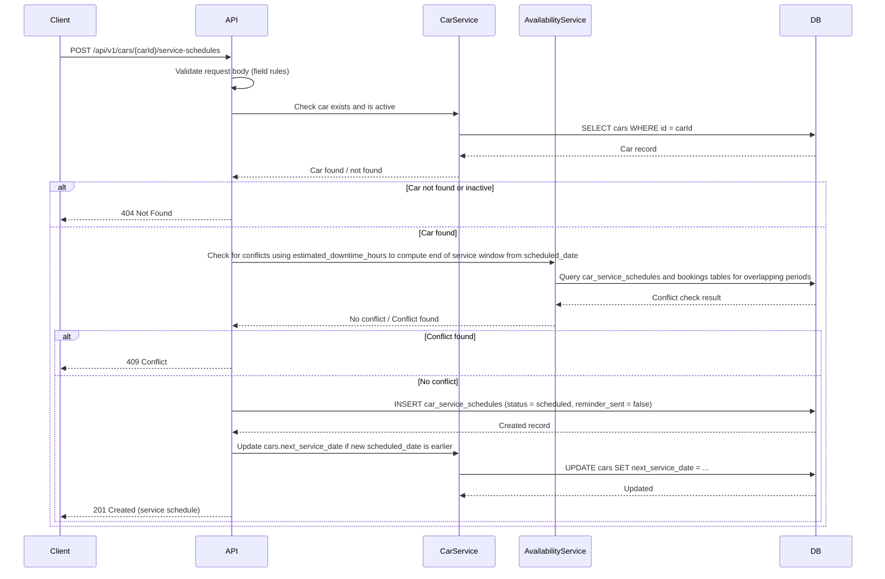
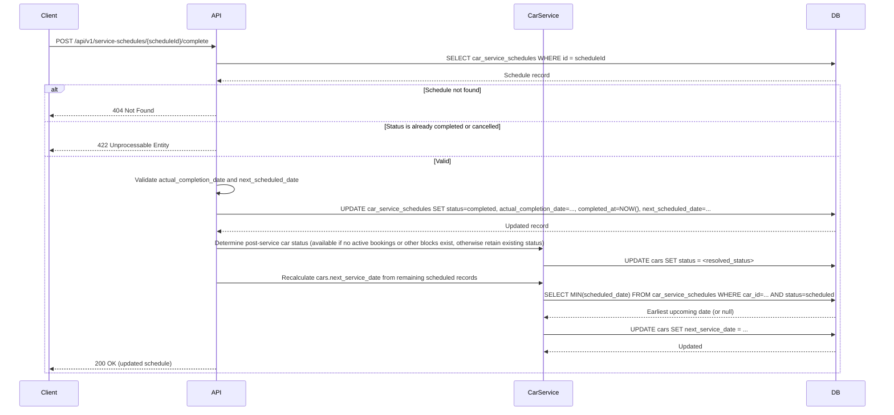
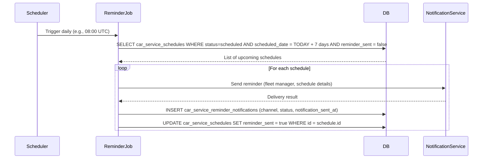

# TRD - Car Management: Manage Service and Maintenance Schedules

## Document Information

| Field | Details |
|---|---|
| **Feature Name** | Car Management – Manage Service and Maintenance Schedules (US-CM-04) |
| **Author** | Copilot |
| **Date** | |
| **Version** | |

---

## Table of Contents

1. [Background](#background)
2. [In Scope](#in-scope)
3. [Constraints](#constraints)
4. [Technical Requirements](#technical-requirements)
   - [Database Design](#database-design)
   - [Frontend](#frontend)
   - [Backend](#backend)
5. [Security Requirements](#security-requirements)
6. [Non-Functional Requirements](#non-functional-requirements)

---

## Background

This TRD implements the functional requirement **US-CM-04: Manage Service and Maintenance Schedules** as defined in the [Car Management PRD](../prd/prd-car-management.md#us-cm-04-manage-service-and-maintenance-schedules).

The requirement asks for a system that allows fleet managers to create, manage, and track service and maintenance records for each car. When a car is scheduled for service, its availability must be blocked for the service period. Automatic reminder notifications must be sent to fleet managers when a service date is within 7 days. When service is marked as completed, the car's status is updated and the next service date is recalculated.

---

## In Scope

- Creating, updating, and cancelling service/maintenance schedule records for individual cars.
- Blocking car availability for the full service period when a schedule is created.
- Unblocking car availability when a service schedule is cancelled.
- Marking a service schedule as completed and recalculating the next service date.
- Sending an automated reminder notification (email and in-app) to the fleet manager 7 days before the scheduled service date.
- Persisting an audit log of all reminder notifications sent.
- REST API endpoints to support all of the above operations.
- Frontend UI for fleet managers to manage service schedules within a car's detail view.
- Database design for the `car_service_schedules` table extensions and the new `car_service_reminder_notifications` table.

---

## Constraints

- This TRD does not cover GPS-based or IoT-triggered automatic service detection.
- Real-time integration with third-party fleet management or telematics systems is out of scope.
- Mobile-optimised or native mobile application support is out of scope for v1; the frontend targets desktop web browsers only.
- The `service_provider` field in `car_service_schedules` is a free-text VARCHAR column (per the consolidated design); management of a centralised provider catalogue is outside this TRD.
- This TRD does not cover automated scheduling logic (e.g., auto-generating the next service schedule record); the fleet manager is responsible for manually creating each record unless explicitly stated otherwise.
- Notification delivery infrastructure (email server, in-app notification service) is assumed to be provided by the platform; this TRD covers only the trigger logic and the reminder audit log.
- Reporting and analytics on maintenance history (covered by US-CM-09) are out of scope for this TRD.

---

## Technical Requirements

### Database Design

See [database-design-car-management-service-maintenance.md](database-design-car-management-service-maintenance.md) for the full entity relationship diagram and table definitions.

The following tables are required:

- **`car_service_schedules`** (consolidated table with US-CM-04 additions) – stores service/maintenance records; defined in [database-design-car-management.md](database-design-car-management.md) with additional columns documented in [database-design-car-management-service-maintenance.md](database-design-car-management-service-maintenance.md).
- **`car_service_reminder_notifications`** – new audit log table for reminder notifications sent for upcoming schedules.

The existing **`cars`** table (defined in the consolidated design) contains a `next_service_date` (DATE) column and a `status` column that includes an `in_service` value. These are updated as a side-effect of service schedule operations.

The **`cars`**, **`users`**, **`locations`**, **`customers`**, **`bookings`**, **`car_booking_assignments`**, and **`car_status_history`** tables follow the consolidated design defined in [database-design-car-management.md](database-design-car-management.md) and [database-design-car-management-assign-car-to-booking.md](database-design-car-management-assign-car-to-booking.md).

---

### Frontend

- The service schedule management UI is embedded within the **Car Detail** page as a dedicated **"Service & Maintenance"** tab.
- The tab displays:
  - A chronological list of all service schedule entries for that car, showing: service type, scheduled date, estimated duration, service provider name, and current status.
  - An **"Add Service Schedule"** button that opens an inline form or modal.
- The add/edit form must include fields for: service type (dropdown), scheduled date (date picker), estimated downtime in hours (numeric input), service provider (free-text input), and notes (text area).
- All form validation errors must be displayed inline, next to the relevant field.
- The UI must indicate when a car's availability has been blocked due to a service period (e.g., a visual indicator on the availability calendar or status badge).
- Upon marking a service as completed, the form must prompt for: actual completion date and next scheduled date (optional).
- The UI must follow the system's existing responsive design guidelines.
- Field-level validation rules must be enforced on the client side using a pre-defined JSON schema shared with the backend.

---

### Backend

#### Validation Rules

| Field | Rule |
|---|---|
| `car_id` | Must reference an existing, active car record. |
| `service_type` | Must be one of: `routine service`, `tyre change`, `inspection`, `oil change`, `brake service`, `other` (matches values in the consolidated `car_service_schedules` design). |
| `scheduled_date` | Must be a valid date. Future dates are standard. Past dates are permitted only within the last 90 days to allow recording of historical service that was not logged at the time. |
| `estimated_downtime_hours` | Must be a positive decimal number (> 0) representing hours the car will be unavailable. |
| `service_provider` | Optional free-text string; maximum 255 characters if provided. |
| `notes` | Optional; maximum 2000 characters if provided. |
| `actual_completion_date` | Required when marking as complete; must be equal to or after `scheduled_date`. |
| `next_scheduled_date` | Optional when marking as complete; if provided, must be after `actual_completion_date`. |

#### REST API Specification

---

##### 1. Create a Service Schedule

- **Method:** `POST`
- **URL:** `/api/v1/cars/{carId}/service-schedules`
- **Path Parameter:** `carId` – UUID of the car
- **Request Body:**

```json
{
  "service_type": "routine service",
  "scheduled_date": "2026-04-10",
  "estimated_downtime_hours": 16.0,
  "service_provider": "FastFix Garage",
  "notes": "Annual routine service"
}
```

- **Response (201 Created):**

```json
{
  "id": "uuid-of-schedule",
  "car_id": "uuid-of-car",
  "service_type": "routine service",
  "scheduled_date": "2026-04-10",
  "estimated_downtime_hours": 16.0,
  "service_provider": "FastFix Garage",
  "status": "scheduled",
  "notes": "Annual routine service",
  "created_by": "uuid-of-fleet-manager",
  "created_at": "2026-03-14T10:00:00Z",
  "updated_at": "2026-03-14T10:00:00Z"
}
```

- **Error Responses:** `400 Bad Request` (validation failure), `404 Not Found` (car not found), `409 Conflict` (service period overlaps with an existing booking or service schedule).

---

##### 2. List Service Schedules for a Car

- **Method:** `GET`
- **URL:** `/api/v1/cars/{carId}/service-schedules`
- **Path Parameter:** `carId` – UUID of the car
- **Query Parameters:**

| Parameter | Type | Required | Description |
|---|---|---|---|
| `status` | string | No | Filter by status: `scheduled`, `in_progress`, `completed`, `cancelled` |
| `from_date` | date | No | Filter records with `scheduled_date` on or after this date (ISO 8601) |
| `to_date` | date | No | Filter records with `scheduled_date` on or before this date (ISO 8601) |
| `page` | integer | No | Page number; defaults to 1 |
| `page_size` | integer | No | Records per page; defaults to 20; maximum 100 |

- **Response (200 OK):**

```json
{
  "data": [
    {
      "id": "uuid-of-schedule",
      "service_type": "routine service",
      "scheduled_date": "2026-04-10",
      "estimated_downtime_hours": 16.0,
      "service_provider": "FastFix Garage",
      "status": "scheduled",
      "notes": "Annual routine service",
      "created_at": "2026-03-14T10:00:00Z"
    }
  ],
  "pagination": {
    "page": 1,
    "page_size": 20,
    "total": 5
  }
}
```

- **Error Responses:** `404 Not Found` (car not found).

---

##### 3. Get a Service Schedule

- **Method:** `GET`
- **URL:** `/api/v1/service-schedules/{scheduleId}`
- **Path Parameter:** `scheduleId` – UUID of the service schedule
- **Response (200 OK):** Full service schedule object (same structure as create response, including `actual_completion_date`, `next_scheduled_date`, `completed_at`).
- **Error Responses:** `404 Not Found`.

---

##### 4. Update a Service Schedule

- **Method:** `PATCH`
- **URL:** `/api/v1/service-schedules/{scheduleId}`
- **Path Parameter:** `scheduleId` – UUID of the service schedule
- **Constraints:** Only schedules with status `scheduled` may be updated.
- **Request Body (all fields optional, only include fields to change):**

```json
{
  "service_type": "inspection",
  "scheduled_date": "2026-04-15",
  "estimated_downtime_hours": 8.0,
  "service_provider": "QuickService Auto",
  "notes": "Updated notes"
}
```

- **Response (200 OK):** Updated service schedule object.
- **Error Responses:** `400 Bad Request`, `404 Not Found`, `409 Conflict`, `422 Unprocessable Entity` (status is not `scheduled`).

---

##### 5. Complete a Service Schedule

- **Method:** `POST`
- **URL:** `/api/v1/service-schedules/{scheduleId}/complete`
- **Path Parameter:** `scheduleId` – UUID of the service schedule
- **Request Body:**

```json
{
  "actual_completion_date": "2026-04-12",
  "next_scheduled_date": "2026-10-12",
  "notes": "Service completed; brakes replaced"
}
```

- **Response (200 OK):** Updated service schedule object with `status: completed` and updated car `next_service_date`.
- **Error Responses:** `400 Bad Request`, `404 Not Found`, `422 Unprocessable Entity` (schedule is already completed or cancelled).

---

##### 6. Cancel a Service Schedule

- **Method:** `POST`
- **URL:** `/api/v1/service-schedules/{scheduleId}/cancel`
- **Path Parameter:** `scheduleId` – UUID of the service schedule
- **Constraints:** Only schedules with status `scheduled` or `in_progress` may be cancelled.
- **Request Body:**

```json
{
  "reason": "Service provider unavailable"
}
```

- **Response (200 OK):** Updated service schedule object with `status: cancelled`. Car availability block for the cancelled service period is lifted.
- **Error Responses:** `404 Not Found`, `422 Unprocessable Entity` (schedule is already completed or cancelled).

---

#### API Logic – Sequence Diagrams

##### Create Service Schedule



---

##### Complete a Service Schedule



---

##### Service Reminder Notification (Background Job)



---

#### Algorithm: Recalculate `car.next_service_date`

When a service schedule is **completed** or **cancelled**, the car's `next_service_date` must be recalculated:

```
FUNCTION recalculate_next_service_date(p_car_id):
    earliest_date = SELECT MIN(scheduled_date)
                    FROM car_service_schedules
                    WHERE car_id = p_car_id
                      AND status = 'scheduled'

    IF earliest_date IS NOT NULL THEN
        UPDATE cars SET next_service_date = earliest_date WHERE id = p_car_id
    ELSE
        UPDATE cars SET next_service_date = NULL WHERE id = p_car_id
    END IF
```

---

## Security Requirements

- All API endpoints in this TRD require a valid **JWT Bearer token** in the `Authorization` header.
- **JWT algorithm:** `RS256` (asymmetric signing, public/private key pair).
- **JWT payload must include:**
  - `sub` – the user's UUID
  - `role` – the user's role (e.g., `fleet_manager`, `operations_staff`)
  - `email` – the user's email address
  - `exp` – token expiry timestamp (Unix epoch)
- **Role-based access control:**
  - `POST /cars/{carId}/service-schedules` – `fleet_manager` only.
  - `GET /cars/{carId}/service-schedules` – `fleet_manager` only.
  - `GET /service-schedules/{scheduleId}` – `fleet_manager` only.
  - `PATCH /service-schedules/{scheduleId}` – `fleet_manager` only.
  - `POST /service-schedules/{scheduleId}/complete` – `fleet_manager` only.
  - `POST /service-schedules/{scheduleId}/cancel` – `fleet_manager` only.
- Any request missing a valid JWT or bearing a token with an insufficient role must receive a `401 Unauthorized` or `403 Forbidden` response respectively.
- Service schedule records are scoped to the fleet's data; a fleet manager must not be able to access or modify records belonging to a different tenant (if multi-tenancy applies).

---

## Non-Functional Requirements

*(To be defined)*


---

## AI Usage Disclaimer

*This document was generated with the assistance of artificial intelligence and should be reviewed by a human for accuracy and completeness.*