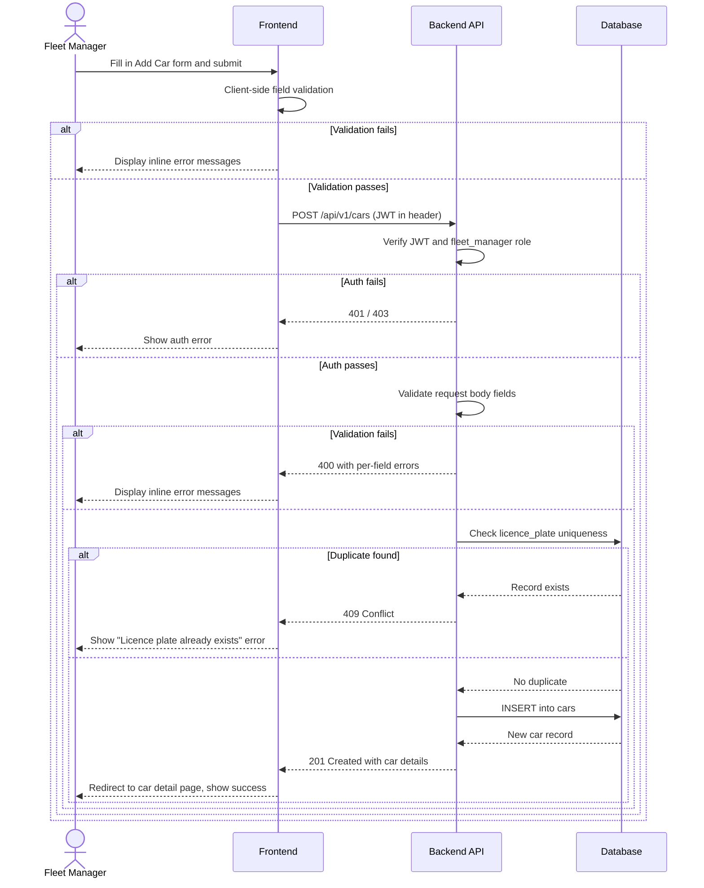
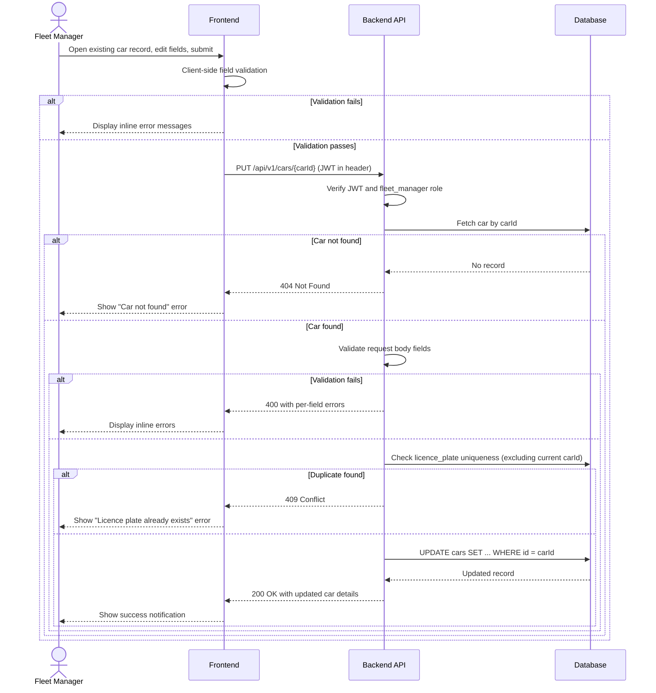
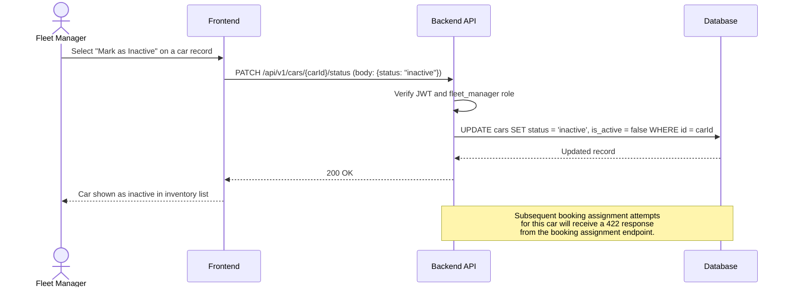

# TRD - Car Management: Add and Update Car Details

## Document Information

| Field | Details |
|---|---|
| **Feature Name** | Car Management – Add and Update Car Details |
| **Author** | Copilot |
| **Date** | |
| **Version** | |

---

## Table of Contents

1. [Background](#background)
2. [In Scope](#in-scope)
3. [Constraints](#constraints)
4. [Technical Requirements](#technical-requirements)
   - [Database Design](#database-design)
   - [Frontend](#frontend)
   - [Backend](#backend)
5. [Security Requirements](#security-requirements)
6. [Non-functional Requirements](#non-functional-requirements)

---

## Background

This TRD implements the functional requirement **US-CM-02: Add and Update Car Details** defined in the [Car Management PRD](../prd/prd-car-management.md#us-cm-02-add-and-update-car-details).

The requirement states that fleet managers must be able to:
- Add new cars to the rental fleet with all relevant vehicle details.
- Edit existing car records to keep the fleet inventory accurate.
- Mark cars as inactive to remove them from the available rental pool without permanently deleting the record.

---

## In Scope

- REST API endpoints to **create** a new car record.
- REST API endpoints to **retrieve** a single car record and a paginated list of car records.
- REST API endpoints to **update** all editable fields of an existing car record.
- REST API endpoint to **change the status** of a car (e.g., mark as `inactive`).
- Input validation rules for all car fields.
- Frontend form for adding and editing a car, including inline validation.
- Prevention of car assignment when the car's status is `inactive`.
- Database table design for `cars` and `car_service_schedules`.

---

## Constraints

- Integration with the Booking/Reservation system (i.e., enforcing that reserved or rented cars cannot be made inactive while an active booking exists) is **not** covered in this TRD; that concern belongs to the booking assignment TRD.
- Real-time GPS location tracking is **not** in scope; location is a free-text field entered manually.
- Photo or document uploads for car condition are **not** covered here; they are handled in the pickup/return logistics TRD (US-CM-05, US-CM-06).
- Service and maintenance schedule management beyond storing the next scheduled service date is **not** covered here; detailed service scheduling is handled in the service management TRD (US-CM-04).
- Soft-delete (physical removal of records) is **not** supported; cars are deactivated by setting `is_active = false` and `status = inactive`.
- Role-based access control enforcement is defined in the User Management TRD; this TRD assumes the requesting user's role has already been verified.
- The initial release targets **desktop web browsers only**; mobile layouts are out of scope.

---

## Technical Requirements

### Database Design

The data model supporting this feature uses the `cars` and `car_service_schedules` tables.  
Full column definitions and the entity-relationship diagram are in [database-design-car-management.md](./database-design-car-management.md).

---

### Frontend

1. **Add Car Form** and **Edit Car Form** must be rendered as a single reusable form component that operates in two modes: _create_ and _edit_.
2. All validation errors must be displayed **inline**, directly beneath the relevant field, and never in a modal or alert box only.
3. The form must be submitted only when all required fields pass client-side validation. The submit button must be disabled until the form is valid.
4. Field validation rules must mirror the backend rules defined in the [Backend](#backend) section and be driven by a shared, language-agnostic JSON Schema (see [Field Validation Rules](#field-validation-rules)).
5. The form must display a loading indicator while an API call is in progress, and must disable the submit button during that time to prevent duplicate submissions.
6. On successful creation or update, the user must be redirected to the car's detail page and shown a success notification.
7. On API error, the form must display a meaningful error message without clearing any entered data.
8. The **status** field (for marking a car inactive) must be rendered as a dropdown with the allowed status values. When a car has an `inactive` status, it must be visually distinguished in the inventory list.
9. The form layout must use a responsive grid but, per scope, is optimised for desktop screens (minimum 1024 px viewport width).

---

### Backend

#### Field Validation Rules

All incoming data must be validated against the following rules before any persistence operation.

| Field | Required | Type | Rules |
|---|---|---|---|
| `licence_plate` | Yes | String | 2–20 characters; alphanumeric and hyphens only; input must be normalised to uppercase before validation; regex: `^[A-Z0-9\-]{2,20}$`; must be unique across active car records |
| `make` | Yes | String | 1–100 characters; printable characters only |
| `model` | Yes | String | 1–100 characters; printable characters only |
| `year` | Yes | Integer | Between 1900 and current calendar year + 1 |
| `colour` | Yes | String | 1–50 characters; letters and spaces only |
| `fuel_type` | Yes | Enum | One of: `petrol`, `diesel`, `electric`, `hybrid` |
| `seating_capacity` | Yes | Integer | Between 1 and 20 (inclusive) |
| `current_location` | Yes | String | 1–255 characters |
| `condition_rating` | Yes | Integer | Between 1 and 10 (inclusive) |
| `status` | Yes (update only) | Enum | One of: `available`, `reserved`, `rented`, `in_service`, `unavailable`, `inactive` |
| `next_service_date` | No | Date | ISO 8601 date (`YYYY-MM-DD`); past dates are permitted to allow backdating of already-planned or historical service entries |

#### REST API Specification

All endpoints are prefixed with `/api/v1`.

---

##### 1. Create Car

| Property | Value |
|---|---|
| **Method** | `POST` |
| **URL** | `/api/v1/cars` |
| **Authentication** | Required (Bearer JWT) |
| **Authorisation** | Role: `fleet_manager` |

**Request Body** (`application/json`):

```json
{
  "licence_plate": "ABC-1234",
  "make": "Toyota",
  "model": "Corolla",
  "year": 2022,
  "colour": "White",
  "fuel_type": "petrol",
  "seating_capacity": 5,
  "current_location": "Main Depot – Lot A",
  "condition_rating": 9,
  "next_service_date": "2026-06-01"
}
```

**Response – 201 Created**:

```json
{
  "id": "550e8400-e29b-41d4-a716-446655440000",
  "licence_plate": "ABC-1234",
  "make": "Toyota",
  "model": "Corolla",
  "year": 2022,
  "colour": "White",
  "fuel_type": "petrol",
  "seating_capacity": 5,
  "current_location": "Main Depot – Lot A",
  "condition_rating": 9,
  "status": "available",
  "is_active": true,
  "next_service_date": "2026-06-01",
  "created_at": "2026-03-14T10:00:00Z",
  "updated_at": "2026-03-14T10:00:00Z"
}
```

**Error Responses**:

| HTTP Status | Condition |
|---|---|
| `400 Bad Request` | One or more fields fail validation; response body lists per-field errors |
| `401 Unauthorized` | Missing or invalid JWT |
| `403 Forbidden` | Authenticated user does not have the `fleet_manager` role |
| `409 Conflict` | A car with the same `licence_plate` already exists |

---

##### 2. Get Car List

| Property | Value |
|---|---|
| **Method** | `GET` |
| **URL** | `/api/v1/cars` |
| **Authentication** | Required (Bearer JWT) |
| **Authorisation** | Roles: `fleet_manager`, `operations_staff` |

**Query Parameters**:

| Parameter | Type | Required | Description |
|---|---|---|---|
| `status` | String | No | Filter by car status (e.g., `available`, `inactive`) |
| `make` | String | No | Filter by manufacturer name (case-insensitive, partial match) |
| `page` | Integer | No | Page number (default: 1, min: 1) |
| `page_size` | Integer | No | Items per page (default: 20, max: 100) |

**Response – 200 OK**:

```json
{
  "data": [
    {
      "id": "550e8400-e29b-41d4-a716-446655440000",
      "licence_plate": "ABC-1234",
      "make": "Toyota",
      "model": "Corolla",
      "year": 2022,
      "colour": "White",
      "fuel_type": "petrol",
      "seating_capacity": 5,
      "current_location": "Main Depot – Lot A",
      "condition_rating": 9,
      "status": "available",
      "is_active": true,
      "next_service_date": "2026-06-01"
    }
  ],
  "pagination": {
    "page": 1,
    "page_size": 20,
    "total_items": 42,
    "total_pages": 3
  }
}
```

---

##### 3. Get Car Details

| Property | Value |
|---|---|
| **Method** | `GET` |
| **URL** | `/api/v1/cars/{carId}` |
| **Authentication** | Required (Bearer JWT) |
| **Authorisation** | Roles: `fleet_manager`, `operations_staff` |

**Path Parameters**:

| Parameter | Type | Required | Description |
|---|---|---|---|
| `carId` | UUID | Yes | Unique identifier of the car |

**Response – 200 OK**: Same schema as a single item in the Create Car response.

**Error Responses**:

| HTTP Status | Condition |
|---|---|
| `401 Unauthorized` | Missing or invalid JWT |
| `403 Forbidden` | Insufficient role |
| `404 Not Found` | No car found with the given `carId` |

---

##### 4. Update Car

| Property | Value |
|---|---|
| **Method** | `PUT` |
| **URL** | `/api/v1/cars/{carId}` |
| **Authentication** | Required (Bearer JWT) |
| **Authorisation** | Role: `fleet_manager` |

**Path Parameters**:

| Parameter | Type | Required | Description |
|---|---|---|---|
| `carId` | UUID | Yes | Unique identifier of the car to update |

**Request Body** (`application/json`): Same schema as Create Car. All fields must be provided (full replacement semantics). If only a subset of fields needs to be changed, callers should first fetch the current record and resubmit all fields with the desired changes applied. A dedicated `PATCH /api/v1/cars/{carId}` endpoint for partial updates may be introduced in a future revision.

**Response – 200 OK**: Updated car object (same schema as Create Car response).

**Error Responses**:

| HTTP Status | Condition |
|---|---|
| `400 Bad Request` | Validation failure |
| `401 Unauthorized` | Missing or invalid JWT |
| `403 Forbidden` | Insufficient role |
| `404 Not Found` | Car not found |
| `409 Conflict` | Updated `licence_plate` conflicts with another existing car |

---

##### 5. Update Car Status

| Property | Value |
|---|---|
| **Method** | `PATCH` |
| **URL** | `/api/v1/cars/{carId}/status` |
| **Authentication** | Required (Bearer JWT) |
| **Authorisation** | Role: `fleet_manager` |

**Path Parameters**:

| Parameter | Type | Required | Description |
|---|---|---|---|
| `carId` | UUID | Yes | Unique identifier of the car |

**Request Body** (`application/json`):

```json
{
  "status": "inactive"
}
```

**Response – 200 OK**:

```json
{
  "id": "550e8400-e29b-41d4-a716-446655440000",
  "status": "inactive",
  "is_active": false,
  "updated_at": "2026-03-14T12:00:00Z"
}
```

**Business Rule**: Setting `status` to `inactive` must also set `is_active = false`. Any transition from `inactive` to an active status must set `is_active = true`.

**Error Responses**:

| HTTP Status | Condition |
|---|---|
| `400 Bad Request` | `status` value is not a valid enum member |
| `401 Unauthorized` | Missing or invalid JWT |
| `403 Forbidden` | Insufficient role |
| `404 Not Found` | Car not found |

---

#### API Logic – Sequence Diagrams

##### Create Car



##### Update Car



##### Mark Car as Inactive



---

## Security Requirements

1. **Authentication**: All endpoints require a valid **JWT Bearer token** in the `Authorization` header (format: `Authorization: Bearer <token>`). The JWT must be signed using the **RS256** algorithm.
2. **JWT Payload**: The token must contain at minimum: `sub` (user ID), `role` (user role), and `exp` (expiry timestamp). The API must reject tokens that are expired or have an invalid signature.
3. **Authorisation**: Only users with the `fleet_manager` role may call the write endpoints (POST, PUT, PATCH). Read endpoints (GET) are accessible to `fleet_manager` and `operations_staff` roles. Requests with insufficient role must receive a `403 Forbidden` response.
4. **Input Sanitisation**: All string inputs must be stripped of leading/trailing whitespace and validated against the allowed patterns defined in the [Field Validation Rules](#field-validation-rules) table to prevent injection attacks.
5. **HTTPS Only**: All API endpoints must only be served over HTTPS. Requests over plain HTTP must be rejected or redirected.
6. **Audit Logging**: Every successful create, update, or status change must write an audit log entry containing: user ID, action performed, car ID, and timestamp.

---

## Non-functional Requirements

*(To be defined)*
