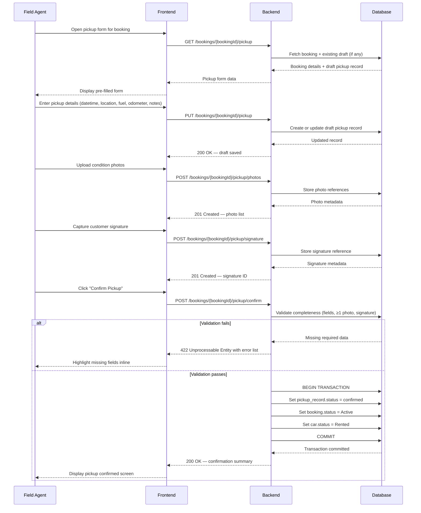

# TRD – Manage Car Pickup Logistics

## Document Information

| Field | Details |
|---|---|
| **Feature Name** | Manage Car Pickup Logistics |
| **Author** | Copilot |
| **Date** | |
| **Version** | |

---

## Table of Contents

1. [Background](#background)
2. [In Scope](#in-scope)
3. [Constraints](#constraints)
4. [Technical Requirements](#technical-requirements)
   - [Database Design](#database-design)
   - [Frontend](#frontend)
   - [Backend](#backend)
5. [Security Requirements](#security-requirements)
6. [Non-Functional Requirements](#non-functional-requirements)

---

## Background

This TRD implements **US-CM-05: Manage Car Pickup Logistics** from the [Car Management PRD](../prd/prd-car-management.md#us-cm-05-manage-car-pickup-logistics).

The requirement defines a structured pickup workflow in which operations staff or field agents record the handover of a rental car to a customer. The record must capture: pickup date/time, pickup location, fuel level, odometer reading, condition notes, and damage check results. Photo uploads and a customer signature are mandatory to complete the pickup. Upon successful confirmation, the booking status must change to **Active** and the car status must change to **Rented**.

---

## In Scope

- REST API endpoints to create, update, and confirm a pickup record for a rental booking.
- REST API endpoint to upload one or more photos as part of the pickup condition check.
- REST API endpoint to store a customer signature (digital or scanned).
- Server-side validation: at least one photo and one signature must be present before a pickup can be confirmed.
- Atomic status transitions on confirmation: booking status → **Active**; car status → **Rented**.
- Frontend pickup form including all required fields, inline validation, photo upload component, and signature capture widget.
- Role-based access: only users with the **operations_staff** or **field_agent** role may initiate or confirm a pickup.
- Database tables: `pickup_record`, `pickup_photo`, `pickup_signature`.

---

## Constraints

- **Mobile not in scope**: The initial release targets desktop web browsers only. A mobile-optimised experience for field agents is out of scope for v1 (per PRD Dependency & Constraints).
- **No real-time GPS**: Pickup location is recorded as a manually entered address; real-time GPS or map integration is not in scope for v1.
- **Return logistics not covered**: The return workflow (US-CM-06) is a separate feature and is not addressed in this TRD.
- **Incident logging not covered**: Incident recording during the rental period (US-CM-07) is a separate feature.
- **No offline support**: The pickup form requires a live network connection; offline/sync capability is not in scope for v1.
- **Photo storage infrastructure**: This TRD assumes the file storage infrastructure (e.g., object storage) is provided by a separate platform concern. The API stores and returns storage references but does not define the storage backend.
- **Notification of pickup confirmation**: Automated customer notifications (e.g., email/SMS) on pickup confirmation are not covered in this TRD.
- **Signature format**: Signature capture produces an image (PNG). Legally binding e-signature certification is out of scope for v1.

---

## Technical Requirements

### Database Design

This feature introduces three new tables. The existing shared tables (`cars`, `bookings`, `users`, `customers`, `locations`, `car_booking_assignments`, `car_status_history`, `car_service_schedules`, `car_service_reminder_notifications`) are defined in the consolidated Car Management database designs and are referenced but not redefined here.

**Consolidated designs (existing tables):**
- 📄 [database-design-car-management.md](./database-design-car-management.md) — `cars`, `car_service_schedules`
- 📄 [database-design-car-management-assign-car-to-booking.md](./database-design-car-management-assign-car-to-booking.md) — `locations`, `users`, `customers`, `bookings`, `car_booking_assignments`, `car_status_history`
- 📄 [database-design-car-management-service-maintenance.md](./database-design-car-management-service-maintenance.md) — `car_service_reminder_notifications`

**New tables introduced by this feature** (full definitions in [database-design-car-pickup-logistics.md](./database-design-car-pickup-logistics.md)):

| Table | Purpose |
|---|---|
| [`pickup_record`](./database-design-car-pickup-logistics.md#pickup_record) | Stores all structured data captured during a pickup handover |
| [`pickup_photo`](./database-design-car-pickup-logistics.md#pickup_photo) | Stores file storage references for photos uploaded at pickup |
| [`pickup_signature`](./database-design-car-pickup-logistics.md#pickup_signature) | Stores the file storage reference for the customer signature captured at pickup |

---

### Frontend

- **Inline validation**: All field-level validation errors must be displayed inline, directly beneath the respective field. A generic error banner is not sufficient.
- **Form schema validation**: Client-side UI validation must be driven by a pre-defined JSON Schema, ensuring consistency with server-side validation rules.
- **Mandatory field highlighting**: Fields that are required (fuel level, odometer, pickup location, pickup datetime, at least one photo, customer signature) must be clearly marked. Attempting to submit without them must prevent submission and highlight the missing inputs.
- **Photo upload component**: Must support multiple file selection, display thumbnails of uploaded photos, and enforce a minimum of one upload before submission is allowed.
- **Signature capture widget**: Must allow the customer to draw a signature on a canvas element. The captured signature is rendered as a PNG image. A "Clear" option must be available before submission.
- **Responsive layout**: The form must render correctly on desktop viewport widths (≥ 1024 px). Narrow-viewport (mobile) layouts are not required for v1.
- **Optimistic UI feedback**: Photo uploads must show upload progress. Confirmation of the pickup must display a success state before navigating away.

---

### Backend

All endpoints require authentication (see [Security Requirements](#security-requirements)).

#### Common validation rules

| Field | Rule |
|---|---|
| `bookingId` (path param) | Must be a valid UUID; referenced booking must exist and have status `Assigned` (car assigned, pickup not yet completed) |
| `pickup_datetime` | ISO 8601 datetime string; must not be in the future by more than 15 minutes |
| `pickup_location` | Non-empty string; maximum 500 characters |
| `fuel_level` | One of: `empty`, `quarter`, `half`, `three_quarter`, `full` |
| `odometer_reading` | Non-negative integer |
| `condition_notes` | Optional string; maximum 2000 characters |
| `damage_found` | Boolean |
| Photo file | MIME type must be `image/jpeg` or `image/png`; maximum size 10 MB per file |
| Signature file | MIME type must be `image/png`; maximum size 2 MB |

---

#### API Endpoints

##### 1. Get Pickup Form Data

Retrieve the booking details and any existing draft pickup record for a given booking.

```
GET /bookings/{bookingId}/pickup
```

| | |
|---|---|
| **Path parameter** | `bookingId` (UUID) — the rental booking |
| **Response 200** | See response body below |
| **Response 404** | Booking not found |
| **Response 409** | Pickup already confirmed for this booking |

Response body (200):

```json
{
  "bookingId": "uuid",
  "carId": "uuid",
  "licensePlate": "string",
  "makeModelYear": "string",
  "pickupRecord": {
    "id": "uuid | null",
    "status": "draft | null",
    "pickupDatetime": "ISO8601 | null",
    "pickupLocation": "string | null",
    "fuelLevel": "empty | quarter | half | three_quarter | full | null",
    "odometerReading": "integer | null",
    "conditionNotes": "string | null",
    "damageFound": "boolean | null",
    "photos": [
      { "id": "uuid", "fileName": "string", "uploadedAt": "ISO8601" }
    ],
    "signatureCaptured": "boolean"
  }
}
```

---

##### 2. Save or Update Pickup Draft

Create or update the draft pickup record with structured handover data. This endpoint is idempotent: if a draft already exists for the booking it is updated; otherwise a new draft is created.

```
PUT /bookings/{bookingId}/pickup
```

| | |
|---|---|
| **Path parameter** | `bookingId` (UUID) |
| **Request body** | `application/json` — see below |
| **Response 200** | Draft saved; returns updated pickup record summary |
| **Response 400** | Validation error |
| **Response 404** | Booking not found |
| **Response 409** | Pickup already confirmed |

Request body:

```json
{
  "pickupDatetime": "ISO8601",
  "pickupLocation": "string",
  "fuelLevel": "empty | quarter | half | three_quarter | full",
  "odometerReading": 12345,
  "conditionNotes": "string (optional)",
  "damageFound": false
}
```

---

##### 3. Upload Pickup Photos

Upload one or more photos for the pickup condition check. May be called multiple times.

```
POST /bookings/{bookingId}/pickup/photos
```

| | |
|---|---|
| **Path parameter** | `bookingId` (UUID) |
| **Request body** | `multipart/form-data`; field name `photos`; supports multiple files |
| **Response 201** | Photos stored; returns list of photo metadata |
| **Response 400** | Invalid file type or size exceeded |
| **Response 404** | Booking or draft pickup record not found |
| **Response 409** | Pickup already confirmed |

Response body (201):

```json
{
  "uploaded": [
    {
      "id": "uuid",
      "fileName": "string",
      "fileSizeBytes": 204800,
      "uploadedAt": "ISO8601"
    }
  ]
}
```

---

##### 4. Save Customer Signature

Store the customer signature image captured on the frontend.

```
POST /bookings/{bookingId}/pickup/signature
```

| | |
|---|---|
| **Path parameter** | `bookingId` (UUID) |
| **Request body** | `multipart/form-data`; field name `signature`; single PNG file |
| **Response 201** | Signature stored; returns signature metadata |
| **Response 400** | Invalid file type or size exceeded |
| **Response 404** | Booking or draft pickup record not found |
| **Response 409** | Pickup already confirmed |

Response body (201):

```json
{
  "id": "uuid",
  "capturedAt": "ISO8601"
}
```

---

##### 5. Confirm Pickup

Validate completeness and confirm the pickup. Triggers booking and car status transitions.

```
POST /bookings/{bookingId}/pickup/confirm
```

| | |
|---|---|
| **Path parameter** | `bookingId` (UUID) |
| **Request body** | None |
| **Response 200** | Pickup confirmed; booking and car statuses updated |
| **Response 422** | Validation failure — missing photos or signature, or required draft fields incomplete |
| **Response 404** | Booking or draft pickup record not found |
| **Response 409** | Pickup already confirmed |

Response body (200):

```json
{
  "pickupRecordId": "uuid",
  "bookingStatus": "Active",
  "carStatus": "Rented",
  "confirmedAt": "ISO8601"
}
```

---

#### Confirmation Logic — Pseudocode

```
FUNCTION confirmPickup(bookingId, requestingUserId):

  booking = findBookingById(bookingId)
  IF booking is null THEN RETURN 404

  pickupRecord = findDraftPickupRecord(bookingId)
  IF pickupRecord is null THEN RETURN 404

  IF pickupRecord.status == "confirmed" THEN RETURN 409

  // Validate required fields
  errors = []
  IF pickupRecord.pickupDatetime is null THEN errors.add("pickupDatetime required")
  IF pickupRecord.pickupLocation is null THEN errors.add("pickupLocation required")
  IF pickupRecord.fuelLevel is null THEN errors.add("fuelLevel required")
  IF pickupRecord.odometerReading is null THEN errors.add("odometerReading required")

  photoCount = countPhotos(pickupRecord.id)
  IF photoCount < 1 THEN errors.add("at least one photo required")

  IF pickupRecord.signatureId is null THEN errors.add("customer signature required")

  IF errors is not empty THEN RETURN 422 with errors

  // Commit in a single transaction
  BEGIN TRANSACTION
    pickupRecord.status = "confirmed"
    pickupRecord.confirmedAt = now()
    pickupRecord.confirmedBy = requestingUserId
    save(pickupRecord)

    booking.status = "Active"
    save(booking)

    car = findCarById(pickupRecord.carId)
    car.status = "Rented"
    save(car)
  COMMIT TRANSACTION

  RETURN 200 with { pickupRecordId, bookingStatus, carStatus, confirmedAt }
```

---

#### Sequence Diagram



---

## Security Requirements

- **Authentication**: All endpoints must require a valid JWT Bearer token in the `Authorization` header.
  - JWT algorithm: **HS256** (symmetric) or **RS256** (asymmetric); the choice is determined by the platform's identity service.
  - Required JWT claims:
    | Claim | Description |
    |---|---|
    | `sub` | User ID (UUID) of the authenticated user |
    | `role` | User role (e.g., `operations_staff`, `field_agent`, `fleet_manager`) |
    | `exp` | Expiry timestamp |
    | `iat` | Issued-at timestamp |

- **Authorisation**: Only users with role `operations_staff` or `field_agent` may call the pickup endpoints. Requests from other roles (e.g., `customer`) must receive **403 Forbidden**.

- **Booking ownership check**: The backend must verify that the `bookingId` in the path belongs to a booking that the requesting user is authorised to act upon (i.e., not any arbitrary booking ID can be accessed).

- **File upload security**:
  - Accepted MIME types for photos: `image/jpeg`, `image/png` only. Any other type must be rejected with **400 Bad Request**.
  - Maximum file size per photo: 10 MB. Maximum signature file size: 2 MB.
  - File content must be validated against magic bytes, not only the MIME type declared by the client.
  - Uploaded files must be stored in an isolated storage location; filenames must be server-generated (UUIDs) and not derived from user-provided names, to prevent path traversal.

- **Input sanitisation**: All free-text inputs (`pickupLocation`, `conditionNotes`) must be sanitised to prevent stored cross-site scripting (XSS). HTML tags must be stripped before persistence.

- **HTTPS only**: All API traffic must be served over HTTPS. HTTP connections must be rejected or redirected.

---

## Non-Functional Requirements

*(To be defined)*
