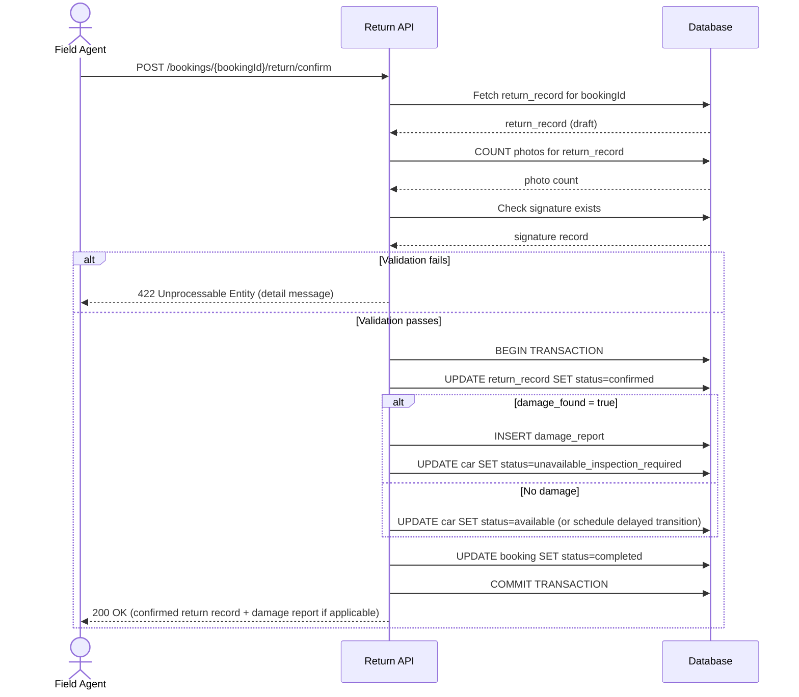

# TRD – Manage Car Return Logistics

## Document Information

| Field | Details |
|---|---|
| **Feature Name** | Manage Car Return Logistics |
| **Author** | Copilot |
| **Date** | |
| **Version** | |

---

## Table of Contents

1. [Background](#background)
2. [In Scope](#in-scope)
3. [Constraints](#constraints)
4. [Technical Requirements](#technical-requirements)
   - [Database Design](#database-design)
   - [Frontend](#frontend)
   - [Backend](#backend)
5. [Security Requirements](#security-requirements)
6. [Non-Functional Requirements](#non-functional-requirements)

---

## Background

This TRD implements **US-CM-06: Manage Car Return Logistics** from the [Car Management PRD](../prd/prd-car-management.md#us-cm-06-manage-car-return-logistics).

The requirement defines a structured return workflow in which field agents record the handover of a rental car back to the company at the end of a booking. The record must capture: return date/time, return location, fuel level, odometer reading, condition notes, and damage check results. Photo uploads and a customer signature are mandatory to complete the return. If damage is found, the system must generate a damage report and set the car status to **Unavailable – Inspection Required**. If no damage is found, the booking status must change to **Completed** and the car status must change to **Available** (after any required cleaning/preparation period).

---

## In Scope

- REST API endpoints to create, update, and confirm a return record for a rental booking.
- REST API endpoint to upload one or more photos as part of the return condition check.
- REST API endpoint to store a customer signature (digital or scanned) at time of return.
- Server-side validation: at least one photo and one signature must be present before a return can be confirmed.
- Automatic damage report generation when `damage_found` is set to `true` on confirmation.
- Atomic status transitions on confirmation:
  - **No damage**: booking status → **Completed**; car status → **Available** (after optional preparation period).
  - **Damage found**: booking status → **Completed** (flagged for damage review); car status → **Unavailable – Inspection Required**.
- Frontend return form including all required fields, inline validation, photo upload component, signature capture widget, and damage flag toggle.
- Role-based access: only users with the **operations_staff** or **field_agent** role may initiate or confirm a return.
- Database tables: `return_record`, `return_photo`, `return_signature`, `damage_report`.

---

## Constraints

- **Mobile not in scope**: The initial release targets desktop web browsers only. A mobile-optimised experience for field agents is out of scope for v1 (per PRD Dependency & Constraints).
- **No real-time GPS**: Return location is recorded as a manually entered address; real-time GPS or map integration is not in scope for v1.
- **Pickup logistics not covered**: The pickup workflow (US-CM-05) is a separate feature and is not addressed in this TRD.
- **Incident logging not covered**: Incident recording during the rental period (US-CM-07) is a separate feature.
- **No offline support**: The return form requires a live network connection; offline/sync capability is not in scope for v1.
- **Photo storage infrastructure**: This TRD assumes the file storage infrastructure (e.g., object storage) is provided by a separate platform concern. The API stores and returns storage references but does not define the storage backend.
- **Notification of return confirmation**: Automated customer notifications (e.g., email/SMS) on return confirmation are not covered in this TRD.
- **Signature format**: Signature capture produces an image (PNG). Legally binding e-signature certification is out of scope for v1.
- **Fuel charge calculation**: Automated calculation of additional charges based on fuel-level discrepancy between pickup and return is out of scope for this TRD; it belongs to the billing/accounting module.
- **Damage cost estimation**: Estimating the financial cost of damage found during return is out of scope for this TRD; it belongs to the damage assessment and billing workflow.

---

## Technical Requirements

### Database Design

The following tables are required for this feature. For full column definitions, data types, constraints, and relationships, refer to [database-design-car-return-logistics.md](./database-design-car-return-logistics.md).

| Table | Purpose |
|---|---|
| [`return_record`](./database-design-car-return-logistics.md#return_record) | Stores all structured data captured during a return handover |
| [`return_photo`](./database-design-car-return-logistics.md#return_photo) | Stores file storage references for photos uploaded at return |
| [`return_signature`](./database-design-car-return-logistics.md#return_signature) | Stores the file storage reference for the customer signature captured at return |
| [`damage_report`](./database-design-car-return-logistics.md#damage_report) | Stores the damage report generated when damage is found during a return check |

---

### Frontend

- **Inline validation**: All field-level validation errors must be displayed inline, directly beneath the respective field. A generic error banner is not sufficient.
- **Form schema validation**: Client-side UI validation must be driven by a pre-defined JSON Schema, ensuring consistency with server-side validation rules.
- **Mandatory field highlighting**: Fields that are required (fuel level, odometer, return location, return datetime, at least one photo, customer signature) must be clearly marked. Attempting to submit without them must prevent submission and highlight the missing inputs.
- **Photo upload component**: Must support multiple file selection, display thumbnails of uploaded photos, and enforce a minimum of one upload before submission is allowed. Accepted MIME types: `image/jpeg`, `image/png`. Maximum file size per photo: 10 MB.
- **Signature capture widget**: Must allow the customer to draw a signature on a canvas element or upload a scanned image. The captured signature must be previewed before the form can be submitted. Requires confirmation from the customer before it is recorded.
- **Damage flag toggle**: A clearly labelled toggle/checkbox labelled "Damage Found" must be present. When enabled, a mandatory free-text "Damage Description" field must appear and must be filled in before submission is allowed. This description populates the generated damage report.
- **Responsive design**: The return form must be responsive and usable on standard desktop screen sizes (minimum 1024 px wide).
- **Read-only booking summary**: The form must display read-only booking information (booking reference, customer name, rental period, assigned car details) so the field agent can verify they are completing the return for the correct booking.

---

### Backend

#### REST API Specification

All endpoints are prefixed with `/api/v1`. All request and response bodies use `application/json`. All endpoints require a valid JWT bearer token.

---

##### Create Return Record (Draft)

**POST** `/bookings/{bookingId}/return`

Creates a new return record in `draft` status for the specified booking.

**Path Parameters:**

| Parameter | Type | Description |
|---|---|---|
| `bookingId` | UUID | The ID of the booking being returned |

**Request Body:**

```json
{
  "return_datetime": "2026-06-15T14:30:00Z",
  "return_location": "123 Main Street, Dublin",
  "fuel_level": "half",
  "odometer_reading": 45230,
  "condition_notes": "Minor scratches on rear bumper",
  "damage_found": true
}
```

| Field | Type | Required | Validation |
|---|---|---|---|
| `return_datetime` | ISO 8601 datetime string | Yes | Must not be before the booking's start datetime |
| `return_location` | string | Yes | 1–500 characters |
| `fuel_level` | enum | Yes | One of: `empty`, `quarter`, `half`, `three_quarter`, `full` |
| `odometer_reading` | integer | Yes | ≥ 0; must be ≥ odometer reading recorded at pickup (if a pickup record exists) |
| `condition_notes` | string | No | Max 5000 characters |
| `damage_found` | boolean | Yes | — |

**Response: 201 Created**

```json
{
  "id": "uuid",
  "booking_id": "uuid",
  "car_id": "uuid",
  "status": "draft",
  "damage_found": true,
  "created_at": "2026-06-15T14:31:00Z"
}
```

**Error Responses:**

| Status | Condition |
|---|---|
| 400 | Validation error (missing/invalid field) |
| 404 | Booking not found |
| 409 | A return record already exists for this booking |
| 422 | Booking is not in `active` status |

---

##### Update Return Record (Draft)

**PATCH** `/bookings/{bookingId}/return`

Updates fields on an existing `draft` return record.

**Path Parameters:**

| Parameter | Type | Description |
|---|---|---|
| `bookingId` | UUID | The ID of the booking |

**Request Body:** Any subset of the fields listed in the Create endpoint above.

**Response: 200 OK** — returns the updated return record.

**Error Responses:**

| Status | Condition |
|---|---|
| 400 | Validation error |
| 404 | Booking or return record not found |
| 409 | Return record is already confirmed |

---

##### Upload Return Photo

**POST** `/bookings/{bookingId}/return/photos`

Uploads one photo and attaches it to the draft return record.

**Path Parameters:**

| Parameter | Type | Description |
|---|---|---|
| `bookingId` | UUID | The ID of the booking |

**Request Body:** `multipart/form-data`

| Field | Type | Required | Validation |
|---|---|---|---|
| `photo` | file | Yes | MIME type must be `image/jpeg` or `image/png`; max 10 MB |

**Response: 201 Created**

```json
{
  "id": "uuid",
  "return_record_id": "uuid",
  "file_name": "front_bumper.jpg",
  "storage_reference": "returns/uuid/front_bumper.jpg",
  "uploaded_at": "2026-06-15T14:32:00Z"
}
```

**Error Responses:**

| Status | Condition |
|---|---|
| 400 | Invalid file type or file too large |
| 404 | Booking or draft return record not found |
| 409 | Return record is already confirmed |

---

##### Store Return Signature

**POST** `/bookings/{bookingId}/return/signature`

Stores the customer signature for the return handover.

**Path Parameters:**

| Parameter | Type | Description |
|---|---|---|
| `bookingId` | UUID | The ID of the booking |

**Request Body:** `multipart/form-data`

| Field | Type | Required | Validation |
|---|---|---|---|
| `signature` | file | Yes | MIME type must be `image/png`; max 2 MB |

**Response: 201 Created**

```json
{
  "id": "uuid",
  "storage_reference": "signatures/uuid/signature.png",
  "captured_at": "2026-06-15T14:33:00Z"
}
```

**Error Responses:**

| Status | Condition |
|---|---|
| 400 | Invalid file type or file too large |
| 404 | Booking or draft return record not found |
| 409 | A signature already exists for this return record |

---

##### Confirm Return

**POST** `/bookings/{bookingId}/return/confirm`

Confirms the return record, triggers status transitions, and (if applicable) generates a damage report.

**Path Parameters:**

| Parameter | Type | Description |
|---|---|---|
| `bookingId` | UUID | The ID of the booking |

**Request Body:** None

**Pre-conditions (validated server-side):**
- The return record must be in `draft` status.
- At least one photo must have been uploaded.
- A signature must have been stored.
- If `damage_found` is `true`, `condition_notes` must be non-empty.

**Processing Logic:**

```
FUNCTION confirmReturn(bookingId):
  returnRecord = getReturnRecord(bookingId)
  VALIDATE returnRecord.status == "draft"
  VALIDATE COUNT(photos for returnRecord) >= 1
  VALIDATE returnRecord.signatureId IS NOT NULL
  IF returnRecord.damage_found == TRUE:
    VALIDATE returnRecord.condition_notes IS NOT NULL AND NOT EMPTY

  BEGIN TRANSACTION
    returnRecord.status = "confirmed"
    returnRecord.confirmed_at = NOW()
    returnRecord.confirmed_by = currentUser.id

    IF returnRecord.damage_found == TRUE:
      damageReport = CREATE damage_report(
        return_record_id = returnRecord.id,
        booking_id       = returnRecord.booking_id,
        car_id           = returnRecord.car_id,
        description      = returnRecord.condition_notes,
        review_status    = "pending"
      )
      returnRecord.damage_report_id = damageReport.id
      UPDATE cars SET status = "unavailable_inspection_required"
        WHERE id = returnRecord.car_id
    ELSE:
      IF returnRecord.preparation_period_minutes IS NOT NULL AND > 0:
        SCHEDULE car status change to "available"
          AT NOW() + returnRecord.preparation_period_minutes
      ELSE:
        UPDATE cars SET status = "available"
          WHERE id = returnRecord.car_id

    UPDATE bookings SET status = "completed"
      WHERE id = returnRecord.booking_id
  END TRANSACTION

  RETURN returnRecord
```

**Sequence Diagram:**



**Response: 200 OK**

```json
{
  "return_record_id": "uuid",
  "booking_id": "uuid",
  "car_id": "uuid",
  "status": "confirmed",
  "damage_found": false,
  "damage_report_id": null,
  "booking_status": "completed",
  "car_status": "available",
  "confirmed_at": "2026-06-15T14:35:00Z"
}
```

**Error Responses:**

| Status | Condition |
|---|---|
| 404 | Booking or return record not found |
| 409 | Return record is already confirmed |
| 422 | Pre-conditions not met (no photos, no signature, damage_found without condition_notes) |

---

##### Get Return Record

**GET** `/bookings/{bookingId}/return`

Retrieves the return record (including photos and signature reference) for a booking.

**Path Parameters:**

| Parameter | Type | Description |
|---|---|---|
| `bookingId` | UUID | The ID of the booking |

**Response: 200 OK**

```json
{
  "id": "uuid",
  "booking_id": "uuid",
  "car_id": "uuid",
  "return_datetime": "2026-06-15T14:30:00Z",
  "return_location": "123 Main Street, Dublin",
  "fuel_level": "half",
  "odometer_reading": 45230,
  "condition_notes": "Minor scratches on rear bumper",
  "damage_found": true,
  "damage_report_id": "uuid",
  "signature_id": "uuid",
  "status": "confirmed",
  "photos": [
    {
      "id": "uuid",
      "file_name": "front_bumper.jpg",
      "storage_reference": "returns/uuid/front_bumper.jpg",
      "uploaded_at": "2026-06-15T14:32:00Z"
    }
  ],
  "confirmed_at": "2026-06-15T14:35:00Z",
  "confirmed_by": "uuid"
}
```

**Error Responses:**

| Status | Condition |
|---|---|
| 404 | Booking or return record not found |

---

#### Common Validation Rules

| Field | Rule |
|---|---|
| `bookingId` (path) | Must be a valid UUID v4 |
| `return_datetime` | ISO 8601 format; must not be a future date/time beyond the server's current time |
| `return_location` | Non-empty string; max 500 characters; leading/trailing whitespace stripped |
| `fuel_level` | Must be one of the defined enum values (case-insensitive on input) |
| `odometer_reading` | Non-negative integer; must be ≥ the odometer value recorded in the corresponding pickup record |
| `condition_notes` | Max 5000 characters; optional unless `damage_found` is `true` |
| `damage_found` | Boolean; must be explicitly provided on record creation |
| Photo file | MIME type: `image/jpeg` or `image/png`; max file size: 10 MB |
| Signature file | MIME type: `image/png`; max file size: 2 MB |

---

## Security Requirements

- **Authentication**: All return logistics endpoints require a valid JWT bearer token in the `Authorization` header. JWT tokens must use the **HS256** or **RS256** algorithm. Unsigned or `alg: none` tokens must be rejected.
- **JWT Payload**: The JWT must contain at minimum:
  - `sub` (string): The authenticated user's ID.
  - `role` (string): The user's role within the system. Must be one of `operations_staff` or `field_agent` to access write endpoints. Fleet managers (`fleet_manager`) may read return records but may not create, update, or confirm them.
  - `exp` (integer): Token expiry as a Unix timestamp. Expired tokens must be rejected.
- **Authorisation**: Role-based access control (RBAC) must be enforced server-side for every endpoint. Roles and their permissions:

  | Role | Create/Update Draft | Upload Photo/Signature | Confirm Return | Read Return Record |
  |---|---|---|---|---|
  | `field_agent` | ✅ | ✅ | ✅ | ✅ |
  | `operations_staff` | ✅ | ✅ | ✅ | ✅ |
  | `fleet_manager` | ❌ | ❌ | ❌ | ✅ |
  | All other roles | ❌ | ❌ | ❌ | ❌ |

- **Booking ownership check**: The API must verify that the `bookingId` in the path belongs to a booking that is in `active` status before allowing record creation. This prevents return records from being created against invalid or already-completed bookings.
- **Photo and signature storage**: Uploaded files must be stored in a server-controlled location; client-provided storage references must never be accepted directly. Presigned upload URLs or server-proxied uploads must be used.
- **Input sanitisation**: All text inputs (`return_location`, `condition_notes`) must be sanitised server-side to prevent injection attacks.
- **Audit trail**: The `created_by`, `confirmed_by`, `uploaded_by`, and `captured_by` columns must be populated from the authenticated user's `sub` claim, never from client-provided values.

---

## Non-Functional Requirements

*(To be defined)*
