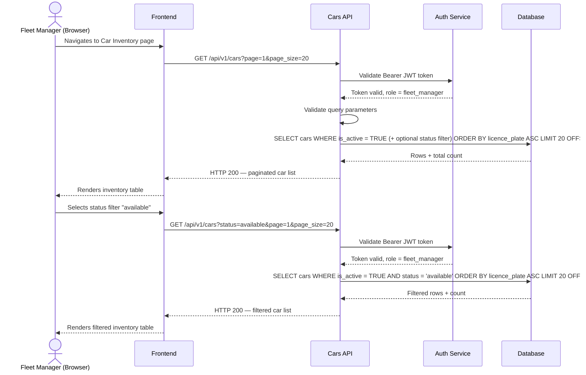

# TRD - View Car Inventory

## Document Information

| Field | Details |
|---|---|
| **Feature Name** | View Car Inventory |
| **Author** | Copilot |
| **Date** | |
| **Version** | |

---

## Table of Contents

1. [Background](#background)
2. [In Scope](#in-scope)
3. [Constraints](#constraints)
4. [Technical Requirements](#technical-requirements)
   - 4.1 [Database Design](#41-database-design)
   - 4.2 [Frontend](#42-frontend)
   - 4.3 [Backend](#43-backend)
5. [Security Requirements](#security-requirements)
6. [Non-Functional Requirements](#non-functional-requirements)

---

## Background

This TRD implements **US-CM-01: View Car Inventory** as defined in the [Car Management PRD](../prd/prd-car-management.md#us-cm-01-view-car-inventory).

The requirement states that fleet managers must be able to view a centralised list of all rental cars with their current status, location, condition, and next service date, and must be able to filter the list by availability status.

---

## In Scope

- REST API endpoint to retrieve the list of rental cars, supporting filtering by `status` and pagination.
- Frontend inventory list page displaying all car attributes required by US-CM-01.
- Frontend filter control for availability status.
- Database table design for the `cars` entity.
- Input validation rules for the list API query parameters.
- JWT-based authentication and role-based access control for the inventory endpoint.

---

## Constraints

- This TRD covers the **read-only** inventory view only. Creating, updating, or deleting car records is out of scope (covered by US-CM-02).
- Car assignment to bookings is out of scope (covered by US-CM-03).
- Service schedule management is out of scope (covered by US-CM-04).
- Pickup, return, and incident workflows are out of scope (covered by US-CM-05 through US-CM-07).
- Real-time GPS-based location tracking is out of scope for v1. Location is a manually recorded text field.
- Mobile-optimised or native mobile interface is out of scope for v1.
- Export / report functionality for the inventory is out of scope (covered by US-CM-09).

---

## Technical Requirements

### 4.1 Database Design

The inventory view is backed by the `cars` table. Full column definitions, allowed status values, and indexes are documented in:

👉 [database-design-view-car-inventory.md](./database-design-view-car-inventory.md)

---

### 4.2 Frontend

- The inventory page must display a tabular list of all active cars. Each row must show the following columns in order: **Licence Plate**, **Make / Model / Year**, **Status**, **Location**, **Condition Rating**, **Next Service Date**.
- A **Status** filter control (dropdown or segmented button) must be presented above the table, offering the options: All, Available, Reserved, Rented, In Service, Unavailable. Selecting a value re-fetches the list with the chosen filter applied.
- The **Status** value must be rendered as a colour-coded badge:
  - `available` → green
  - `reserved` → blue
  - `rented` → orange
  - `in_service` → yellow
  - `unavailable` → red
- The list must support **pagination**. Page size defaults to 20. The user can navigate between pages.
- **No result state**: when the filtered list is empty, a clear message such as "No cars match the selected status" must be displayed.
- **Loading state**: a loading indicator must be shown while the API request is in flight.
- **Error state**: if the API call fails, an inline error message must be shown with an option to retry.
- **Condition Rating** must be displayed as a numeric value (1–5) and optionally with a visual indicator (e.g., star or dot scale).
- **Next Service Date** must be formatted as `DD MMM YYYY` (e.g., `25 Apr 2026`). If no service date is set, display `—`.
- UI validation on filter inputs must follow the pre-defined JSON schema for query parameters (see [Backend](#43-backend) section).
- The page must have a responsive layout that works correctly at standard desktop resolutions (minimum 1024 px wide) as required by the v1 desktop-only constraint.

---

### 4.3 Backend

#### API Endpoint

**Retrieve Car Inventory List**

| Attribute | Value |
|---|---|
| **HTTP Method** | `GET` |
| **URL** | `/api/v1/cars` |
| **Authentication** | Required — Bearer JWT token |
| **Authorisation** | Role: `fleet_manager` |

**Query Parameters**

| Parameter | Type | Required | Description |
|---|---|---|---|
| `status` | string (enum) | No | Filter by car status. Allowed values: `available`, `reserved`, `rented`, `in_service`, `unavailable`. If omitted, all active cars are returned. |
| `page` | integer | No | Page number (1-based). Defaults to `1`. |
| `page_size` | integer | No | Number of records per page. Defaults to `20`. Maximum `100`. |
| `sort_by` | string (enum) | No | Column to sort by. Allowed values: `licence_plate`, `make`, `model`, `year`, `status`, `next_service_date`. Defaults to `licence_plate`. |
| `sort_order` | string (enum) | No | Sort direction. Allowed values: `asc`, `desc`. Defaults to `asc`. |

**Response Body — Success (HTTP 200)**

```json
{
  "data": [
    {
      "id": "uuid",
      "licence_plate": "string",
      "make": "string",
      "model": "string",
      "year": "integer",
      "colour": "string",
      "fuel_type": "string",
      "seating_capacity": "integer",
      "current_location": "string",
      "condition_rating": "integer (1–5)",
      "status": "string (enum)",
      "next_service_date": "string (ISO 8601 date) | null"
    }
  ],
  "pagination": {
    "page": "integer",
    "page_size": "integer",
    "total_records": "integer",
    "total_pages": "integer"
  }
}
```

**Response Body — Validation Error (HTTP 422)**

```json
{
  "error": "VALIDATION_ERROR",
  "message": "string",
  "details": [
    {
      "field": "string",
      "issue": "string"
    }
  ]
}
```

**Response Body — Unauthorized (HTTP 401)**

```json
{
  "error": "UNAUTHORIZED",
  "message": "Authentication token is missing or invalid."
}
```

**Response Body — Forbidden (HTTP 403)**

```json
{
  "error": "FORBIDDEN",
  "message": "You do not have permission to access this resource."
}
```

---

#### Parameter Validation Rules

| Parameter | Validation Rule |
|---|---|
| `status` | Must be one of: `available`, `reserved`, `rented`, `in_service`, `unavailable`. Any other value returns HTTP 422. |
| `page` | Must be a positive integer ≥ 1. Defaults to `1` if absent. Non-integer or value < 1 returns HTTP 422. |
| `page_size` | Must be a positive integer between 1 and 100 inclusive. Defaults to `20` if absent. Out-of-range values return HTTP 422. |
| `sort_by` | Must be one of the listed allowed column names. Any other value returns HTTP 422. |
| `sort_order` | Must be `asc` or `desc` (case-insensitive). Any other value returns HTTP 422. |

---

#### API Logic — Sequence Diagram



---

#### API Logic — Pseudocode

```
function GET /api/v1/cars(request):

    // 1. Authentication
    token = extract_bearer_token(request.headers)
    if token is null or invalid:
        return HTTP 401

    // 2. Authorisation
    user = decode_jwt(token)
    if user.role != "fleet_manager":
        return HTTP 403

    // 3. Parse and validate query parameters
    params = parse_query_params(request.query)

    if params.status is present and params.status not in ALLOWED_STATUSES:
        return HTTP 422 with field error for "status"

    if params.page is present:
        if params.page is not a positive integer:
            return HTTP 422 with field error for "page"
    else:
        params.page = 1

    if params.page_size is present:
        if params.page_size is not an integer in [1, 100]:
            return HTTP 422 with field error for "page_size"
    else:
        params.page_size = 20

    if params.sort_by is present and params.sort_by not in ALLOWED_SORT_COLUMNS:
        return HTTP 422 with field error for "sort_by"
    else:
        params.sort_by = "licence_plate"

    if params.sort_order is present and params.sort_order.lower() not in ["asc", "desc"]:
        return HTTP 422 with field error for "sort_order"
    else:
        params.sort_order = "asc"

    // 4. Build database query
    filters = { is_active: TRUE }
    if params.status is present:
        filters.status = params.status

    offset = (params.page - 1) * params.page_size

    // 5. Execute query
    rows = db.query(
        table  = "cars",
        where  = filters,
        order  = { column: params.sort_by, direction: params.sort_order },
        limit  = params.page_size,
        offset = offset
    )
    total_records = db.count(table = "cars", where = filters)

    // 6. Build and return response
    return HTTP 200 with:
        data       = rows
        pagination = {
            page          : params.page,
            page_size     : params.page_size,
            total_records : total_records,
            total_pages   : ceil(total_records / params.page_size)
        }
```

---

## Security Requirements

- All requests to `GET /api/v1/cars` must include a valid **Bearer JWT token** in the `Authorization` header.
- JWT tokens must be signed using the **HS256** (HMAC-SHA256) algorithm with a server-side secret key, or **RS256** (RSA-SHA256) with a private/public key pair. The chosen algorithm must be consistent with the platform-wide authentication standard.
- The JWT payload must include, at minimum, the following claims:

| Claim | Description |
|---|---|
| `sub` | The unique identifier of the authenticated user |
| `role` | The user's role (e.g., `fleet_manager`, `operations_staff`) |
| `iat` | Token issued-at timestamp (Unix epoch) |
| `exp` | Token expiry timestamp (Unix epoch) |

- The API must reject tokens that are expired (`exp` in the past), have an invalid signature, or are missing required claims, returning HTTP 401.
- Only users with the `fleet_manager` role are authorised to call this endpoint. Authenticated users with any other role must receive HTTP 403.
- The API must not include any sensitive internal data (e.g., internal database IDs beyond the car's own `id`, server stack traces) in error responses.
- HTTPS must be enforced for all API communications. Plain HTTP requests must be rejected or redirected.

---

## Non-Functional Requirements

*(To be defined)*
